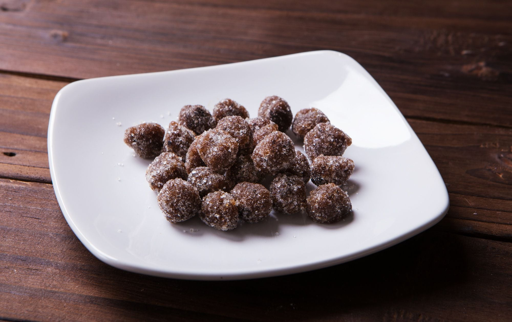

# Tamarind Balls

*Sticky-sweet-sour tamarind pulp pressed into sugar-coated balls with a hit of Scotch bonnet and salt, the small bag of one-bite sweets sold at every Antiguan roadside stall.*

**Serves:** 24 balls

**Prep Time:** 25 minutes

**Cook Time:** 0 minutes

## Overview
Tamarind balls are the Caribbean three-flavour sweet, sour from the tamarind pulp, sweet from the brown sugar coat, hot from the finely minced Scotch bonnet folded through. Antiguans make them in big batches in October when tamarind pods drop from the trees: shell the pods, soak the pulp in warm water, work the seeds and fibres out by hand, then knead the pulp with sugar and a pinch of salt until it tightens enough to roll. Each ball gets a final dusting of sugar. Stored in a jar by the door, they last weeks, getting sharper as the tamarind acid concentrates. One ball is a punch; two is a meal.

## Ingredients

- 300 g tamarind pulp (from pods or block, deseeded)
- 250 g dark brown sugar (plus 80 g for rolling)
- 1/4 tsp salt
- 1/2 small Scotch bonnet, very finely minced (optional, traditional)
- 2 tbsp granulated white sugar (for the outer coat)

## Method

### Stage 1 - Prepare the pulp
1. If using whole pods, shell them. Soak the pulp in 100 ml warm water for 15 minutes.
2. Work the pulp with your hands through a sieve to remove the seeds and any fibrous strings. You want a thick smooth paste.
3. If using block tamarind, the soak-and-sieve step is the same.

### Stage 2 - Knead
1. Combine the tamarind paste with the 250 g brown sugar and salt in a bowl.
2. Add the minced Scotch bonnet if using.
3. Knead with the heel of your hand for 5 minutes, until the mixture tightens up and stops sticking to your palms.
4. If the paste stays too wet to roll, add 1-2 more tablespoons of brown sugar.

### Stage 3 - Shape and coat
1. Pinch off a teaspoon-sized piece and roll between your palms into a 2 cm ball.
2. Roll each ball in the white sugar to coat.
3. Lay out on a tray, leave to air-dry for 2 hours.
4. Transfer to an airtight jar.

## Notes
- **The pulp:** Block tamarind is the easy route. Pods need shelling and the seeds picked out, but the flavour is fresher.
- **The Scotch bonnet:** Optional, but Antiguan tradition. Use a quarter pepper for a mild kick, half for the proper heat.
- **The roll:** Wet hands ever so slightly if the pulp sticks; do not use too much water or the balls will not hold.

## Variations
- **Coconut tamarind balls:** Roll in desiccated coconut instead of sugar.
- **Lime tamarind:** Add the zest of one lime to the paste for a citrus brightness.
- **Ginger tamarind:** Knead in 1 tsp finely grated fresh ginger.
- **Spiced version:** Add 1/2 tsp ground cinnamon and a pinch of nutmeg with the sugar.

## Serving
Eat as a sweet between meals · pack into lunchboxes · serve on a tray of mixed Caribbean sweets · pass round at Christmas alongside sugar cake.

## Storage
- Keeps 4 weeks in an airtight jar at room temperature
- The flavour intensifies over the first week
- Do not refrigerate, the sugar absorbs moisture
