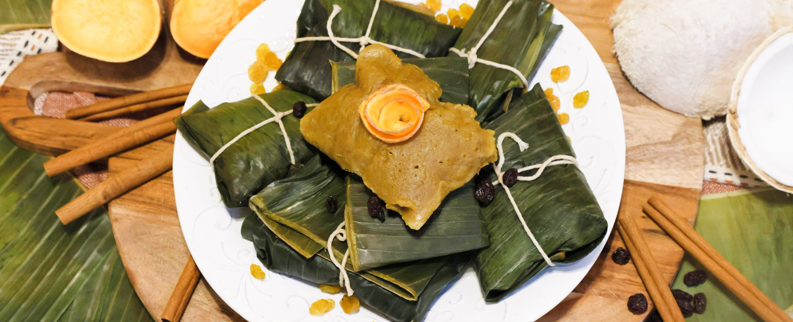

# Doucouna

*Antiguan ducana: a sweet potato and coconut dumpling tied in a banana leaf and boiled, eaten with saltfish or pepperpot as the starchy half of an old-island plate.*

**Serves:** 6 (12 dumplings)

**Prep Time:** 35 minutes

**Cook Time:** 50 minutes

## Overview
Doucouna (also written ducana or duckanoo across the islands) is the West African legacy in Antiguan cooking, a sweet starch parcel of grated sweet potato, coconut, sugar and spices steamed inside a banana leaf wrap. The recipe came across with the enslaved and survived intact: same grated tuber, same coconut, same banana leaf. On the plate it sits next to flaked saltfish, the salt of the fish playing against the sweetness of the parcel. Cinnamon, nutmeg, vanilla and a pinch of mixed spice carry it across the border into dessert territory, and some families eat the leftover doucouna sliced and fried in butter the next morning. The dumplings come out of the leaf dark, glossy, dense and perfumed.

## Ingredients

- 800 g sweet potato (orange-fleshed), peeled and grated
- 200 g fresh grated coconut (or desiccated soaked in 100 ml warm water)
- 150 g plain flour
- 150 g dark brown sugar
- 1 tsp ground cinnamon
- 1 tsp grated nutmeg
- 1/2 tsp [mixed spice](../../base-ingredients/spices/mixed-spice.md)
- 1 tsp vanilla extract
- 1/2 tsp salt
- 100 ml coconut milk
- 12 banana leaf squares, 25 cm each (or foil)
- Kitchen string

## Method

### Stage 1 - Prepare the leaves
1. Pass each banana leaf square briefly over a gas flame or dip in boiling water, 5 seconds per side, to soften and turn glossy.
2. Wipe with a damp cloth.

### Stage 2 - Make the mixture
1. Combine the grated sweet potato and coconut in a large bowl.
2. Stir in the flour, sugar, cinnamon, nutmeg, mixed spice and salt.
3. Add the vanilla and coconut milk. Mix to a thick stiff paste; it should hold its shape on a spoon.

### Stage 3 - Wrap and boil
1. Place a generous heaped tablespoon of mixture on the centre of a leaf.
2. Fold the long sides over to enclose, then fold the ends under. Tie with string.
3. Bring a large pot of water to a rolling boil. Lower the parcels in, weighted with a plate if they float.
4. Boil 40-50 minutes until firm to the touch through the leaf.
5. Lift out, drain, rest 5 minutes before unwrapping.

## Notes
- **The grate:** Use the fine side of a box grater for the sweet potato. A food processor turns it watery.
- **The wrap:** The banana leaf gives the dumpling its smell, the foil is a backup but loses that perfume.
- **The set:** Press a parcel after 40 minutes; it should feel firm with no soft centre. If still soft, give it 10 more minutes.

## Variations
- **Cassava doucouna:** Swap half the sweet potato for grated cassava for the harder, denser Saint Lucian-leaning version.
- **Raisin doucouna:** Stir 80 g raisins into the mixture for sweetness pockets.
- **Pumpkin doucouna:** Use grated pumpkin in place of a third of the sweet potato for a softer set.
- **Plantain doucouna:** Add 100 g mashed ripe plantain for a richer fudgy result.

## Serving
- Serve with flaked saltfish · pepperpot stew · a wedge of avocado · cold ginger beer.

## Storage
- Keeps 4 days refrigerated still in the leaf
- Freezes 2 months wrapped
- Reheat by steaming or boiling for 10 minutes, or slice cold doucouna and pan-fry in butter
