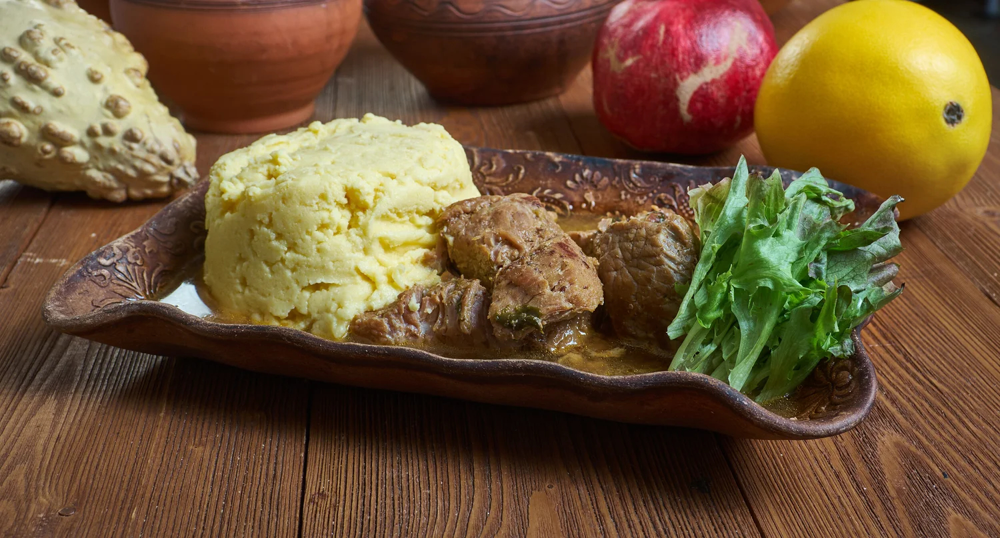

# Fungie and Pepperpot

*Antigua's national dish: a buttery cornmeal-and-okra mush served with a long-simmered stew of salt beef, pork and dark island greens that fills every Sunday plate from Saint John's to English Harbour.*

**Serves:** 6

**Prep Time:** 30 minutes

**Cook Time:** 2 hours

## Overview
Fungie (pronounced foon-gee) and pepperpot is the dish Antiguans claim as their own, the table-defining pairing that turns up at family lunches, church suppers and Independence Day plates. The fungie itself is yellow cornmeal cooked down with sliced okra into a smooth dense mush, scooped with a wet spoon into round balls that hold their shape on the plate. The pepperpot is the stew it sits next to, a long-simmered pot of salt beef and pork with spinach, kale, callaloo or pak choi, plus pumpkin, eggplant and a whole Scotch bonnet floating on top for heat. The two are eaten together: a hot ball of fungie pressed into the stew, gravy clinging, eaten with the hand or a spoon.

## Ingredients

For the pepperpot:
- 500 g salt beef, soaked overnight and cubed
- 300 g pork shoulder, cubed
- 1 onion, chopped
- 3 garlic cloves, crushed
- 1 tbsp fresh thyme leaves
- 400 g callaloo or spinach, chopped
- 200 g kale or pak choi, chopped
- 300 g pumpkin, peeled and cubed
- 1 small eggplant, cubed
- 1 whole Scotch bonnet pepper
- 2 tbsp tomato paste
- 1 tbsp vegetable oil

For the fungie:
- 250 g fine yellow cornmeal
- 200 g okra, thinly sliced
- 750 ml water
- 1 tsp salt
- 30 g butter

## Method

### Stage 1 - Build the pepperpot
1. Drain the soaked salt beef and rinse. Combine with the pork in a heavy pot, cover with fresh water, and bring to a boil. Skim the foam and simmer for 45 minutes.
2. Heat the oil in a separate pan, soften the onion for 5 minutes, then add garlic, thyme and tomato paste. Cook for 2 minutes.
3. Tip the onion mixture into the meat pot. Add the pumpkin and eggplant, simmer 20 minutes.
4. Add the callaloo and kale and the whole Scotch bonnet (do not pierce). Simmer 25 minutes more, until the greens collapse and the gravy thickens. Lift out the pepper before it bursts.

### Stage 2 - Cook the fungie
1. Bring 500 ml of water with the salt to a boil. Add the sliced okra and cook 5 minutes until softened and slightly slimy.
2. Mix the cornmeal with the remaining 250 ml cold water in a bowl to make a slurry.
3. Pour the slurry into the boiling okra water, whisking hard to avoid lumps.
4. Drop the heat low. Stir with a wooden spoon for 8-10 minutes, working the mass against the side of the pot, until it pulls away clean and shines.
5. Beat in the butter. Scoop wet balls of fungie onto each plate next to a ladle of pepperpot.

## Notes
- **The salt beef:** Cured salt beef needs an overnight soak; change the water once. If you skip this the dish is too salty to eat.
- **The okra:** The okra is the binder in fungie, it makes the cornmeal silky. Sliced thin so the rings disappear into the mush.
- **The pepper:** Keep the Scotch bonnet whole. Antiguan grandmothers say a burst pepper ruins the pot.

## Variations
- **Fish pepperpot:** Replace half the salt beef with chunks of saltfish added in the last 15 minutes.
- **Cassava fungie:** Substitute half the cornmeal with grated cassava for a denser, more West African texture.
- **Christmas pepperpot:** Add a splash of cassareep (cassava molasses) and a stick of cinnamon for the Boxing Day pot.
- **Sunday pepperpot:** Drop in a couple of green bananas and a chunk of dasheen for a fuller starch plate.

## Serving
Serve with hot pepper sauce on the side · cold sorrel or mauby to drink · a slice of avocado pear · a wedge of lime.

## Storage
- Pepperpot keeps 3 days refrigerated and improves on day two
- Fungie sets hard on cooling, reheat with a splash of water and a knob of butter
- Both freeze well separately for 2 months
