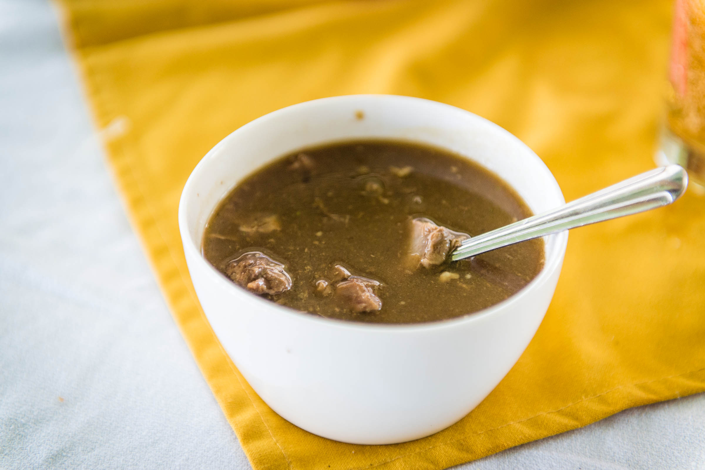

# Goat Water

*Antigua's celebration stew: bone-in goat slow-simmered with cloves, allspice, thyme and a final splash of dark rum, traditionally served at weddings, christenings and Carnival.*

**Serves:** 6

**Prep Time:** 25 minutes

**Cook Time:** 3 hours

## Overview
Goat water is the celebration pot of the eastern Caribbean, claimed by Antigua and Montserrat both and served at any occasion that calls for feeding a crowd. The name describes the soup-like thinness of the gravy, but the flavour is anything but watery: bone-in goat meat browned hard, then simmered for hours with onion, scallion, garlic, thyme, cloves and allspice berries, the bones giving up their marrow to thicken the broth. A finishing splash of dark Antiguan rum is the local signature; it cuts the richness and gives the pot the smell of celebration. Eat with crusty bread or boiled provisions, hot sauce on the table; the bowl goes around the room and people return for seconds. The longer it sits, the better it tastes.

## Ingredients

- 1.5 kg bone-in goat meat (shoulder or leg), cut into chunks
- 2 large onions, chopped
- 5 garlic cloves, crushed
- 4 scallions, chopped
- 2 tbsp fresh thyme leaves
- 8 whole cloves
- 1 tbsp allspice berries
- 2 bay leaves
- 1 Scotch bonnet pepper, whole
- 2 tbsp tomato paste
- 3 tbsp vegetable oil
- 1 tbsp salt
- 1.5 litres water or beef stock
- 60 ml dark rum
- Juice of 1 lime
- Black pepper

## Method

### Stage 1 - Season and brown
1. Rub the goat with the lime juice and a tablespoon of salt; let it sit 20 minutes.
2. Pat the meat dry. Heat the oil in a heavy pot over high heat. Brown the goat in batches, all sides, 6 minutes per batch. Set aside.
3. Reduce heat to medium. Soften the onion in the same pot for 6 minutes. Add the garlic, scallion and tomato paste. Cook 2 minutes.

### Stage 2 - Simmer slow
1. Return the goat to the pot. Add the thyme, cloves, allspice berries, bay leaves and the whole Scotch bonnet.
2. Pour in the water or stock. Bring to a boil, then drop to the lowest simmer.
3. Cook covered for 2 to 2.5 hours, stirring every 30 minutes, until the meat falls off the bone and the broth turns dark and glossy.
4. Lift out the Scotch bonnet before it bursts. Pluck out the bay leaves.

### Stage 3 - Finish
1. Stir in the dark rum and simmer uncovered for 10 minutes.
2. Black pepper to taste. Check the salt.
3. Ladle into deep bowls, bone and all.

## Notes
- **The goat:** Bone-in pieces are non-negotiable, the marrow is what thickens the gravy. Ask the butcher for shoulder cut across the bone.
- **The lime rub:** A short lime-and-salt rub before cooking removes any gamey smell from older goat.
- **The rum:** Antiguan dark rum is the local choice; any aged Caribbean dark rum works. Add at the end so the alcohol cooks off but the molasses note stays.

## Variations
- **With dumplings:** Drop spoonfuls of flour-and-water dumpling dough in for the last 20 minutes.
- **Provision goat water:** Add chunks of green banana, dasheen and yam in the last 40 minutes for a fuller stew.
- **Montserratian style:** Skip the rum, add a tablespoon of flour stirred into the gravy for thickness, this is the Montserrat take.
- **Spiced version:** Add a stick of cinnamon and 2 cardamom pods for a more Indian-Caribbean profile.

## Serving
Serve in deep bowls · with crusty bread or hard-dough bread · cold ginger beer or rum punch · hot pepper sauce alongside.

## Storage
- Keeps 4 days refrigerated, improves daily
- Freezes 3 months in portions
- Reheat slowly on the stove, add a splash of water if the broth has reduced
