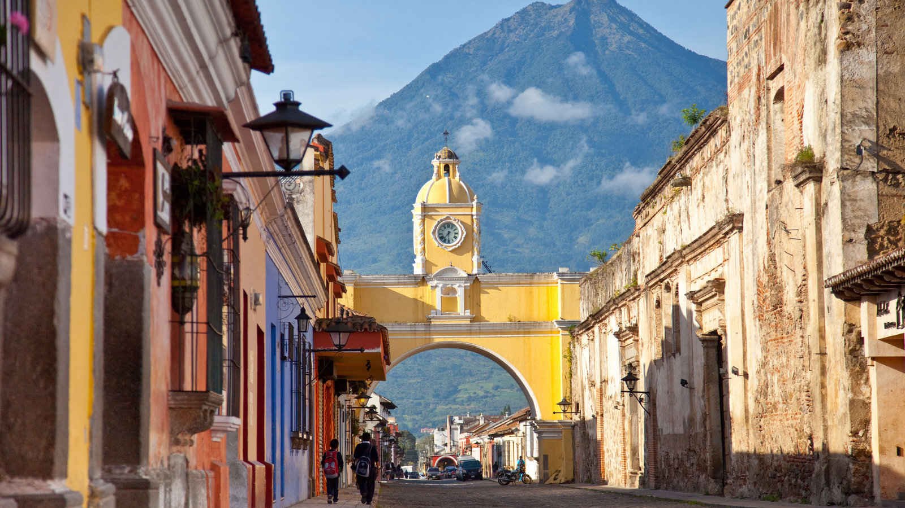

# Antiguan Cuisine

Antigua sits in the Leeward Islands of the eastern Caribbean, and its food is the Afro-Caribbean inheritance of two centuries of sugar, salt cod, fishing and small-island gardening. The national dish is fungie and pepperpot: a buttery cornmeal-and-okra mush served alongside a long-simmered stew of salt beef, pork and dark island greens, eaten every Sunday from Saint John's to English Harbour. Saltfish and chop-up is the household breakfast, flaked salt cod with a rough mash of eggplant and okra, served with fry bakes and a cup of cocoa tea on a Saturday morning. Goat water is the celebration stew, bone-in goat slow-simmered with cloves, allspice and a finishing splash of dark Antiguan rum, served at weddings and Carnival. Conch and dumplings comes from the fishermen at Half Moon Bay, a one-pot of pounded sea snail with flour dumplings on top. Doucouna is the West African legacy, a sweet-potato-and-coconut parcel steamed in banana leaf, eaten alongside saltfish. Cornmeal pone, Antiguan sugar cake and tamarind balls fill out the sweet side. Sorrel and mauby are the household drinks, served ice-cold; ginger beer is brewed by the gallon at Christmas. The Antiguan kitchen is plain in tools, generous in flavour, and grounded in the rhythms of fishing boats, church Sundays and island gardens.
