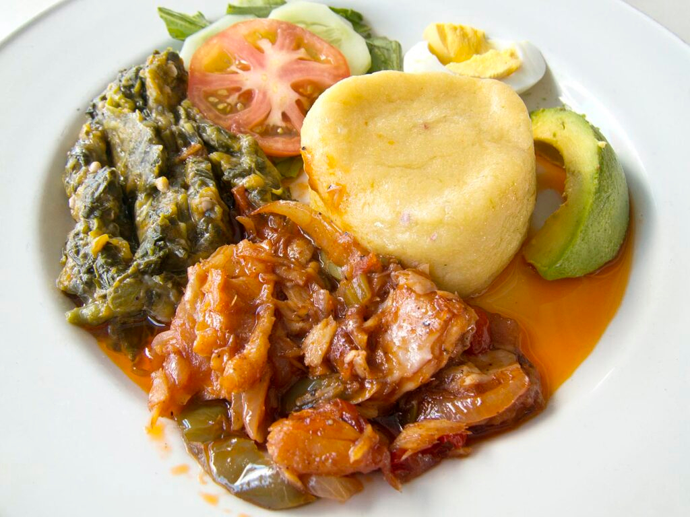

# Saltfish and Chop-up

*Antiguan Sunday breakfast: flaked salt cod sautéed with onion and tomato, served with chop-up, a mashed eggplant and okra side that takes its name from the rough chop of its vegetables.*

**Serves:** 4

**Prep Time:** 20 minutes (plus overnight soak)

**Cook Time:** 40 minutes

## Overview
Saltfish and chop-up is the breakfast Antiguan families gather for on a Sunday morning, the plate that follows church or a long lie-in. The saltfish is properly desalted cod, flaked and tossed with onion, garlic, tomato and thyme in a hot oily pan. The chop-up is the side: eggplant and okra boiled together until soft, then mashed roughly with butter and a hit of black pepper. It looks plain on the plate, a pile of dark green chop-up next to the orange-red saltfish, but the contrast is the point: the fish is bright and salty, the chop-up is smooth and earthy, and they balance each other across the same forkful. Served with bakes or fried bread on the side.

## Ingredients

For the saltfish:
- 400 g boneless salt cod, soaked overnight
- 1 large onion, sliced
- 3 garlic cloves, crushed
- 2 large tomatoes, chopped
- 1 tbsp fresh thyme leaves
- 1 small Scotch bonnet, deseeded and minced
- 2 tbsp vegetable oil
- Black pepper

For the chop-up:
- 1 large eggplant, cubed
- 300 g okra, topped and sliced
- 1 small onion, finely chopped
- 30 g butter
- 1 tsp salt
- Black pepper

## Method

### Stage 1 - Desalt and cook the cod
1. Drain the soaked salt cod and rinse twice. Place in a pan of fresh water and bring to the boil. Simmer 10 minutes, drain, taste; if still too salty, repeat with fresh water.
2. Flake the fish with your fingers, discarding any bones.
3. Heat the oil in a wide pan. Soften the onion for 5 minutes, add the garlic, thyme and Scotch bonnet. Cook 1 minute.
4. Add the tomato and a few grinds of black pepper. Cook 5 minutes until the tomato breaks down.
5. Add the flaked cod and toss to coat. Warm through for 3 minutes.

### Stage 2 - Make the chop-up
1. Combine the eggplant cubes and okra in a pot. Cover with water, add the salt, bring to a boil and cook 15 minutes until both are soft.
2. Drain well, pressing out excess water.
3. Return to the pot with the butter and chopped onion. Mash roughly with a fork or wooden spoon, leaving texture. Black pepper to finish.

## Notes
- **The soak:** A 12-hour soak with one water change brings cod down to a workable saltiness. Taste after the first boil to check.
- **The okra:** Boiled okra is what binds the chop-up. Do not skip or substitute, the slime is the texture.
- **The fish:** Use boneless skinless saltfish if you can find it. The cheaper bone-in cuts work, just pick over carefully after flaking.

## Variations
- **With ackee:** Add 200 g drained tinned ackee to the saltfish pan in the last 2 minutes for the Jamaican-influenced version.
- **Spinach chop-up:** Stir 100 g chopped spinach or callaloo into the chop-up in the last 5 minutes.
- **Bake on the side:** Pair with Antiguan fry bakes (small fried dough rounds) for the classic breakfast plate.
- **With avocado:** A wedge of avocado pear cools the heat of the Scotch bonnet.

## Serving
- Serve with fry bakes or fresh white bread · cold ginger beer · a wedge of lime · hot pepper sauce on the table.

## Storage
- Saltfish keeps 3 days refrigerated, the flavour deepens
- Chop-up keeps 2 days, reheat with a splash of water
- Neither freezes well, the okra goes stringy
