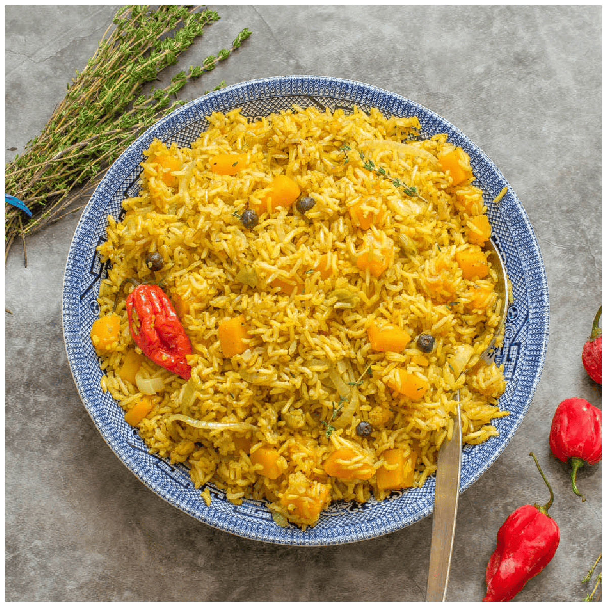

# Antiguan Pumpkin Rice

*Antigua's earthy island side: long-grain rice cooked in coconut milk with diced sugar pumpkin (calabaza), thyme, garlic, scotch bonnet and a knob of butter; the orange-flecked everyday partner to saltfish chop-up or stewed goat.*

**Serves:** 4-6 as a side

**Prep Time:** 10 minutes

**Cook Time:** 30 minutes

## Overview
Antiguan pumpkin rice is the everyday Caribbean side that turns a small wedge of West Indian pumpkin (calabaza, kalabasa, or any firm orange winter squash) into a one-pot rice plate. The construction sits between a Trinidadian pelau and a south-Indian coconut-rice: onion, garlic and thyme are sweated in butter; diced pumpkin is added and caramelised at the edges; long-grain rice goes in to soak up the flavours; coconut milk and stock cover the lot; a whole scotch bonnet rides on top (never pierced) to perfume without overpowering. The pot lid stays on for the steam, and the rice cooks in 18 minutes flat. The pumpkin collapses partway into the grains, giving the rice an orange flecking and a faint natural sweetness. Stand-in side for any roasted, stewed or grilled main on the Antiguan plate.

## Ingredients

### For 4-6 servings
- 50 g butter
- 1 medium onion (finely diced)
- 4 cloves garlic (finely chopped)
- 2 sprigs fresh thyme (leaves picked) + extra for garnish
- 500 g West Indian pumpkin (calabaza) or butternut squash (peeled, deseeded, diced into 1.5 cm cubes)
- 350 g long-grain rice (rinsed in cold water till the water runs clear, then drained)
- 1 teaspoon ground allspice (Caribbean pimento)
- 400 ml coconut milk (one tin)
- 400 ml chicken or vegetable stock
- 1 whole scotch bonnet chilli (left whole; do not pierce)
- 1 spring onion (finely sliced)
- 1 teaspoon fine sea salt
- 1 teaspoon coarsely cracked black pepper

### To serve
- A few extra thyme sprigs
- A wedge of lime
- A small pat of butter (stirred through at the end)

## Method

### Stage 1 - Aromatics and pumpkin
1. Melt the butter in a heavy lidded pan over medium heat.
2. Add the onion and a pinch of salt; sweat 4 minutes till translucent.
3. Add the garlic and thyme leaves; cook 30 seconds.
4. Tip in the diced pumpkin; turn the heat up.
5. Sauté 5 minutes till the pumpkin is lightly caramelised at the edges (don't worry if some cubes break down).

### Stage 2 - Toast the rice
1. Add the rinsed rice and the ground allspice to the pot.
2. Stir constantly for 2 minutes till the grains are coated in butter and start to look glassy.

### Stage 3 - Liquid
1. Pour in the coconut milk and the stock.
2. Stir once; bring to a rolling boil.
3. Add salt and pepper.
4. Lay the whole scotch bonnet on top (its perfume releases as the pot steams, but no heat unless the skin breaks).

### Stage 4 - Cover and steam
1. Drop the heat to its lowest setting.
2. Clamp the lid on tight.
3. Cook 18 minutes undisturbed (no peeking; lifting the lid drops the steam).

### Stage 5 - Rest and fluff
1. Take the pot off the heat; leave covered another 5 minutes.
2. Lift the lid; fish out the whole scotch bonnet (discard or pickle for later).
3. Stir in the pat of butter and the sliced spring onion.
4. Fluff with a fork; the pumpkin will be soft and partly broken into the rice.
5. Check seasoning.

### Stage 6 - Serve
1. Pile onto a warm serving plate.
2. Scatter the extra thyme sprigs over.
3. Serve with a lime wedge alongside.

## Notes
- **Rinse the rice:** removes surface starch and gives the finished pot loose grains rather than a sticky mass.
- **Don't pierce the scotch bonnet:** the whole pepper perfumes the rice; piercing makes the whole pot fiery.
- **West Indian pumpkin (calabaza):** the right squash; sweeter and firmer than supermarket pumpkin. Butternut works as the substitute.
- **No peeking during the 18-minute steam:** every lift loses 5 minutes of cooking momentum.
- **Allspice is the Caribbean signature:** don't substitute mixed spice or cinnamon; the warm-clove note is the whole point.

## Variations
**With salt pork:** dice 100 g salt pork and render with the onion for a richer Antiguan stewed-rice version.
**With pigeon peas:** add a 400 g tin of drained pigeon peas with the coconut milk for a heartier dish closer to a pelau.
**Vegan-friendly already:** the dish is plant-based if you use vegetable stock; check the butter (swap for coconut oil).
**With curry powder:** stir 1 tablespoon Antiguan curry powder into the aromatics for a curry-pumpkin rice.
**Roasted-pumpkin twist:** roast the pumpkin first at 200°C for 15 minutes for a deeper caramel note.

## Serving
With Antiguan saltfish and chop-up (the everyday pairing) · alongside stewed goat or goat water · with grilled snapper at a beach restaurant · for a Sunday lunch with fried chicken · at a Christmas-table buffet alongside black cake · with a wedge of lime and a glass of ginger beer.

## Storage
- Refrigerates 3 days in a sealed container.
- Reheat in a covered pan with a splash of coconut milk to revive the moisture.
- Don't freeze (the pumpkin texture goes mushy and the rice grains break).
- Best eaten warm; cold rice loses the perfume.
