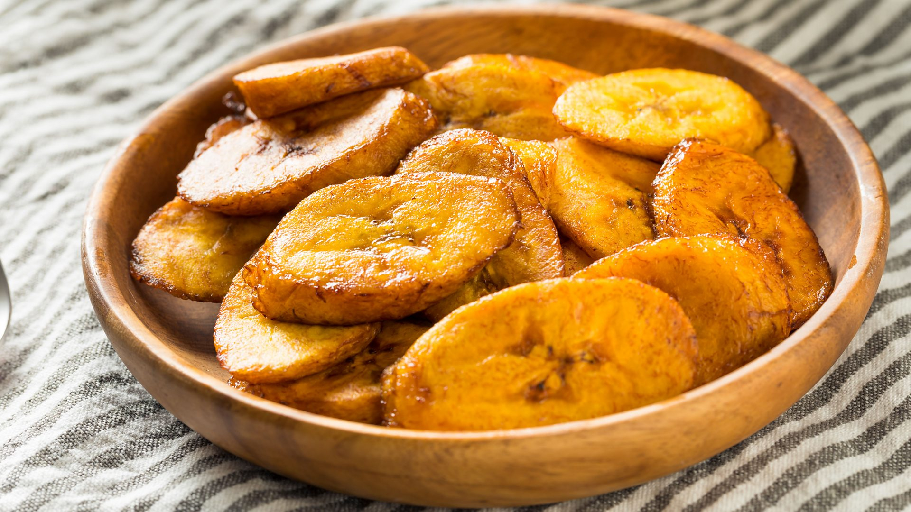

# Fried Plantain Antigua-style

*Ripe plantain sliced thick on the diagonal and fried in shallow oil until the edges caramelise dark and the centres go soft and sweet, the side that turns up next to almost every Antiguan main.*

**Serves:** 4

**Prep Time:** 5 minutes

**Cook Time:** 12 minutes

## Overview
Fried plantain is the Antiguan side that needs almost no explanation: ripe plantains, a hot pan, a slosh of oil, a sprinkle of salt. The single decision is the ripeness. Antiguans like their plantain almost black-skinned, the flesh inside soft and sugar-sweet, so the slices brown fast and caramelise at the edges within seconds of hitting the oil. Cut thick on the bias, fried in shallow oil over medium-high heat, salted while still glossy. They sit on the plate next to fungie and pepperpot, alongside rice and peas with stewed chicken, or just as a plain breakfast next to fried eggs and saltfish. Sweetness against everything else on the plate.

## Ingredients

- 4 very ripe plantains (black-spotted to mostly black)
- 4 tbsp vegetable oil (or coconut oil)
- 1/2 tsp fine salt

## Method

### Stage 1 - Slice
1. Cut both ends off each plantain. Score the skin lengthwise down one side and peel away.
2. Slice thick on the diagonal, around 1.5 cm thick. The diagonal cut gives more surface area for browning.

### Stage 2 - Fry
1. Heat the oil in a wide heavy pan over medium-high heat. The oil should shimmer but not smoke.
2. Lay the plantain slices in a single layer; do not crowd, work in batches if needed.
3. Fry 3 minutes on the first side, until the edges go deep gold and the surface caramelises.
4. Flip with tongs. Fry 2-3 minutes on the second side.
5. Lift onto kitchen paper. Sprinkle with the fine salt while still hot.
6. Serve at once.

## Notes
- **The ripeness:** Yellow plantains with no spots will not work, they are starchy and dense. Wait until the skin is at least half black.
- **The oil temperature:** Too cool and the plantains soak up oil and go soggy; too hot and the sugars burn before the centre softens. Medium-high is the spot.
- **The salt:** A small pinch right out of the pan amplifies the sweetness. Do not skip.

## Variations
- **Boiled green plantain side:** Use unripe green plantains, peel, slice, boil in salted water for 15 minutes; this is the starch side under fish stew.
- **Maduros style:** Slice thinner (1 cm) and double-fry, the first pass at lower heat to cook through, the second at high heat to caramelise.
- **Sweet finish:** Sprinkle with a pinch of cinnamon and a drop of vanilla while frying for a dessert-leaning version.
- **Cane sugar glaze:** Add a teaspoon of brown sugar to the pan in the last minute and toss to coat.

## Serving
- Serve hot with fungie and pepperpot · alongside saltfish breakfast · with rice and peas and stewed chicken · as a snack with a sprinkle of pepper sauce.

## Storage
- Best eaten straight from the pan
- Keeps 1 day refrigerated, reheat in a dry pan to crisp the edges back up
- Do not freeze, the texture collapses
