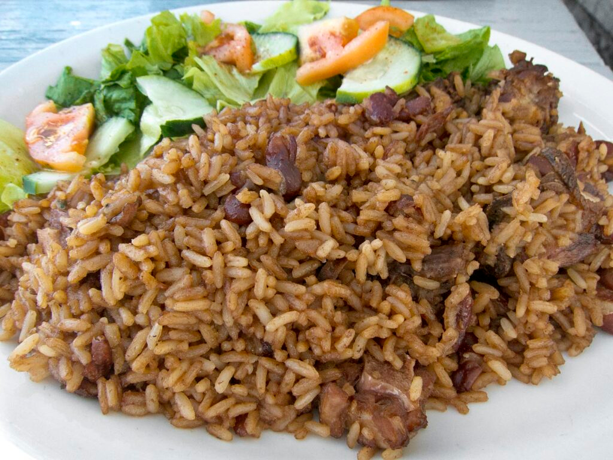

# Rice and Peas Antiguan

*The Antiguan Sunday rice: long-grain rice cooked with pigeon peas in coconut milk, thyme and a whole Scotch bonnet, finished firm and dry with each grain visibly separate.*

**Serves:** 6

**Prep Time:** 15 minutes

**Cook Time:** 45 minutes

## Overview
Every English-speaking Caribbean island claims its own rice and peas, and the Antiguan version is built around pigeon peas (gungo peas locally), small green-brown legumes with a nutty taste that hold their shape through the long simmer. The peas go in first with water, thyme, scallion and a whole Scotch bonnet; once they have softened the coconut milk and rice join the pot. The trick is the dry finish: enough liquid to cook the rice through but not a drop more, so the grains stand separate when you fork them up. Served alongside stewed chicken, oxtail or fried fish, it is the starch under every Antiguan plate that is not fungie.

## Ingredients

- 300 g dried pigeon peas, soaked overnight (or 2 tins, drained)
- 400 g long-grain rice
- 400 ml coconut milk
- 500 ml water
- 1 onion, finely chopped
- 3 scallions, chopped
- 3 garlic cloves, crushed
- 1 tbsp fresh thyme leaves
- 1 whole Scotch bonnet pepper
- 1 tbsp vegetable oil
- 1.5 tsp salt
- Black pepper

## Method

### Stage 1 - Cook the peas
1. If using dried peas, drain the soaked peas. Place in a pot with 1 litre fresh water and simmer 40 minutes until tender but not collapsing. Drain, reserving 250 ml of the cooking liquid. (If using tinned, skip this step.)

### Stage 2 - Build the pot
1. Heat the oil in a heavy pot. Soften the onion for 5 minutes.
2. Add the garlic, scallion and thyme. Cook 1 minute.
3. Add the cooked pigeon peas (or tinned). Stir to coat.
4. Pour in the coconut milk and 500 ml water (or 250 ml of the reserved pea liquid plus 250 ml water). Add salt.
5. Drop in the whole Scotch bonnet pepper, do not pierce.
6. Bring to a boil. Rinse the rice and stir it in.

### Stage 3 - Steam
1. As soon as the surface bubbles steadily, drop heat to the lowest setting.
2. Cover tight, cook 20 minutes without lifting the lid.
3. Off the heat, rest covered 10 minutes.
4. Lift out the Scotch bonnet. Fork through the rice to fluff.

## Notes
- **The pea:** Pigeon peas are essential, not red kidney beans. Tinned gungo peas are the easy substitute if dried are unavailable.
- **The pepper:** Whole, never pierced. It perfumes the pot without setting it on fire.
- **The dry finish:** The lid stays on for the full 20 minutes plus the rest. Lifting it releases the steam that finishes the cooking.

## Variations
- **With salt beef:** Add 200 g cubed salt beef (pre-soaked) to the pot with the peas in stage 2.
- **Brown rice version:** Use long-grain brown rice and extend the cook to 35 minutes.
- **Spicier:** Pierce the Scotch bonnet once before adding.
- **Without coconut:** Replace coconut milk with stock for a lighter cleaner side.

## Serving
Serve with stewed chicken or oxtail · fried plantain on the side · a wedge of avocado pear · hot pepper sauce.

## Storage
- Keeps 3 days refrigerated
- Freezes 2 months, reheat with a splash of water
- The peas firm up on chilling, gentle reheat brings them back
