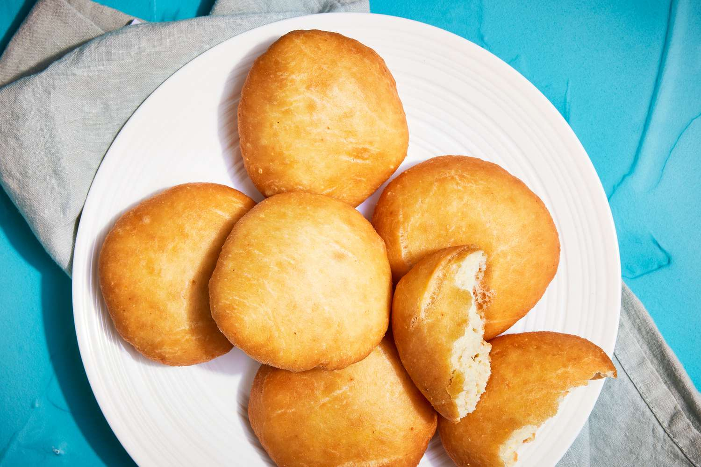

# Antiguan Johnny Cakes

*Antigua's everyday fried-dough rounds: a sweet-savoury flour-and-butter dough rolled into golf-ball-sized rounds, pan-fried in shallow oil till the crusts puff golden and the centres stay pillow-soft; the breakfast plate's pillar.*

**Serves:** 12 cakes

**Prep Time:** 20 minutes (plus 30 minutes rest)

**Cook Time:** 25 minutes

## Overview
Johnny cakes (also written jonny cakes, journey cakes, or "ducana cousin") are the everyday Antiguan flour-based fried bread, sat between an English scone and a Latin American sopaipilla in feel. The construction: plain flour is rubbed with cold butter, mixed with milk and a touch of sugar into a soft dough, rolled into balls, flattened slightly, and shallow-fried in hot oil till the outside puffs golden and the inside is fluffy. The morning Antiguan plate pairs them with saltfish-and-tomato chow, fried eggs, or simply with a wedge of mango and a cup of tea. Pickup-truck breakfasts at St John's market are sold from coolers stacked with paper bags of warm johnny cakes; the same dough also appears alongside stews as a small dumpling. Caribbean home cooks each guard the family ratio of butter to milk.

## Ingredients

### Dough
- 500 g plain flour
- 2 teaspoons baking powder
- 1 1/2 teaspoons fine sea salt
- 50 g caster sugar
- 80 g cold butter (diced)
- 250-300 ml whole milk (warm)
- 1 egg (beaten, for binding)

### Frying
- 600 ml vegetable oil (for shallow frying)

### To serve
- Antiguan saltfish chow OR butter and honey
- A pot of tea
- A slice of ripe mango

## Method

### Stage 1 - Dry mix
1. In a large bowl, whisk the flour, baking powder, salt and sugar together.
2. Make sure the baking powder is fully distributed (white streaks gone).

### Stage 2 - Rub in the butter
1. Add the cold diced butter to the bowl.
2. Rub the butter through the flour with your fingertips till the mixture looks like fine breadcrumbs.
3. This takes 4-5 minutes; the goal is no pea-sized butter chunks remaining.

### Stage 3 - Bring the dough together
1. Make a well in the centre.
2. Pour in the beaten egg and 250 ml of warm milk.
3. Mix with a wooden spoon till the dough comes together.
4. Add a splash more milk if needed (the dough should be soft but not sticky).
5. Tip onto a lightly floured surface; knead briefly 1-2 minutes.

### Stage 4 - Rest
1. Cover with a clean tea towel.
2. Rest 30 minutes at room temperature (gluten relaxes, fry rises better).

### Stage 5 - Shape
1. Divide the dough into 12 equal pieces (about 70 g each).
2. Roll each into a smooth ball between your palms.
3. Flatten gently to a 2 cm thick disc.

### Stage 6 - Fry
1. Heat the oil to 170°C in a deep heavy pan (a chip thermometer is the safe check; or test with a small piece of dough that should sizzle gently but not brown immediately).
2. Lower 3-4 cakes into the oil at a time (don't crowd; the temperature drops).
3. Fry 3 minutes on the first side till deep golden and the dough has puffed.
4. Turn carefully with a slotted spoon; fry another 2-3 minutes on the second side.
5. The cakes should sound hollow when tapped.

### Stage 7 - Drain and rest
1. Lift onto a paper-towel-lined tray.
2. Sprinkle a tiny pinch of salt over each.
3. Rest 5 minutes; the inside finishes steaming.

### Stage 8 - Serve
1. Stack warm onto a plate.
2. Serve with saltfish chow alongside, or split and butter for breakfast.

## Notes
- **Cold butter rubbed in:** the cold butter is what gives the cakes their flaky texture; melted butter makes them dense.
- **Don't over-knead:** johnny cakes are softer than bread; over-kneading turns them tough.
- **170°C oil:** too hot and the outside browns before the inside cooks; too cold and the cakes drink up oil and go greasy.
- **Sprinkle salt while hot:** the salt sticks to the still-oily surface and lifts the flavour.
- **Eat the day they're fried:** day-old johnny cakes are dense.

## Variations
**Whole wheat johnny cakes:** swap 200 g of the plain flour for wholemeal.
**Coconut johnny cakes:** add 50 g desiccated coconut to the dry mix.
**Cornmeal johnny cakes:** replace 100 g of the flour with fine cornmeal (the older Antiguan version).
**Cheese johnny cakes:** grate 100 g sharp cheddar into the dough before kneading.
**Oven-baked version:** brush with milk and bake on a tray at 200°C for 18 minutes (less authentic but lighter).

## Serving
At an Antiguan breakfast (the traditional setting) · with saltfish chop-up or fried eggs · with a mug of strong tea · alongside goat water stew · split and filled with cheese or butter for a hand-held snack · at a beach picnic with a Tupperware of jerk chicken.

## Storage
- Best the day they're fried.
- Day 2: refresh in a 160°C oven 4 minutes; they crisp back up.
- Don't refrigerate (the cakes go stale fast).
- Freeze unfried dough balls 1 month; defrost in the fridge overnight then fry.
- Fried cakes don't freeze well (the texture suffers).
