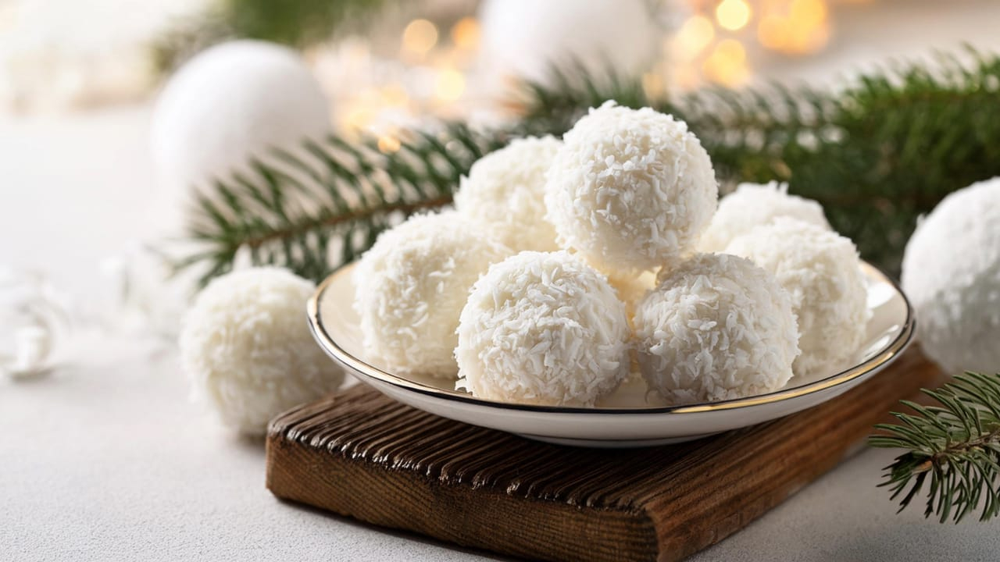

# Coconut Snowballs

*Antiguan shave-ice in a paper cup: a mound of finely shaved ice drenched in homemade coconut syrup and a splash of sweet milk, the beach-day cool-down sold from carts along Fort James and Dickenson Bay.*

**Serves:** 4

**Prep Time:** 10 minutes (plus syrup cool)

**Cook Time:** 8 minutes

## Overview
Snowballs are the Antiguan equivalent of the wider Caribbean snowcone, but the local version stays simple: shave ice, coconut syrup, a splash of condensed milk on top. The syrup is built from grated fresh coconut steeped in sugar water until it tastes like the inside of a young coconut. The shave needs to be properly fine, not crushed lumps but feathery snow, which means either a hand-cranked shaver or sweeping a sharp blade across a solid block. The cup is filled to a mound, syrup poured over until the snow turns pale, condensed milk drizzled in a spiral, and a straw with a wide bore for scooping. Five minutes from cup to empty in the Antiguan sun.

## Ingredients

For the coconut syrup:
- 200 g freshly grated coconut (or desiccated)
- 300 g white sugar
- 300 ml water
- 1/2 tsp vanilla extract
- A drop of green or white food colouring (optional)

For the snowballs:
- 1 kg crushed or shaved ice (very fine)
- 4 tbsp sweetened condensed milk
- 4 paper cups (250 ml each)

## Method

### Stage 1 - Make the syrup
1. Combine the grated coconut, sugar and water in a heavy pot over medium heat.
2. Stir until the sugar dissolves, around 3 minutes.
3. Simmer gently for 6-8 minutes; the syrup should reduce slightly and smell strongly of coconut.
4. Strain through a fine sieve, pressing on the coconut solids to extract every drop.
5. Stir in the vanilla and food colouring if using.
6. Cool completely, then refrigerate. Use cold.

### Stage 2 - Shave the ice
1. Use a shaved-ice machine if you have one. If not, freeze water in shallow trays the day before to make a flat block.
2. Use a sharp serrated knife or a Y-peeler to scrape feathery flakes off the block.
3. Pile into the paper cups, mounding above the rim.

### Stage 3 - Assemble
1. Pour 3-4 tablespoons of cold coconut syrup over each mound of ice. The snow should turn pale and damp.
2. Drizzle a tablespoon of condensed milk in a spiral on top.
3. Serve at once with a wide straw or a small spoon.

## Notes
- **The shave:** True shave ice is feathery, not crushed. A blender or food processor turns ice into hard crystals that do not absorb syrup.
- **The syrup:** Always use cold syrup on cold ice. Warm syrup melts the snow before it can absorb.
- **The pour:** Tilt the cup as you pour the syrup so it runs through the snow rather than puddling on top.

## Variations
- **Tamarind snowball:** Replace the coconut syrup with a tamarind syrup made from 200 g tamarind pulp and 200 g sugar.
- **Sorrel snowball:** Use a hibiscus syrup, brewed from 30 g dried sorrel petals, sugar and water.
- **Pineapple snowball:** Blend fresh pineapple with the sugar syrup, strain, chill.
- **Stout floats:** Drizzle a tablespoon of Guinness or stout on top in place of the milk for the adult version.

## Serving
- Eat at once on a hot day · at the beach in a paper cup with a paper straw · with a piece of sugar cake to chew between sips · with a slice of cold mango on the side.

## Storage
- Coconut syrup keeps 2 weeks refrigerated in a sealed bottle
- Shave fresh ice each time, frozen snowballs turn to one solid lump
- Condensed milk lasts indefinitely refrigerated once opened
