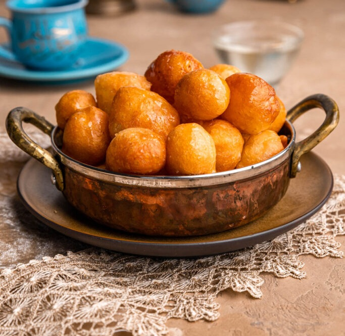

# Lugaimat

*A Khaleeji Ramadan sweet: small balls of yeasted batter deep-fried golden, drenched in date syrup or saffron sugar syrup, sprinkled with sesame.*

**Serves:** 6 (makes about 40 small balls)

**Prep Time:** 15 minutes (plus 1 hour rising)

**Cook Time:** 20 minutes

## Overview
The little golden dumpling that arrives on the table after iftar across the Khaleej, sometimes piled in a glass dish next to the dates and the qahwa, always disappearing faster than the cook can replace them. You mix a slack batter of flour, cornflour, yeast and milk powder with cardamom and saffron, then leave it to rest for an hour until it bubbles and puffs. Small balls of it drop into 170°C oil and fry for three or four minutes until they're deep gold and just hollow inside. While they're still warm you dunk them into date syrup or a saffron-cardamom sugar syrup so the outside crackles and the centre soaks the sweetness up. A sprinkle of sesame on top, eaten with the fingers, ideally with a tiny cup of cardamom coffee to cut the sugar.

## Ingredients

### Batter
- 250 g plain flour
- 30 g cornflour
- 1 sachet (7 g) fast-action yeast
- 1 tablespoon caster sugar
- 1 tablespoon milk powder
- ½ teaspoon ground cardamom
- 1 small pinch saffron (bloomed in 1 tablespoon hot water)
- 350 ml warm water (more if needed)
- 1 litre vegetable oil for deep frying

### Syrup (choose one)
#### Date syrup
-  200 g date syrup (warmed gently)

#### Sugar syrup:
- 200 g caster sugar 
- 120 ml water 
- 1 teaspoon lemon juice 
- ½ teaspoon ground cardamom 
- pinch saffron (boil 5 minutes, cool slightly)

### Garnish
- 1 tablespoon toasted sesame seeds

## Method

### Stage 1 - Batter
1. Whisk flour, cornflour, yeast, sugar, milk powder, cardamom in a large bowl.
1. Stir in the saffron-water and warm water gradually until you have a thick, sticky batter (slightly looser than pancake batter).
1. Cover; rest in a warm spot 1 hour until bubbly.

### Stage 2 - Syrup
1. Make the syrup (or warm the date syrup) and keep warm but not boiling.

### Stage 3 - Fry
1. Heat the oil to 170°C in a wide pan.
1. Wet your hand. Scoop a small amount of batter; squeeze through your thumb-and-forefinger fist into the oil to drop small walnut-sized balls. (Or use two teaspoons dipped in water.)
1. Fry in batches of 8-10, 3-4 minutes, turning, until deep gold all over.
1. Lift onto kitchen paper for 5 seconds.

### Stage 4 - Soak
1. While still hot, dunk each ball into the warm syrup for 5-10 seconds; lift; drain on a wire rack.

### Stage 5 - Finish
1. Stack on a plate; scatter with toasted sesame seeds.

### Stage 6 - Serve
1. Eat warm with qahwa (cardamom coffee) or strong black tea.

## Notes
- **Batter consistency:** Slack enough to fall from a wet hand but thick enough to hold a rough ball shape in the oil. Too thin and you get flat puffs; too thick and they don't fry through.
- **Date syrup is traditional:** Sold in Middle Eastern shops as "dibs" or "rub al rumman" labels. Darker, richer than honey. Saudi households go either way.
- **Soak briefly:** A few seconds glazes; longer and they go soggy.

## Storage
- Best fresh, eaten warm. Will keep 1 day in a tin; eat at room temperature.
- Don't refrigerate (the syrup crystallises).
