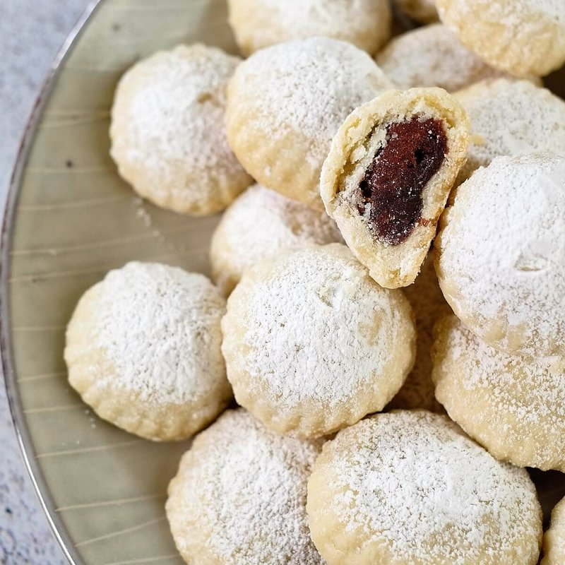

# Maamoul

*The Middle East's holiday cookie: semolina shortbread shells pressed in carved wooden moulds and stuffed with date, walnut or pistachio paste.*

**Makes:** 30 cookies

**Prep Time:** 1 hour (plus overnight resting)

**Cook Time:** 25 minutes

## Overview
The cookie that arrives in tins at every Middle Eastern festival worth marking, baked for Eid al-Fitr, Eid al-Adha, Christmas and Easter alike across Lebanese, Syrian, Iraqi and Gulf households. You make a short dough of fine semolina and plain flour with butter, milk and orange blossom water, then let it rest overnight so the semolina hydrates fully and the dough turns silky. Three classic fillings sit alongside: dates pounded with cinnamon and cloves, walnuts mixed with sugar and rose water, pistachios with sugar and a drop more orange blossom. Each cookie wraps a teaspoon of filling, gets pressed into a carved wooden mould (or scored by hand with the back of a knife), then bakes pale gold so the crust stays sandy and the filling stays soft. A dust of icing sugar at the end. Tea or coffee on the side, and a tin kept on the shelf for visitors who haven't yet been told about your batch.

## Ingredients

### Dough
- 400 g fine semolina
- 200 g plain flour
- 250 g unsalted butter (melted; or ghee)
- 80 g caster sugar
- 1 teaspoon mahleb (optional but classic)
- 1 teaspoon ground mastic (optional)
- ½ teaspoon ground cardamom
- ½ teaspoon active dry yeast
- 100 ml whole milk (warm)
- 2 tablespoons orange blossom water
- 1 tablespoon rosewater

### Date filling
- 300 g pitted dates (chopped)
- 30 g unsalted butter
- 1 teaspoon ground cinnamon
- ½ teaspoon ground cloves
- ½ teaspoon ground cardamom

### Walnut filling
- 200 g walnuts (chopped)
- 80 g caster sugar
- 1 tablespoon rosewater
- 1 teaspoon ground cinnamon

### Pistachio filling
- 200 g pistachios (chopped)
- 80 g caster sugar
- 1 tablespoon orange blossom water

### To finish
- Icing sugar for dusting

## Method

### Stage 1 - Dough (the day before)
1. Whisk the semolina, flour, sugar, mahleb, mastic and cardamom in a large bowl.
1. Pour over the warm melted butter; mix well to coat every grain.
1. Cover and rest 4 hours at room temperature (or overnight) - the semolina absorbs the butter.
1. Dissolve the yeast in the warm milk; rest 5 minutes.
1. Add to the semolina mixture with the orange blossom water and rosewater.
1. Mix to a soft, smooth dough; cover and rest 30 minutes.

### Stage 2 - Fillings
1. Date: cook the chopped dates with the butter and spices over low heat 5 minutes, mashing, until smooth. Cool. Roll into 30 small balls.
1. Walnut: mix the chopped nuts with sugar, rosewater and cinnamon.
1. Pistachio: mix the chopped pistachios with sugar and orange blossom water.

### Stage 3 - Shape
1. Heat the oven to 180°C (160°C fan).
1. Pinch a walnut-sized piece of dough; flatten on the palm to a 6 cm disc.
1. Place a teaspoon of filling in the centre; bring the edges up and over; pinch closed.
1. Roll into a smooth ball.

### Stage 4 - Mould or score
1. If using a maamoul mould: dust with flour; press the cookie smooth-side down into the mould; tap out onto a baking tray.
1. If hand-shaping: flatten the ball gently to a 4 cm thick disc; press a pattern in the surface with the tines of a fork or the back of a knife (date - diamond; walnut - round; pistachio - oval, traditionally).

### Stage 5 - Bake
1. Place on lined trays, 2 cm apart.
1. Bake 18-22 minutes until pale gold (not brown - maamoul stay light).
1. Cool fully on a wire rack - they firm up as they cool.

### Stage 6 - Dust and serve
1. Dust generously with icing sugar.
1. Serve with strong sweet coffee or tea.

## Notes
- **Pale, never golden:** Browned maamoul are overdone - the texture goes from soft-crumbly to dry. Pull from the oven before they colour.
- **Mahleb:** Ground sour cherry kernels; gives a faintly almond-cherry note unique to maamoul. Sold at Middle Eastern grocers; skip if unavailable.
- **Maamoul moulds:** Carved wooden moulds give the traditional patterns and a cleaner shape. Each filling has its mould (date is diamond-pattern; walnut and pistachio are round). A fork-pattern is the easy substitute.

## Storage
- Keeps 3 weeks in an airtight tin; flavour deepens.
- Freeze 3 months.
