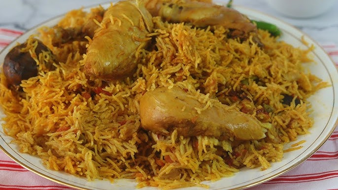

# Madghoot

*Saudi Arabia's pressure-cooked rice and lamb: bone-in shoulder marinated in baharat and dried lime, cooked fast with onion, basmati and stock.*

**Serves:** 4

**Prep Time:** 20 minutes (plus 1 hour marinating)

**Cook Time:** 50 minutes

## Overview
The fast Saudi cousin of mandi, made when you want kabsa-deep flavour but the day doesn't have three hours in it for the meat to cook. You give bone-in lamb a quick wet marinade of crushed tomato, baharat, dried lime, garlic and yogurt (the yogurt tenderises while the spice mix works in), then it goes into a pressure cooker with onion and stock for thirty minutes under pressure, which is what a slow oven would otherwise do in three hours. The cooking liquid gets strained out (it is the dish's stock), basmati cooks absorption-style in it for twelve to fifteen minutes, and the lamb returns on top to rest while the rice steams through. Served straight from the pot with sahawiq (the chilli-coriander relish that shows up on every Khaleeji table) and salata on the side. Weeknight kabsa, basically.

## Ingredients

### Lamb
- 1200 g bone-in lamb shoulder (cut into 4-6 large chunks)
- 2 tablespoons [Baharat](../../base-ingredients/spices/baharat.md) (or 1 tsp each: ground cumin, coriander, black pepper, allspice, cinnamon)
- 4 garlic cloves (crushed)
- 1 tablespoon tomato puree
- 3 tablespoons natural yogurt
- 1 ½ teaspoons salt
- 2 tablespoons vegetable oil

### Cooking
- 2 onions (large, sliced)
- 1 (400 g) tin chopped tomatoes
- 2 dried black limes (loomi, pierced; whole)
- 1 cinnamon stick
- 4 cardamom pods (bruised)
- 1.2 litres hot water (or stock)

### Rice
- 500 g basmati rice (rinsed and soaked 20 minutes, drained)
- 1 teaspoon salt (to taste)
- 1 large pinch saffron threads (bloomed in 2 tablespoons hot water)
- 3 tablespoons sliced almonds 
- 40 g pine nuts (toasted, optional)

## Method

### Stage 1 - Marinate
1. Mix baharat, garlic, tomato puree, yogurt, salt in a bowl. Coat the lamb; refrigerate 1 hour.

### Stage 2 - Brown
1. Heat the oil in a pressure cooker (sauté mode).
1. Brown the lamb hard on all sides, 3-4 minutes per side. Set aside.

### Stage 3 - Pressure-cook
1. In the same cooker, soften the onion 6-7 minutes.
1. Add tomatoes, dried limes, cinnamon and cardamom.
1. Return the lamb. Pour in the hot water.
1. Close the lid; pressure cook high 30 minutes.
1. Natural release 10 minutes; remaining steam release.

### Stage 4 - Separate
1. Lift the lamb out onto a plate (keep warm).
1. Strain the cooking liquid into a measuring jug; you need 800 ml. Top up with hot water if short.

### Stage 5 - Cook the rice
1. Return 800 ml of strained liquid to the cooker (no pressure). Add the drained rice, salt and saffron-water.
1. Bring to a boil; cover; reduce to lowest; cook 12-15 minutes until the liquid is absorbed.

### Stage 6 - Combine and rest
1. Lay the lamb pieces on top of the rice.
1. Cover; rest off heat 10 minutes.

### Stage 7 - Serve
1. Tip onto a wide platter, rice first, lamb on top.
1. Scatter toasted almonds and pine nuts if using.
1. Serve with sahawiq, yogurt and lemon wedges.

## Notes
- **No pressure cooker?** Use a heavy lidded pot; 2 hours simmering for the lamb, then the same rice step. Identical result, longer wait.
- **Dried lime / loomi:** The signature flavour. Pierce them; whole limes infuse without falling apart. Available from any Middle Eastern shop.
- **Strain and skim:** The cooking liquid will have a layer of fat. Strain, then skim the surface fat before pouring back over the rice; otherwise it floods the rice.

## Storage
- Refrigerate 3 days. Reheat covered with a splash of water.
- Freezes 2 months.
