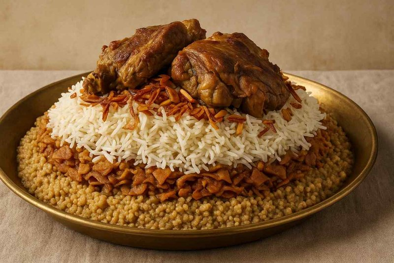

# Mathloutha

*A Saudi celebration platter: chicken, lamb and beef cooked together on the same spiced basmati rice. Made when one cut isn't enough; eaten communally.*

**Serves:** 8

**Prep Time:** 30 minutes (plus 30 minutes marinating)

**Cook Time:** 2 hours

## Overview
Lamb shoulder and beef chunks brown and slow-cook in a kabsa-spiced tomato base for 90 minutes until tender. Chicken pieces are added in the last 35 minutes (their cooking time is shorter). Rice cooks absorption-style in the strained meat broth with saffron and dried lime. All three proteins go on top of the rice for serving.

## Ingredients

### Three meats
- 600 g lamb shoulder (cut into 4 cm chunks)
- 500 g beef shin (or chuck, cut into 4 cm chunks)
- 6 bone-in chicken thighs

### Aromatics
- 3 tablespoons vegetable oil
- 2 onions (large, chopped)
- 8 garlic cloves (crushed)
- 1 thumb fresh ginger (grated)
- 2 (400 g) tins chopped tomatoes
- 3 tablespoons tomato puree
- 2 tablespoons kabsa spice mix (or 1 tsp each: ground cumin, coriander, cardamom, black pepper, allspice, cloves, cinnamon)
- 3 dried black limes (loomi, pierced; whole)
- 1 cinnamon stick
- 4 cardamom pods (bruised)
- 2 bay leaves
- 1 ½ teaspoons salt
- 1.8 litres hot water

### Rice
- 700 g basmati rice (rinsed; soaked 20 minutes; drained)
- 1 large pinch saffron threads (bloomed in 2 tablespoons hot water)
- 1 teaspoon salt (to taste)

### Garnish
- 2 onions (deep-fried until crisp, kept aside)
- 3 tablespoons sliced almonds (toasted)
- 3 tablespoons pine nuts (or pistachios, toasted)
- 4 tablespoons raisins (lightly fried)
- Lemon wedges
- Sahawiq and salata

## Method

### Stage 1 - Brown the lamb and beef
1. Heat the oil in a wide heavy pot.
1. Brown the lamb in batches; transfer to a plate.
1. Brown the beef in batches; transfer to the plate.

### Stage 2 - Build base
1. In the same pot, soften the onion 10 minutes.
1. Add garlic, ginger, kabsa spice mix, cardamom and cinnamon stick; cook 1 minute.
1. Add tomatoes and tomato puree; reduce 8 minutes until thick.

### Stage 3 - Slow cook
1. Return the lamb and beef; add bay, dried limes and salt; pour over hot water.
1. Bring to a simmer; cover; cook on low 1 hour 15 minutes.
1. Add the chicken thighs; cook a further 30-35 minutes until all three meats are tender.

### Stage 4 - Strain stock
1. Lift the meats onto a tray; tent with foil.
1. Strain the stock into a measuring jug; you need 1.2 litres. Top up with hot water if short.

### Stage 5 - Rice
1. Return 1.2 litres of strained stock to a wide pot. Add the drained rice, saffron-water, salt.
1. Bring to a boil; reduce heat to lowest; cover; cook 18 minutes.
1. Rest off heat (lid on) 5 minutes; fluff with a fork.

### Stage 6 - Plate
1. Tip the rice onto a wide platter.
1. Arrange lamb, beef and chicken on top.
1. Scatter fried onions, almonds, pine nuts and raisins.
1. Serve with sahawiq, salata and lemon wedges.

## Notes
- **Why three meats:** Saudi hospitality goes wide - serving one meat to guests would be modest, three is generous. Each diner picks what they want.
- **Don't rush the simmer:** Lamb shin needs 90 minutes minimum; rushing makes chewy meat. Beef joins the lamb; chicken comes in last to keep it moist.
- **One pot but better in stages:** Cooking the three meats separately is more space-efficient if your pot isn't huge.

## Storage
- Refrigerate 4 days; reheat covered.
- Freezes 2 months.
