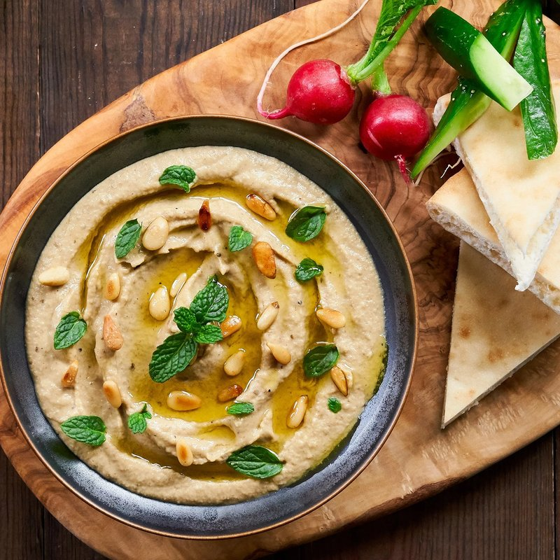

# Mutabbal

*Smoky aubergine dip, similar to baba ganoush but richer - yogurt joins the tahini, giving a creamier, slightly tart finish. The aubergines must char over flame for the proper smoky depth. Eats with warm flatbread, alongside meze, or smeared under grilled lamb.*

**Serves:** 4-6 as a side or starter

**Prep Time:** 15 minutes

**Cook Time:** 15 minutes

## Overview
The richer Levantine cousin of baba ganoush: aubergines charred until the skins blacken and the flesh inside has gone completely soft and smoky, then folded into tahini, yogurt, lemon and garlic for a creamier, slightly tart finish. The yogurt is the dish's defining move; where baba ganoush stays olive-oil rich, mutabbal carries a quiet dairy tang across the back. The aubergines have to char over a real flame (gas hob, grill or charcoal); the smoky depth that comes from open fire is exactly what an oven roast cannot give you. After charring you cool them, peel off the skins, drain the bitter water, and chop or mash the flesh by hand. Never blend, because pureeing turns the dip into babyfood and loses the texture that makes it. A pool of olive oil on top, a scatter of pomegranate seeds for colour and a sweet-sharp bite, warm flatbread torn alongside to scoop.

## Ingredients

- 3 aubergines (large, around 1.2 kg total)
- 100 g tahini (well-stirred)
- 100 g plain yogurt (Greek-style)
- 4 garlic cloves (crushed to paste with salt)
- 1 lemon (or to taste, juice)
- 1 teaspoon salt
- ½ teaspoon ground cumin
- A pinch of cayenne (or Aleppo pepper)
- 4 tablespoons extra-virgin olive oil

### To serve
- 2 tablespoons pomegranate seeds
- A small handful of flat-leaf parsley (chopped)
- A pinch of sumac
- Warm flatbread

## Method

### Stage 1 - Char
1. Place the aubergines whole directly on a gas flame; turn every couple of minutes.
1. Char 10-15 minutes until the skins are blackened all over and the aubergines feel completely soft and collapsed.
1. Or roast at 220°C for 40-45 minutes - less smoky but workable.
1. Cool slightly until handleable.

### Stage 2 - Drain
1. Peel off the blackened skins; discard.
1. Place the flesh in a colander; weight with a plate; rest 15 minutes - this drains excess water that would make the dip soggy.

### Stage 3 - Combine
1. Chop the drained flesh roughly with a knife (not a blender).
1. Tip into a bowl with the tahini, yogurt, garlic, lemon juice, salt, cumin and cayenne.
1. Stir thoroughly with a fork; the texture should be coarse but cohesive.
1. Taste; adjust lemon and salt.

### Stage 4 - Serve
1. Spread on a flat plate; create a swirl with the back of a spoon.
1. Drizzle generously with olive oil - the oil pool should sit in the swirl.
1. Top with pomegranate seeds, parsley and sumac.
1. Serve with warm flatbread.

## Notes
- **Char over flame for the smoke:** This is the difference between mutabbal and any other aubergine dip. Open windows; turn often.
- **Drain properly:** Wet aubergine flesh dilutes the tahini and yogurt. The 15-minute drain is non-negotiable.
- **Don't blend:** A food processor turns mutabbal into baby food. Chop with a knife or mash with a fork for proper texture.

## Storage
- Keeps 3 days refrigerated; the flavour deepens. Bring to room temperature before serving.
