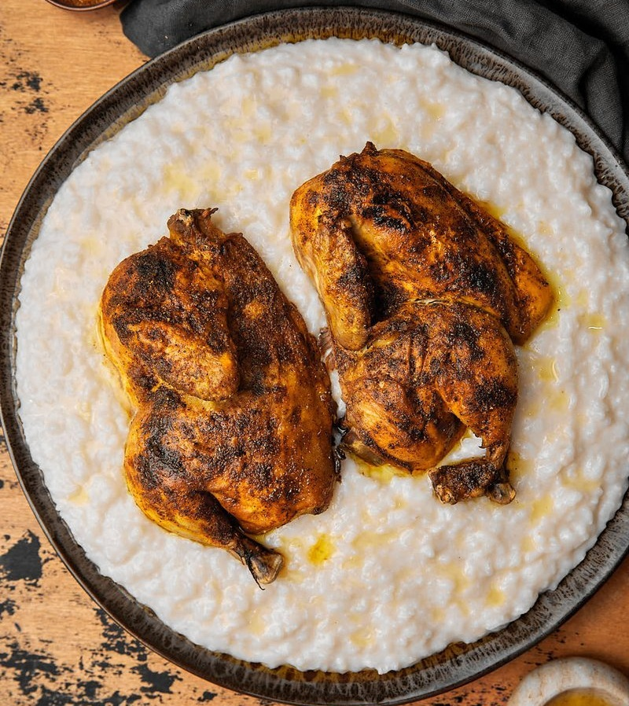

# Saleeg

*A Hijazi speciality: short-grain rice cooked in chicken broth and full-cream milk into a creamy savoury porridge, topped with butter-glazed chicken.*

**Serves:** 4

**Prep Time:** 15 minutes

**Cook Time:** 1 hour 30 minutes

## Overview
Whole chicken pokes in a stock of onion, cardamom, black lime, mastic and bay for 45 minutes. The chicken comes out; the stock is strained and reduced. Short-grain rice cooks in equal parts stock and warm whole milk for 35 minutes, stirring often, until it reaches a creamy, almost-risotto consistency. The chicken is brushed with butter and finished under the grill. Plate together; finish with brown butter and pepper.

## Ingredients

### Chicken and stock
- 1 whole chicken (1.4-1.6 kg) jointed into 8 pieces
- 2 onions (halved)
- 6 cardamom pods (bruised)
- 2 dried black limes (loomi - pierced)
- 1 mastic gum tear (optional)
- 2 bay leaves
- 8 black peppercorns
- 1 tablespoon salt
- 2 litres water

### Rice
- 400 g short-grain rice (Egyptian, Calrose or arborio at a pinch)
- 1.2 litres reduced chicken stock (from above)
- 600 ml whole milk (warm)
- 50 g unsalted butter
- 1 teaspoon salt (to taste)

### Finishing
- 60 g unsalted butter
- 1 teaspoon coarsely ground black pepper
- Yogurt and a small dish of sahawiq, on the side

## Method

### Stage 1 - Chicken
1. Place the chicken, onion, cardamom, black limes, mastic, bay, peppercorns, salt and water in a wide pot.
1. Bring to a simmer; skim the scum.
1. Cover; simmer 45 minutes until just cooked.
1. Lift the chicken pieces out onto a tray. Strain the stock through a sieve into a measuring jug.

### Stage 2 - Reduce stock
1. Return the strained stock to the pot; reduce on high heat to 1.2 litres (10 minutes if you need to).

### Stage 3 - Rice
1. Rinse the rice in 3 changes of cold water; drain.
1. In a heavy pot, melt the 50 g butter over medium heat. Add the rice; toast 1 minute.
1. Pour in the reduced stock; bring to a simmer.
1. After 15 minutes, when the rice has absorbed most of the stock, stir in the warm milk in 3 additions, stirring often.
1. Cook another 15-20 minutes on low heat, stirring frequently, until the rice is creamy and slightly soupy (it will thicken as it rests). Taste; adjust salt.

### Stage 4 - Finish the chicken
1. Heat the grill to high. Brush the chicken with melted butter.
1. Grill 5-7 minutes until the skin is deep gold and slightly crisped.

### Stage 5 - Plate
1. Tip the rice onto a wide platter; smooth.
1. Arrange the chicken pieces on top.
1. Brown the 60 g of butter in a small pan until golden and nutty (smells of toasted hazelnuts); pour over the rice.
1. Sprinkle generously with cracked black pepper.
1. Serve with yogurt and sahawiq.

## Notes
- **Short-grain matters:** Saleeg's texture is creamy and soupy. Long-grain (basmati) gives a dry pilaf - not saleeg. Egyptian, Calrose or Italian arborio work; even pudding rice.
- **Stir often:** Like risotto, this benefits from agitation. Lazy cooking gives lumpy or scorched rice.
- **Brown butter is the finish:** Plain melted butter is fine; properly browned butter (samna baladi) is signature - take it to a nutty deep gold, not black.

## Storage
- Best eaten fresh. The rice thickens cold; reheat with a generous splash of warm milk on low heat, stirring.
- Refrigerate 2 days; chicken keeps 3.
