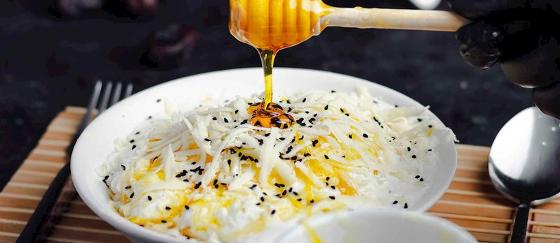

# Areeka

*A Saudi date-and-bread sweet: toasted whole-wheat bread torn into a dish with pitted dates, drenched in melted samna, pressed lightly to soak.*

**Serves:** 4 as a snack

**Prep Time:** 10 minutes

**Cook Time:** 10 minutes

## Overview
A Saudi sweet you can put together in five minutes from three ingredients you almost certainly have: bread, dates, samna. You tear soft, slightly toasted whole-wheat flatbread (khubz tameez works) into a heavy bowl, scatter pitted dates over it (medjool or kholas, the Saudi favourites), then press the mixture lightly with a wooden pestle or the back of a spoon while a generous pour of warm melted samna goes over the top. The dates collapse into the bread under the heat and the pressure, and the samna soaks through until you have a thick, buttery, intensely sweet mass that holds together in a spoon. Some versions add ground cardamom, a sprinkle of toasted sesame, or a final swirl of honey on top. Eat warm with the fingers or a spoon, traditionally for breakfast or as the sweet course at the end of a heavy meal.

## Ingredients

- 4 khubz tameez (medium, or other slightly toasted whole-wheat flatbreads)
- 250 g pitted dates (medjool, kholas, or ajwa)
- 80 g samna (clarified butter) or unsalted butter
- ½ teaspoon ground cardamom
- 1 tablespoon honey (optional)
- 1 tablespoon toasted sesame seeds (optional)

## Method

### Stage 1 - Warm the bread
1. If the bread is room temperature, warm briefly under a grill or on a dry pan until just toasted at the edges and pliable. Tear into 3-4 cm pieces.

### Stage 2 - Combine bread and dates
1. Place the torn bread in a wide heavy bowl.
1. Cut each date into 3-4 pieces (if very dry, soften in 1 tablespoon of hot water for 30 seconds first).
1. Scatter the dates over the bread.

### Stage 3 - Press and butter
1. Melt the samna in a small pan over low heat until just warm.
1. Pour over the bread and dates.
1. With a wooden pestle (or the back of a sturdy spoon), press and stir the mixture together - the dates break down, the bread absorbs the butter, everything combines into a dense, buttery, brown-flecked mass.
1. Stir in the cardamom and honey (if using).

### Stage 4 - Serve
1. Spoon into a wide shallow dish.
1. Sprinkle with sesame seeds.
1. Eat warm, with the fingers or a small spoon, alongside qahwa.

## Notes
- **Bread quality:** A whole-wheat flatbread with a slight tooth is best. Sliced sandwich bread doesn't work - the structure collapses into wet mush.
- **Date quality:** Medjool dates are huge, soft, caramelly. Kholas are smaller, more wrinkled, deeply Saudi. Ajwa (from Medina) are highly prized but expensive. All work.
- **Samna matters:** Indian ghee is the closest substitute. Plain butter works but lacks the slightly nutty samna character.

## Storage
- Best fresh, eaten warm. Keeps 1 day at room temperature.
- Don't refrigerate - the butter sets hard and the texture turns wrong.
