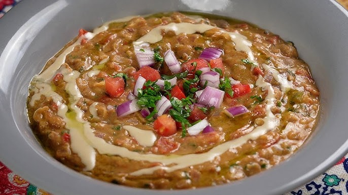

# Foul Saudi

*Saudi-style fava beans: dried favas slow-cooked till soft, warmed in olive oil with garlic, cumin and lemon, crushed into a chunky paste.*

**Serves:** 4

**Prep Time:** 10 minutes (plus overnight soaking)

**Cook Time:** 6 hours (or 45 minutes pressure-cooked)

## Overview
The Saudi take on foul medames, somewhere between the Egyptian original and the Yemeni daal-like versions. You soak dried fava beans overnight, then simmer them with a chickpea or two and a garlic clove for six hours low and slow (or pressure-cook for forty-five minutes if you don't have the day) until they're so soft they fall apart at a glance. Once drained, the beans go back into a hot pan with olive oil and garlic, cumin and a hit of chilli; you crush them roughly with a fork (chunky, not smooth) and finish with lemon and a handful of chopped parsley. Eat warm for breakfast across the Gulf, scooped with flatbread, with a side of pickles or salata hara, and a glass of mint tea.

## Ingredients

- 300 g dried small brown fava beans (foul mudammas variety)
- 50 g dried chickpeas (optional - the small white addition is traditional)
- 1 garlic clove (whole, for the cook)
- 1 ½ teaspoons salt (added later)
- 1.2 litres water

### To finish
- 4 tablespoons olive oil (extra virgin, plus more to drizzle)
- 4 garlic cloves (crushed)
- 1 teaspoon ground cumin
- ½ teaspoon ground chilli (or pinch of dried chilli flakes)
- 1 lemon (juice)
- 3 tablespoons fresh parsley (chopped)
- ½ teaspoon ground black pepper

### To serve
- 1 tomato (diced)
- 1 onion (small, diced)
- Lemon wedges
- Khubz tameez (or pita)

## Method

### Stage 1 - Soak
1. Place the fava beans (and chickpeas if using) in a bowl; cover with cold water by 5 cm; soak 12 hours.

### Stage 2 - Cook
1. **Slow:** Drain; place in a pot with the 1.2 litres of water and the whole garlic clove. Simmer covered on the lowest heat 5-6 hours until very soft.
1. **Pressure cooker:** 30 minutes high pressure; natural release.
1. Stir in 1 teaspoon salt; cook 5 minutes more.
1. Drain, reserving 100 ml of the cooking liquor.

### Stage 3 - Finish
1. Heat the olive oil in a wide pan over medium heat.
1. Add the crushed garlic, cumin and chilli; cook 30 seconds until aromatic.
1. Add the beans and 80 ml of reserved liquor; warm through, stirring, 3 minutes.
1. Crush lightly with a fork - some whole, some mashed.
1. Stir in lemon juice, parsley, pepper and the remaining ½ teaspoon salt. Taste.

### Stage 4 - Plate
1. Tip into a wide warm bowl.
1. Top with diced tomato and onion. Drizzle with extra olive oil.
1. Serve with khubz tameez or pita, and lemon wedges.

## Notes
- **Beans need time:** Properly soft fava beans take 6 hours on slow simmer. Cutting it short gives mealy texture and chalky bite.
- **Crush, don't blend:** The Saudi version keeps texture - half whole, half mashed. A food processor purées it into something else.
- **Tomato and onion on top:** Adds fresh crunch and acidity. Don't skip - the dish needs them.

## Storage
- Refrigerate 3 days; reheat with a splash of water and fresh oil.
- The cooked beans (before finishing) freeze well 2 months; finish fresh.
