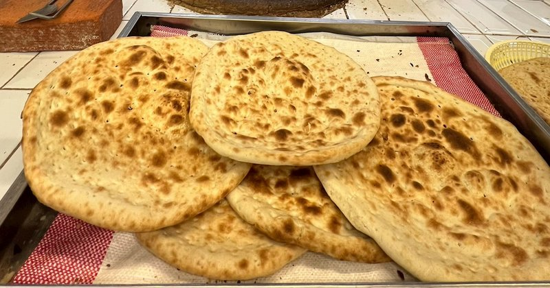

# Khubz Tameez

*A Saudi tandoor-style flatbread: baked at high heat against the side of a clay oven till blistered and golden. Thicker than roti, more pliable than naan.*

**Serves:** 4 (makes 6 breads)

**Prep Time:** 15 minutes (plus 1 hour 30 minutes rising)

**Cook Time:** 20 minutes (with a baking stone)

## Overview
A simple yeasted bread dough - plain flour, fast-action yeast, salt, sugar, olive oil and warm water - kneads, rises, divides into balls, shapes into thick rounds, and bakes on a screaming-hot stone or steel for 4-5 minutes per side. The result puffs slightly, blisters across the top, and stays soft inside.

## Ingredients

- 500 g plain flour (or replace 100 g with wholemeal for the traditional darker version)
- 1 sachet (7 g) fast-action yeast
- 1 ½ teaspoons salt
- 1 tablespoon caster sugar
- 2 tablespoons olive oil
- 320 ml warm water
- 1 teaspoon black sesame or nigella seeds (optional, for the top)

## Method

### Stage 1 - Dough
1. Whisk flour, yeast, salt and sugar in a bowl.
1. Add olive oil and warm water; mix to a soft dough.
1. Knead 8-10 minutes until smooth and elastic.
1. Cover; rise 1 hour until doubled.

### Stage 2 - Heat the oven
1. Place a baking stone, steel or upturned heavy baking tray on the top rack.
1. Heat the oven to 250°C (or as hot as it goes) for at least 30 minutes.

### Stage 3 - Shape
1. Knock back; divide into 6 equal balls.
1. Cover; rest 15 minutes.
1. Press or roll each into a 18 cm round, about 8 mm thick (thicker than a flatbread, thinner than a focaccia).
1. Press a fingertip pattern across the top of each (the traditional indent).
1. Sprinkle with sesame or nigella seeds.

### Stage 4 - Bake
1. Slide breads onto the hot stone using a peel or back of a tray (2 at a time).
1. Bake 3-4 minutes - the bottom should be deep gold and the top should puff and blister.
1. If your oven has a grill, hit the top with 60 seconds under the grill to colour the surface.

### Stage 5 - Stack
1. Stack the breads under a clean tea towel as they come out - the steam keeps them soft.

### Stage 6 - Serve
1. Eat warm. They keep all day in a tea towel; reheat in a dry pan or 200°C oven.

## Notes
- **Hot stone is essential:** Without it, the bottom doesn't crisp and the top doesn't puff. Pre-heat for at least 30 minutes; longer is better.
- **Thickness:** 8 mm is right. Thinner and you've made a pita; thicker and the middle stays raw.
- **Fingertip dimples:** Help control the puff and give the bread its characteristic look. Press all the way to the surface but not through.

## Storage
- Best fresh, eaten warm. Will keep wrapped in foil at room temperature 24 hours.
- Freezes 1 month.
