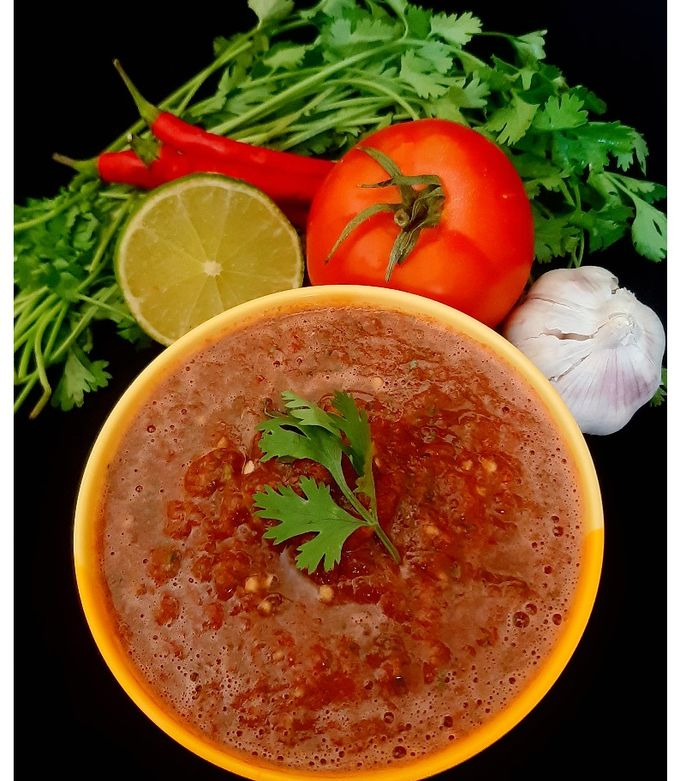

# Salata Hara

*The Saudi "hot salad": a chunky relish-salad of tomato, cucumber, onion, parsley and fresh green chilli, sharpened with lemon and a pinch of cumin. Served alongside almost everything - kabsa, mandi, grilled meats. Saudi tables aren't complete without it. Fast, vivid, crunchy, mildly hot.*

**Serves:** 4 as a side

**Prep Time:** 12 minutes

**Cook Time:** 0 minutes

## Overview
Tomato, cucumber and onion chop fine; parsley and green chilli go in; a quick dressing of lemon, olive oil, cumin and salt brings it together. Let it sit 5 minutes so the salt draws out a little tomato juice. Eat as a side or scoop with bread.

## Ingredients

- 3 ripe tomatoes (small dice)
- 1 medium cucumber (seeded, small dice)
- 1 small red onion (very finely chopped)
- 1-2 fresh green chillies (deseeded, finely chopped)
- 4 tablespoons fresh parsley (finely chopped)
- 2 tablespoons fresh mint (finely chopped, optional)
- 3 tablespoons olive oil
- Juice of 1 lemon
- ½ teaspoon ground cumin
- ½ teaspoon salt
- ¼ teaspoon ground black pepper

## Method

### Stage 1 - Chop
1. Dice the tomato, cucumber and onion to a similar small size.
1. Finely chop the chilli and herbs.

### Stage 2 - Combine
1. In a serving bowl, combine all the chopped vegetables.

### Stage 3 - Dress
1. In a small bowl, whisk olive oil, lemon juice, cumin, salt and pepper.
1. Pour over the salad; toss gently.
1. Let sit 5 minutes for flavours to mingle.

### Stage 4 - Serve
1. Taste; adjust salt and lemon. Serve at the table with any rice or meat dish.

## Notes
- **Chop sizes:** Aim for 5-6 mm cubes. Bigger and it's a chopped salad; smaller and it's a salsa. The middle gives the right scoopable texture.
- **Cucumber seeds:** Scrape them out; they bleed water and dilute the dressing.
- **Heat control:** One small chilli for a gentle Saudi version; two or three (with seeds) for a Yemeni-influenced hotter one.

## Storage
- Best within a few hours. Keeps 1 day refrigerated, but the tomatoes weep and the cucumber softens.
