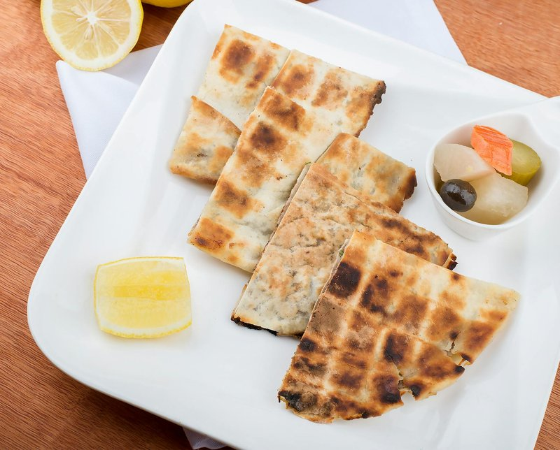

# Mutabbaq

*Saudi Arabia's folded street snack: paper-thin dough wrapped around spiced mince and egg, then crisped flat on a hot griddle.*

**Serves:** 4 (makes 4 large folded parcels, each cut in 4 squares)

**Prep Time:** 30 minutes (plus 1 hour dough rest)

**Cook Time:** 25 minutes

## Overview
A stretchy oil-rich dough rests for 1 hour to develop pliability; key to mutabbaq's paper-thin stretch. Filling: ground beef or lamb sautées with onion, leek (or scallion), garlic, baharat, cumin and pepper, cooled, then mixed with beaten eggs and chopped parsley just before folding (eggs go in raw and cook inside the pastry). Each dough ball oils heavily; stretched and pulled by hand on an oiled surface into a 35 cm thin square (translucent). The filling spreads in a 15 cm square in the centre. Edges fold in to enclose into a flat square parcel. Griddled on a hot pan with a glug of oil 2-3 minutes per side until amber-crisp and the egg has set inside. Cut into quarters; eaten warm.

## Ingredients

### Dough
- 400 g plain flour
- 1 teaspoon salt
- 60 ml sunflower oil
- 240 ml warm water
- A bowl of extra oil (for stretching the dough)

### Filling
- 2 tablespoons sunflower oil
- 1 large onion (finely diced)
- 1 small leek (white and pale green, finely chopped) OR 4 spring onions
- 4 garlic cloves (crushed)
- 400 g ground beef or lamb
- 1 ½ teaspoons baharat
- 1 teaspoon ground cumin
- 1 teaspoon ground coriander
- 1 ½ teaspoons salt
- ½ teaspoon black pepper

### To assemble
- 4 large eggs (beaten lightly)
- 4 tablespoons fresh parsley (chopped)
- 4 tablespoons fresh coriander (chopped)
- 1 green chilli (finely chopped, optional)

### For cooking
- 4 tablespoons sunflower oil (for the griddle, 1 tablespoon per parcel)

### To serve
- 2 limes (cut into wedges)
- Pickled chillies or sweet chilli dipping sauce

## Method

### Stage 1 - Dough
1. Mix flour and salt; add oil and warm water; knead to a soft sticky dough.
1. Knead 10 minutes by hand or 7 in a stand mixer until very smooth and elastic.
1. Divide into 4 balls.
1. Smear each with oil; rest in an oiled bowl, covered, 1 hour minimum.

### Stage 2 - Filling
1. Heat oil over medium; add onion; cook 6 minutes until soft.
1. Add leek and garlic; cook 3 minutes.
1. Add mince; brown 6 minutes, breaking up.
1. Stir in baharat, cumin, coriander, salt and pepper; cook 1 minute.
1. Off heat; cool fully (very important).

### Stage 3 - Stretch the dough
1. Heavily oil a wide work surface AND your hands.
1. Take one dough ball; flatten between palms; pull and stretch outward into a paper-thin square 35 cm across. The dough should be translucent in the centre. Small tears are OK (they fold over).

### Stage 4 - Fill and fold
1. Just before folding, mix one quarter of the cool filling with 1 beaten egg and 1 tablespoon each of parsley and coriander.
1. Spoon into a 15 cm square in the centre of the stretched dough.
1. Fold the four edges of the dough over the filling - left, right, top, bottom - overlapping into a flat closed square parcel about 18 cm.

### Stage 5 - Griddle
1. Heat a wide non-stick frying pan over medium-high heat with 1 tablespoon oil.
1. Place the parcel seam-side-DOWN.
1. Cook 2-3 minutes; the underside should be golden-brown.
1. Flip; cook 2-3 more minutes; press gently with a spatula.
1. The internal egg should be just set.
1. Lift onto a board.

### Stage 6 - Cut and serve
1. Cut each parcel into 4 squares.
1. Plate with lime wedges and pickled chilli.
1. Eat hot.

## Notes
- **Paper-thin stretch is the technique:** A 35 cm translucent square from a tennis-ball of dough is the goal. The high oil content of the dough makes this possible without tearing - if it tears, patch with a small piece of stretched dough.
- **Raw egg in the filling cooks inside:** The beaten egg gets folded in just before stretching; it cooks during griddling and binds the filling. Don't pre-cook the egg.
- **Hot pan, small amount of oil:** The crust crisps from contact with hot pan + a small slick of oil. Too much oil and the crust becomes greasy; too little and it sticks.

## Storage
- Best fresh.
- Cool and refrigerate 2 days; re-crisp in a dry pan 1 minute per side.
- The filling alone (cooked, without eggs) keeps refrigerated 3 days.
