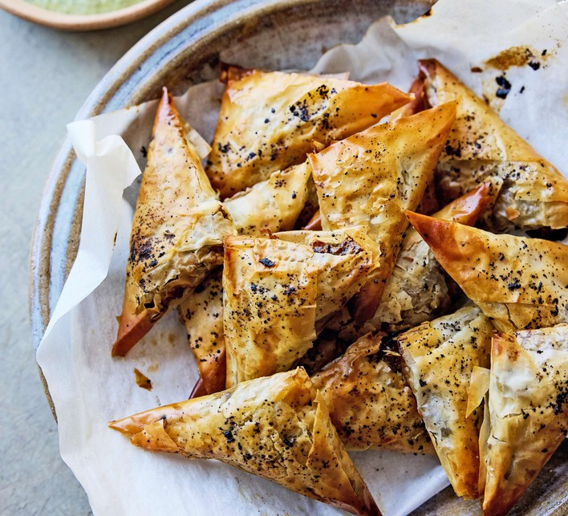

# Samboosa

*Saudi Arabia's Ramadan triangle: thin wrappers folded around spiced minced beef with onion and baharat, deep-fried amber-crisp.*

**Serves:** 6 (makes 20 samboosa)

**Prep Time:** 30 minutes

**Cook Time:** 15 minutes

## Overview
Minced beef (or chicken) browns with diced onion, garlic and Saudi spice mix (baharat, black pepper, cumin, coriander, cardamom, cinnamon, allspice). Pine nuts toast in; chopped parsley and lemon zest finish; the filling cools fully. Spring-roll wrappers (or samboosa pastry sheets) fold into traditional triangular packets, fold the long strip into a triangle pocket; spoon filling; continue folding into a stacked triangle; seal with a flour-and-water paste. Deep-fried at 180°C in 3-4 cm of oil until amber-gold. Drained and eaten warm.

## Ingredients

### Filling
- 400 g lean ground beef (or chicken)
- 2 tablespoons sunflower oil
- 1 medium onion (finely diced)
- 4 garlic cloves (crushed)
- 1 ½ teaspoons baharat (Saudi seven-spice - sold at Middle Eastern shops)
- 1 teaspoon ground allspice
- ½ teaspoon ground cinnamon
- 1 dried black lime (loomi, crushed; optional, traditional)
- 1 ½ teaspoons salt
- ½ teaspoon black pepper
- 30 g pine nuts (toasted)
- 3 tablespoons fresh parsley (chopped fine)
- Zest of ½ lemon

### Wrappers and sealing paste
- 20 spring-roll wrappers (the thin square or rectangular kind - sold at Asian shops) OR 20 samboosa pastry sheets
- 2 tablespoons plain flour mixed with 3 tablespoons cold water (the flour paste seals the pastry)

### For frying
- 1 litre vegetable oil

### To serve
- Lemon wedges
- Tahini-yogurt dip (200 g yogurt + 2 tablespoons tahini + juice of ½ lemon + a pinch of salt)
- A small bowl of green hot sauce (Saudi sahawiq / Yemeni zhug)

## Method

### Stage 1 - Filling
1. Heat oil over medium-high.
1. Add onion; cook 6 minutes until golden.
1. Add garlic; cook 1 minute.
1. Add mince; break up; brown 6 minutes.
1. Stir in baharat, allspice, cinnamon, crushed black lime, salt and pepper; cook 1 minute.
1. Off heat; stir in pine nuts, parsley and lemon zest.
1. Cool fully - warm filling tears the wrappers.

### Stage 2 - Fold
1. Cut spring-roll wrappers into long strips (about 8 cm wide, 25 cm long) if using full sheets - usually they come pre-cut.
1. Place 1 tablespoon of filling at the bottom corner.
1. Fold corner over filling diagonally to make a triangle.
1. Continue folding triangle-over-triangle up the strip.
1. Brush the last edge with flour paste; press to seal.

### Stage 3 - Fry
1. Heat oil to 180°C.
1. Fry 5-6 samboosa at a time, 2-3 minutes, turning, until amber-gold.
1. Lift onto kitchen paper.

### Stage 4 - Serve
1. Pile on a warm plate.
1. Offer tahini-yogurt dip and hot sauce.
1. Eat warm.

## Notes
- **Cool the filling fully:** Hot or warm filling melts the spring-roll wrappers and produces gluey samboosa.
- **Triangle fold takes practice:** Diagonally fold corner-over-corner, working up the strip like folding a flag. A bit of filling visible is fine; gaps need sealing with flour paste.
- **Black lime is the Saudi note:** Dried lime (loomi / noomi basra) gives a distinctive fermented-citrus flavour. Optional; without it, add an extra teaspoon of lemon zest.

## Storage
- Best within 30 minutes.
- Filled raw samboosa freeze 2 months on a tray; fry from frozen at 170°C for 5 minutes.
- Cooked: refrigerate 2 days; re-crisp at 200°C 5 minutes.
