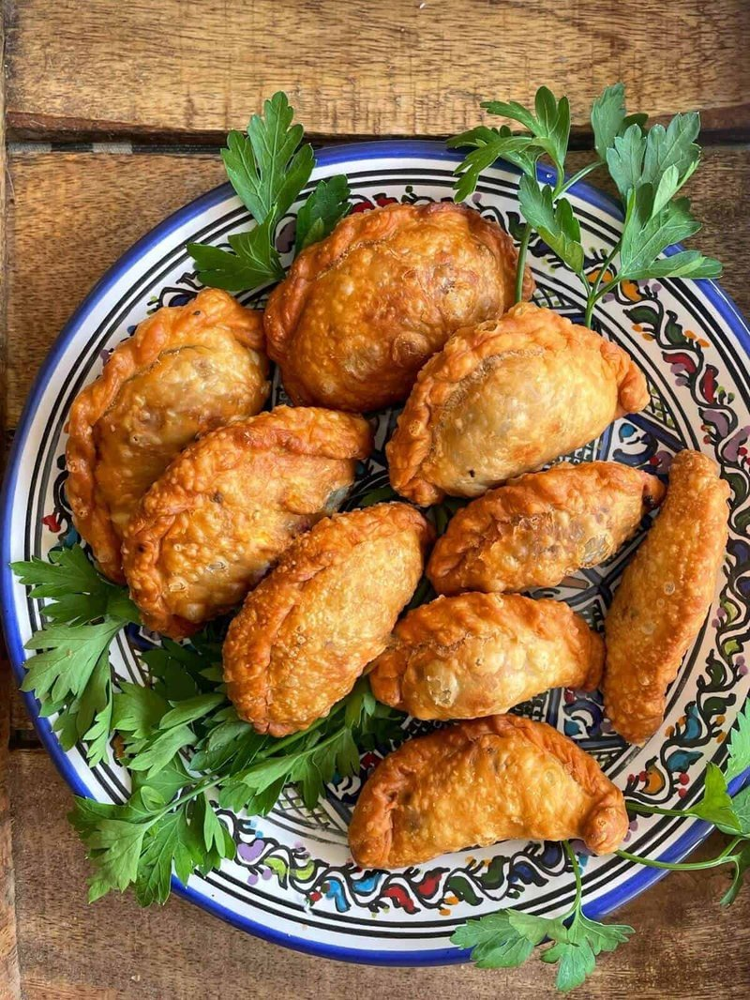

# Sambousek Jibneh

*The Arabian cheese sambousek: half-moon pastries filled with akkawi, halloumi and parsley, deep-fried or baked golden.*

**Serves:** 4 (makes 24 sambousek)

**Prep Time:** 30 minutes (plus 20 min dough rest)

**Cook Time:** 12 minutes (fried) OR 18 minutes (baked)

## Overview
The Levantine-Arabian cheese half-moon, the milder vegetarian cousin to the meat sambousek. You roll a smooth pliable dough from oil, yogurt and flour and let it rest briefly while you build the filling: grated akkawi (desalted by soaking for thirty minutes) or a mix of low-moisture mozzarella and halloumi, crumbled feta, chopped parsley, scallion, mint, an egg yolk to bind and a touch of ground black pepper. The dough rolls to three millimetres, cuts into eight-centimetre rounds, gets a spoon of filling in the centre, folds into a half-moon and is crimped sharp with a fork. From there it's either deep-fried at 175°C for two minutes a side until golden, or brushed with egg wash, scattered with sesame seeds and baked at 200°C for fifteen to eighteen minutes. The cheese melts inside the sealed shell, the pastry browns. Eat warm with labneh or a chilli-lemon dip on the side.

## Ingredients

### Pastry
- 300 g plain flour
- ½ teaspoon salt
- 100 ml sunflower oil (or olive oil)
- 100 g Greek yogurt
- 1 egg (large)
- 1 teaspoon white wine vinegar
- 50-80 ml cold water (as needed)

### Filling
- 150 g low-moisture mozzarella 
- 50 g halloumi (grated, halloumi rinsed to reduce salt)
- 100 g feta cheese (crumbled)
- 1 egg yolk (large)
- 3 tablespoons fresh parsley (chopped fine)
- 2 spring onions (finely chopped)
- 1 tablespoon fresh mint (chopped) or 1 teaspoon dried mint
- ½ teaspoon black pepper
- A pinch of nutmeg
- 1 teaspoon nigella seeds (optional)

### Egg wash (for baked version)
- 1 egg yolk (beaten with 1 tablespoon milk)
- 1 tablespoon sesame seeds (white)
- 1 tablespoon black sesame seeds (optional, for visual)

### For frying (alternative)
- 1 litre vegetable oil

## Method

### Stage 1 - Pastry
1. Whisk flour and salt; rub in oil with fingertips.
1. Whisk yogurt with the egg and vinegar; mix into the flour.
1. Add water 1 tablespoon at a time to a smooth pliable dough.
1. Wrap; rest 20 minutes.

### Stage 2 - Filling
1. Mix grated akkawi (or mozzarella-halloumi blend), crumbled feta, egg yolk, parsley, spring onion, mint, pepper, nutmeg and nigella in a wide bowl.
1. Don't add extra salt - the cheeses are salty.

### Stage 3 - Roll
1. Heat oven to 200°C (180°C fan) if baking.
1. Roll pastry on a lightly floured surface to 3 mm.
1. Cut out 8 cm rounds (a small bowl or biscuit cutter).
1. Re-roll scraps once.

### Stage 4 - Fill and crimp
1. Place 1 teaspoon of filling on each round.
1. Brush the edge with water; fold into a half-moon; press to seal.
1. Crimp the curved edge with a fork.

### Stage 5 - Cook (choose one)
**Baked**:
1. Place on a lined baking tray; brush with egg wash; sprinkle with sesame and nigella.
1. Bake 15-18 minutes until deep golden brown.

**Fried**:
1. Heat oil to 175°C.
1. Fry 4-5 at a time, 90 seconds per side, until amber-gold.
1. Lift onto kitchen paper.

### Stage 6 - Serve
1. Eat warm. The cheese is hot and melty.

## Notes
- **Akkawi is the authentic cheese:** A brined cow's-milk Levantine cheese, mild and milky, melts smoothly. The mozzarella-halloumi substitute is the practical option outside the region - mozzarella gives the stretch; halloumi gives the salt and a hint of squeaky texture.
- **Don't over-salt:** Feta + akkawi (even desalted) + halloumi all bring salt. Skip adding extra; the filling is plenty seasoned.
- **Fried vs baked:** Fried gives the crispest, richest result. Baked is lighter, more practical for a batch, and works well with the egg-wash-and-sesame finish.

## Storage
- Best within 1 hour of cooking.
- Refrigerate 3 days; reheat at 200°C oven 5 minutes.
- Filled raw sambousek freeze 2 months; bake from frozen at 200°C for 22 minutes, or fry from frozen at 170°C 4 minutes per side.
