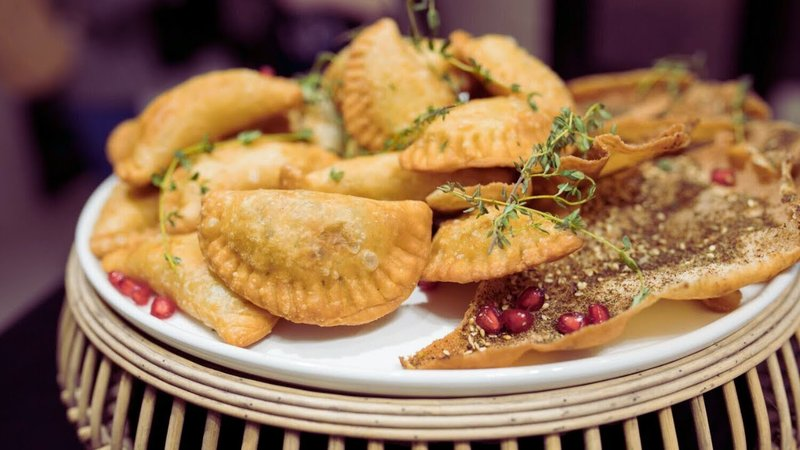

# Sambousek Bil Lahm

*A Saudi meat sambousek: crescent-shaped pastries with a spiced lamb mince filling, crimped along the edge and either baked or fried. The iftar mainstay.*

**Serves:** 6 (makes 24)

**Prep Time:** 1 hour (plus 30 minutes resting)

**Cook Time:** 25 minutes

## Overview
The meat-filled half-moon that sits next to the cheese version on every Levantine-Arabian table. You roll a soft butter-and-yogurt dough thin, stamp it into nine-centimetre rounds, and place a teaspoon of spiced lamb mince in the centre of each. The lamb is fragrant with baharat, onion, toasted pine nuts and a touch of pomegranate molasses that adds a sweet-sharp depth you can't quite place. The rounds fold into half-moons and crimp with a fork. From there they go either route: deep-fried at 170°C for three or four minutes per side, or baked at 200°C for eighteen to twenty minutes with an egg wash for shine. The pastry blisters lightly, the filling stays juicy. Eaten warm with a wedge of lemon, often as part of a meze spread alongside hummus, mutabbal, salata and warm flatbread.

## Ingredients

### Dough
- 500 g plain flour
- 1 teaspoon salt
- 1 teaspoon caster sugar
- 100 g unsalted butter (softened)
- 3 tablespoons natural yogurt
- 1 egg (large)
- 150 ml warm water

### Filling
- 400 g lamb mince
- 2 tablespoons olive oil
- 1 onion (medium, very finely chopped)
- 3 garlic cloves (crushed)
- 1 ½ teaspoons [Baharat](../../../base-ingredients/spices/baharat.md)
- ½ teaspoon ground cinnamon
- ½ teaspoon ground allspice
- 40 g pine nuts (toasted)
- 1 tablespoon pomegranate molasses
- 2 tablespoons fresh parsley (chopped)
- salt
- pepper

### To finish
- 1 egg yolk + 1 tablespoon milk (for egg wash if baking)
- OR 1 litre vegetable oil for deep frying
- 1 tablespoon sesame seeds (optional, for baking)

## Method

### Stage 1 - Dough
1. Whisk flour, salt and sugar in a bowl.
1. Rub in the butter to fine crumbs.
1. Whisk yogurt, egg and warm water; pour in; mix to a soft dough.
1. Knead 4-5 minutes until smooth. Cover; rest 30 minutes.

### Stage 2 - Filling
1. Heat the olive oil in a wide pan over medium heat.
1. Brown the lamb hard, breaking up clumps; pour off excess fat.
1. Add the onion; cook 5 minutes.
1. Stir in garlic, baharat, cinnamon and allspice; cook 1 minute.
1. Splash 80 ml of water; simmer 4 minutes until dry.
1. Off the heat, stir in pine nuts, pomegranate molasses, parsley, salt and pepper.
1. Cool completely.

### Stage 3 - Shape
1. Roll the dough to 2 mm thick on a lightly floured board.
1. Stamp out 9 cm rounds.
1. Place 1 teaspoon of filling in the centre of each.
1. Fold into a half-moon; press the edge to seal; crimp with a fork or pinch into pleats.

### Stage 4 - Cook (choose one)
1. **Fry:** Heat oil to 170°C. Fry in batches of 5, 2-3 minutes per side until deep gold. Drain on paper.
1. **Bake:** Heat oven to 200°C (180°C fan). Place sambousek on a lined tray. Brush with egg wash; scatter sesame seeds. Bake 18-20 minutes until deep gold.

### Stage 5 - Serve
1. Eat warm. A small dish of laban (drinking yogurt) or a wedge of lemon completes the plate.

## Notes
- **Pomegranate molasses:** Adds depth and a slight sweet-sourness that's distinctly Levantine-Arabian. Don't substitute.
- **Cool filling:** Warm filling steams the dough from inside and breaks the seal in the fryer. Cool fully.
- **Bake vs fry:** Frying gives shatter, baking gives soft. Both are right. Saudi households do both.

## Storage
- Refrigerate (cooked) 3 days; reheat at 180°C.
- Freeze unbaked / unfried 2 months. Cook from frozen, adding 4-5 minutes.
