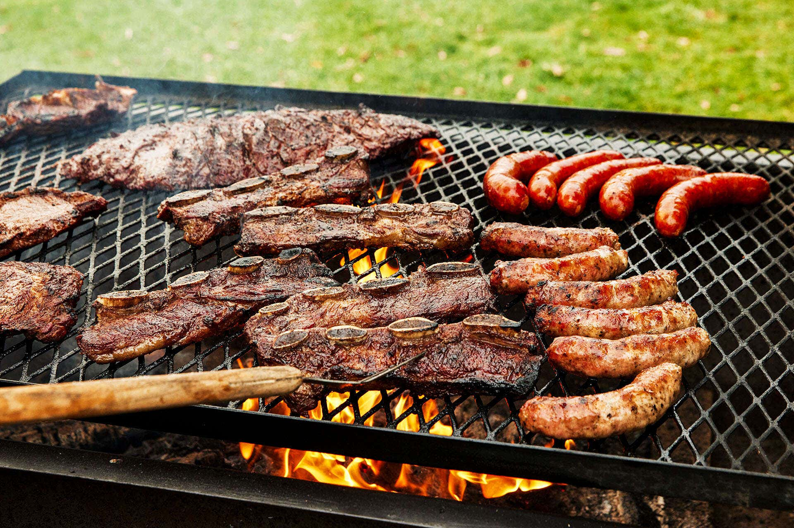

# Asado (Argentine Barbecue)

*Argentina's national ritual: multiple cuts of beef (bife de chorizo, vacío, asado de tira, entraña), morcilla (blood sausage) and chorizo grilled over open wood-and-charcoal fire on a flat parrilla grate or hung crucified-style on a wooden cross. Salt only; no marinades. Served with chimichurri, provoleta, salsa criolla, bread, Malbec and 4-hour conversations. The Sunday-afternoon ritual that defines Argentine social life.*

**Serves:** 8-10

**Prep Time:** 30 minutes (plus 1 hour fire-building)

**Cook Time:** 3-4 hours (slow open-fire grilling)

## Overview
Asado is Argentina's most sacred food ritual, far more than a barbecue, it's the Sunday social anchor for every Argentine family. The construction is built around the parrilla (a flat metal grate that sits over slow-burning embers, not flames) or the cruz (a wooden cross on which whole lambs and goats are tied and slow-cooked beside the fire). The hierarchy of cuts: chorizo and morcilla go on first (eaten as choripán starters with chimichurri); then offal, molleja (sweetbreads), chinchulines (small intestine), riñones (kidneys); then the beef cuts, asado de tira (short ribs cross-cut), vacío (flank), entraña (skirt), bife de chorizo (sirloin), tira de asado (rack of ribs). Salt only, no marinades, no rubs; Argentine asado is about the meat, the fire and the time. The asador (the host who grills) is responsible for the fire and is the social centre. Sides: provoleta, salsa criolla, ensalada de tomate, simple lettuce salad, bread. Chimichurri is the only condiment; Malbec (Mendoza) is the drink; 4-hour conversations are mandatory.

## Ingredients

### The meats (for 8-10)
- 1500 g asado de tira (short ribs, cross-cut into 3 cm strips): the traditional first beef cut
- 1 kg vacío (flank steak, with the fat cap on): the asador's favourite
- 800 g bife de chorizo (sirloin steak) OR entraña (skirt): premium cuts
- 6 chorizo sausages (Argentine; sweet or spicy)
- 6 morcilla (Argentine blood sausages with rice and spices)
- 400 g molleja (sweetbreads, optional but traditional)
- 200 g chinchulines (small intestine, optional; very traditional, very strong)

### Seasoning
- 200 g coarse rock salt (sal gruesa; the only seasoning)

### Sides and sauces
- 1 batch [chimichurri](side-dishes/chimichurri.md) sauce
- 1 batch salsa criolla (see [ensalada criolla](side-dishes/ensalada-criolla.md))
- 1 round of provoleta cheese (250 g)
- 2 fresh baguettes (pan francés)
- Mixed green salad (lettuce, tomato, onion)
- Boiled potatoes or fried potatoes alongside

### To drink
- 2-3 bottles of Argentine Malbec (Mendoza; Catena Zapata, Trapiche, Norton)
- Cold beer for the asador while cooking
- A pitcher of water

### Equipment
- A parrilla (flat grill over coals) OR a cross/cruz set-up
- Hardwood (quebracho or carob ideally; oak works) and charcoal
- Long tongs
- A long fork
- A wooden cutting board for serving

## Method

### Stage 1 - Build the fire (1 hour ahead)
1. Build a hardwood fire to one side of the parrilla.
2. Let it burn down for 45-60 minutes till the wood becomes red glowing embers (not flames).
3. Rake the embers under the parrilla in an even layer, slightly more under the cuts that need higher heat.
4. The parrilla grate should be hot enough that you can hold a hand over it for 4-5 seconds (not less).

### Stage 2 - Season the meats
1. Pat all meats dry.
2. Salt generously with coarse rock salt just before placing on the grill (don't salt hours ahead, draws moisture).

### Stage 3 - Start with chorizo and morcilla
1. Place 6 chorizos and 6 morcillas on the cooler side of the parrilla.
2. Cook 15-20 minutes, turning occasionally, till browned and just cooked through.
3. Remove; slice and serve as choripán starters in bread with chimichurri.

### Stage 4 - Then the offal (if using)
1. Place sweetbreads and chinchulines on hot heat.
2. Cook 10-12 minutes till crisp on the outside, tender within.
3. Serve immediately with chimichurri and a wedge of lemon.

### Stage 5 - The beef cuts (in order of cooking time)
1. **Asado de tira (short ribs):** place bone-side-down. Cook 30 minutes per side over medium heat. Total 60-90 minutes.
2. **Vacío (flank):** place fat-side-down. Cook 25-30 minutes per side. Internal target 55°C for medium-rare.
3. **Bife de chorizo (sirloin):** cook 8-10 minutes per side over medium-high. Internal target 50-55°C.

### Stage 6 - Rest the meats
1. As each cut comes off, place on a wooden board.
2. Tent loosely with foil (NOT sealed).
3. Rest 8-10 minutes before slicing.

### Stage 7 - Provoleta
1. Place a thick disc of provolone on the parrilla.
2. Sprinkle with dried oregano and a few chilli flakes.
3. Grill 3-4 minutes till the bottom browns and the top bubbles.
4. Serve immediately on a small board.

### Stage 8 - Slice and serve at the table
1. Place the wooden board in the centre of a long table.
2. Slice each cut against the grain, in thick slices.
3. Each diner takes what they want; pass the chimichurri, salsa criolla, bread, salad.
4. Pour Malbec generously.
5. Talk for 3-4 hours.

## Notes
- **Wood coals not flames:** the traditional asado cooks over embers, not over open flame. Flames char the meat and impart bitter taste.
- **Salt only:** no marinades, no rubs, no sauces during cooking. Argentine asado is about the meat itself.
- **The asador is sacred:** one person is responsible for the fire. Don't let anyone else interfere.
- **The hand test:** hold your hand 15 cm above the grate. If you can hold it 4-5 seconds, the heat is right. Less, too hot; more, too cold.
- **Eat the cuts in order:** chorizo/morcilla first (as choripán starters), then offal, then the beef cuts. The Argentine order is sacred.

## Variations
- **Asado al asador (cross-grilled):** whole lamb, goat, or pig tied to a wooden cross and slow-cooked beside the fire for 4-6 hours. The Patagonian variant.
- **Smaller home asado:** a small parrilla on a balcony - 2 cuts of beef, chorizo, morcilla, and provoleta, feeds 4.
- **Charcoal-only asado:** less traditional but works (uses pure charcoal instead of wood); easier in apartment settings.
- **Asado para vegetarianos:** the modern Argentine vegetarian variant, grilled portobello, halloumi, peppers, courgette; chimichurri the same.
- **Patagonian lamb asado:** whole lamb cross-grilled for 6 hours, the Patagonian ritual.
- **Bife de chorizo a la milanesa:** the milanesa interpretation, schnitzel-style, breaded and fried.

## Serving
- Every Sunday afternoon in every Argentine home (the traditional setting) · at a Buenos Aires parrilla restaurant · at a Patagonian estancia (ranch) · at a Mendoza wine-country lunch · at an Argentine Independence Day celebration (9 July) · at an Argentine wedding reception · at home with Malbec and friends.

## Storage
- Leftover cooked meat refrigerates 3 days; eat cold sliced with chimichurri.
- Sliced asado in a sandwich (with chimichurri) is the traditional Monday lunch.
- Don't freeze cooked beef (texture suffers).
- The chimichurri keeps 2 weeks refrigerated; gets better with age.
