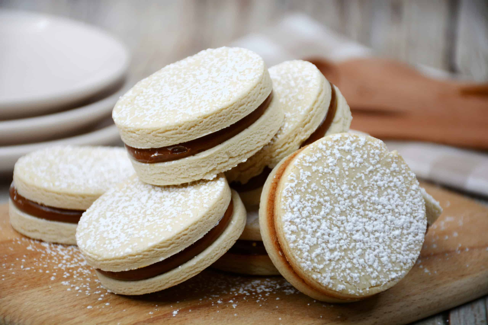

# Alfajores

*Argentina's iconic sandwich biscuit: two short, crumbly cornflour-and-vanilla biscuits sandwiched with a generous filling of dulce de leche, sometimes rolled in desiccated coconut around the dulce edge, sometimes dipped in chocolate. The traditional Argentine sweet; the country's most exported food; the dish that every Argentine bakery sells, every Argentine eats with coffee, every Argentine child grows up loving.*

**Serves:** Makes 24 alfajores

**Prep Time:** 30 minutes (plus 1 hour dough chill)

**Cook Time:** 15 minutes

## Overview
Alfajores are Argentina's most universally beloved biscuit: the traditional "with-coffee" snack at every Argentine merienda (tea-time), the country's most exported food, present at every children's birthday party, every wedding favour and every supermarket biscuit aisle. Spanish-Moorish roots (the name comes from the Arabic al-hashu, "the stuffed one"); the modern Argentine form was refined in the 19th and 20th centuries. Three components: short crumbly biscuits made with a high proportion of cornflour to plain flour (the cornflour gives the traditional melt-in-mouth crumb, hence alfajores de maicena), a thick layer of dulce de leche sandwiched between two biscuits, and a coating: either desiccated coconut around the visible dulce edge or a chocolate dip. The biscuits bake to just pale golden, barely coloured, to keep the soft crumb. The dulce filling is generous; about a tablespoon per alfajor.

## Ingredients

### Biscuit dough (makes 48 biscuits = 24 alfajores)
- 200 g cornflour
- 200 g plain flour
- 200 g cold butter (cubed)
- 100 g icing sugar (sifted)
- 4 large egg yolks
- 1 teaspoon vanilla extract
- 1 teaspoon brandy or rum (optional; traditional Argentine touch)
- Zest of 1 lemon
- 1 teaspoon baking powder
- A pinch of fine sea salt

### Filling
- 500 g dulce de leche (homemade or shop-bought)

### Coating
- 200 g desiccated coconut (for rolling) OR
- 300 g dark chocolate (melted; for dipping) OR
- 100 g icing sugar (for dusting plain alfajores)

## Method

### Stage 1 - Make the biscuit dough
1. In a large bowl, sift the cornflour, plain flour, baking powder, and salt.
2. Add the cold cubed butter; rub in with fingertips till the mixture looks like fine breadcrumbs.
3. Add the icing sugar; stir.
4. In a small bowl, whisk the egg yolks, vanilla, brandy (if using), and lemon zest.
5. Add to the dry mix; bring together with a spoon, then your hands, into a smooth dough.
6. Don't overwork.
7. Wrap in cling film; refrigerate 1 hour.

### Stage 2 - Roll and cut
1. Preheat oven to 170°C / 150°C fan / 325°F.
2. Line two baking trays with parchment.
3. Roll the dough out between two sheets of cling film (helps prevent sticking) to 4-5 mm thickness.
4. Cut into 5 cm rounds.
5. Transfer to the trays.

### Stage 3 - Bake
1. Bake for 12-15 minutes till the biscuits are JUST set but still pale.
2. Don't brown them; the traditional alfajor biscuit is barely coloured.
3. Cool on a wire rack completely (about 30 minutes).

### Stage 4 - Sandwich with dulce
1. Pair up the cooled biscuits.
2. Spread a generous tablespoon of dulce de leche on the flat side of one biscuit.
3. Top with the second biscuit (flat sides together).
4. Press gently; the dulce should ooze slightly to the edge.

### Stage 5a - Coconut coating (traditional maicena version)
1. Place the desiccated coconut on a plate.
2. Roll the edge of each alfajor in the coconut so the visible dulce around the sandwich is coated.
3. The result: a sandwich biscuit with a coconut-coated band around the dulce edge.

### Stage 5b - Chocolate dipping (alfajor de chocolate)
1. Melt the dark chocolate gently (microwave at 50% power, or bain-marie).
2. Dip each alfajor completely in the melted chocolate; let excess drip off.
3. Place on parchment to set (about 30 minutes).

### Stage 5c - Icing sugar dusting (plain version)
1. Dust the completed alfajores lightly with icing sugar.

### Stage 6 - Rest
1. Let the assembled alfajores rest at room temperature for 30 minutes (the dulce settles; the flavours marry).

### Stage 7 - Serve
1. Serve with a strong coffee, a cup of mate, or a glass of milk.
2. Pack in paper cases or cellophane bags for gifts.

## Notes
- **Cornflour-heavy dough:** the traditional alfajor crumb. Plain shortcrust gives a different (less delicate) texture.
- **Bake pale:** the biscuits should be barely coloured. Browned alfajor biscuits are over-baked.
- **Generous dulce:** don't skimp. About a tablespoon per alfajor; the dulce should ooze slightly.
- **Three coating options:** coconut, chocolate, or icing sugar dust. All are traditional.
- **Rest 30 minutes:** lets the dulce settle and the biscuits absorb a little moisture.

## Variations
**Alfajores santafesinos:** triple-decker, three biscuits with two layers of dulce, glazed with white royal icing on top. The Santa Fe variant.
**Alfajores cordobeses:** filled with fruit preserve instead of dulce, Cordoba variant.
**Alfajor marplatense:** chocolate-coated alfajor, the Mar del Plata variant.
**Alfajores Havanna:** the commercial brand, chocolate-dipped with dulce filling. Slightly sweeter biscuit, more elaborate.
**Alfajor de chocolate triple:** three layers of chocolate biscuit with chocolate dulce and chocolate coating, the chocoholic variant.
**Alfajor con mermelada (fruit jam version):** instead of dulce, sandwich with apricot jam or quince paste.
**Vegan alfajores:** swap butter for vegan baking block; egg yolks for 4 tablespoons aquafaba.
**Mini alfajores:** smaller biscuits (3 cm); perfect for party canapés.
**Alfajor de maicena (the traditional):** the cornflour-heavy version described above. The Argentine standard.

## Serving
At every Argentine merienda (afternoon tea, the traditional setting) · at every Argentine bakery counter · at every Argentine school cafeteria · at every Argentine children's birthday party · at a Buenos Aires café with espresso · at a Mendoza picnic · at home as the daily sweet snack · packaged as a tourist gift from Argentina.

## Storage
- Keep in a sealed tin at room temperature 1 week.
- Freeze the unfilled biscuits 1 month; sandwich with dulce on the day of eating.
- Don't refrigerate (the biscuits go hard).
- Coconut-coated alfajores keep slightly less well than chocolate-coated.
- The dulce de leche keeps 3 weeks in a sealed jar.
- The flavour improves on day 2; the biscuits soften slightly into the dulce.
