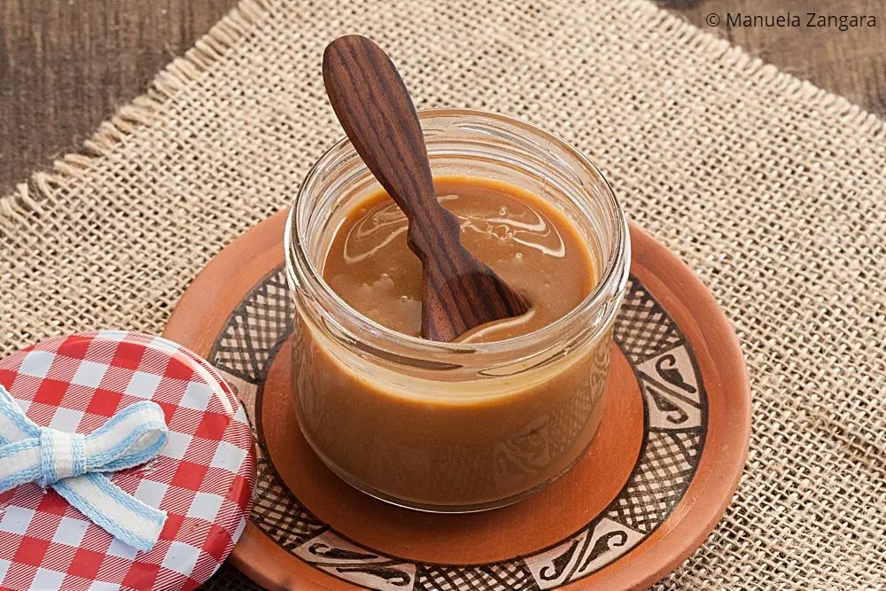

# Dulce de Leche

*Argentina's national caramel: milk and sugar slowly simmered together for hours till the milk reduces and caramelises into a thick, golden-brown, deeply sweet caramel spread. The Argentine answer to caramel; spread on toast, in alfajores, swirled into ice cream, stirred into coffee. Every Argentine pantry has a jar; every Argentine dessert has a touch.*

**Serves:** Makes about 800 g (1 large jar)

**Prep Time:** 5 minutes

**Cook Time:** 2-3 hours

## Overview
Dulce de leche (literally "sweet of milk") is Argentina's most beloved sweet ingredient - the foundation of countless desserts and a staple of every Argentine pantry. While South American countries dispute the origin (Argentina, Uruguay, Chile, France via 16th-century Spanish military all claim invention), the modern Argentine version is regarded as the canonical. The construction is two main methods: (1) THE TRADITIONAL: whole milk + sugar + a small amount of bicarbonate of soda, simmered slowly for 2-3 hours till the milk reduces by 60-70% and caramelises to a thick golden-brown paste; (2) THE EASY METHOD: a tin of sweetened condensed milk, simmered in its sealed can in boiling water for 2-3 hours till the milk inside caramelises (the "tin in water" hack popular in Argentine homes). The traditional method gives a smoother, more refined dulce; the can method is faster but the texture is slightly grainier. The finished dulce de leche is thick (just-pourable when warm; spreadable when cold), deep amber to mahogany in colour, intensely sweet, with caramelised milk notes and a slight saltiness. Used in: alfajores (the sandwich biscuit), helado de dulce (the canonical Argentine ice cream), flan con dulce de leche, panqueques con dulce de leche (crêpes with dulce), conitos and chocotorta (cake).

## Ingredients

### Traditional method (makes 800 g)
- 2 litres whole milk
- 600 g caster sugar
- 1 teaspoon bicarbonate of soda
- 1 teaspoon vanilla extract (optional)
- A pinch of fine sea salt

### Easy method (the "tin in water")
- 1-2 tins sweetened condensed milk (each 397 g; unopened, label removed)
- A large saucepan
- Enough water to cover the tins by 5 cm at all times

### To serve
- Spread on toast for breakfast
- In alfajores (sandwich biscuits)
- Swirled into vanilla ice cream
- Stirred into hot milk for "leche con dulce"
- In tarts and pastries
- As filling for crêpes (panqueques)

## Method

### Stage 1 - Traditional method
1. In a large heavy-bottomed pot, combine the milk, sugar, and salt.
2. Place over medium heat; stir to dissolve the sugar.
3. Once the sugar is dissolved (about 10 minutes), stir in the bicarbonate of soda - the mixture will foam dramatically (this is normal; the bicarb prevents crystallisation).
4. Bring to a gentle simmer (don't boil hard).
5. Continue simmering for 2-3 hours, stirring frequently (every 5-10 minutes), reducing the heat as the mixture thickens.
6. The mixture will gradually turn from white to pale gold to deep amber.
7. Don't let it stick to the bottom - keep stirring.
8. The dulce is ready when it coats the back of a wooden spoon thickly and the colour is deep golden-amber.
9. If you have a thermometer, the target is 105°C.
10. Stir in the vanilla extract.

### Stage 2 - Cool and store
1. Pour into clean sterilised jars.
2. Cool to room temperature; the dulce thickens as it cools.
3. Seal; refrigerate.
4. Stays for 3 weeks refrigerated.

### Stage 3 - Easy method (tin in water)
1. Place 1-2 unopened tins of sweetened condensed milk in a deep saucepan.
2. Cover with cold water (the water must remain at least 5 cm above the tins at all times - non-negotiable for safety).
3. Bring to a boil; reduce to a steady simmer.
4. Simmer for 2 hours (for light caramel) or 3 hours (for deep amber dulce).
5. CRITICAL: top up with boiling water as needed; never let the water level drop below the top of the tins (uncovered tins can explode dangerously).
6. After the cooking time, lift the tins out carefully with tongs.
7. Cool COMPLETELY before opening (about 4 hours; the dulce inside is under pressure when hot).
8. Open the cold tins; the dulce inside is now deep golden, thick, and ready.

### Stage 4 - Serve
1. Spread on toast or fresh bread for breakfast.
2. Use as filling for alfajores (sandwich biscuits).
3. Swirl into ice cream.
4. Drizzle over pancakes or waffles.
5. Stir into hot milk for a sweet drink.
6. Use as cake filling or pastry filling.

## Notes
- **Stir, stir, stir:** the bottom burns easily. Wooden spoon, every 5-10 minutes throughout.
- **Bicarbonate of soda:** the secret to the deep colour and silky texture. Don't skip.
- **For the tin method, ALWAYS keep the tins covered with water:** uncovered tins can explode dangerously. Top up with boiling water as needed.
- **Cool the tin completely before opening:** hot tins are under pressure; opening hot tins is dangerous.
- **Traditional vs easy:** the traditional method gives smoother, more refined dulce. The easy method is faster but slightly grainier.

## Variations
**Dulce de leche repostero:** thicker, made for baking (a more reduced version). Cook 30 minutes longer for thicker dulce.
**Dulce de leche con coco:** stir in 100 g grated coconut at the end. Tropical variant.
**Dulce de leche con chocolate:** stir in 100 g dark chocolate (melted) at the end. Bittersweet variant.
**Dulce de leche con nueces:** stir in 80 g chopped walnuts. Texture variant.
**Salted dulce de leche:** add 1 teaspoon flaked sea salt at the end. Modern variant.
**Dulce de leche con cafe:** add 2 tablespoons instant espresso powder. Coffee variant.
**Pressure cooker dulce (modern):** condensed milk in pressure cooker for 30 minutes high pressure (must be FULLY immersed in water).
**Microwave dulce (controversial):** condensed milk in microwave at 50% power for 30 minutes, stirring every 2 minutes. Doesn't give the same texture but works in emergency.

## Serving
On toast at every Argentine breakfast (the canonical setting) · in alfajores (the canonical sandwich biscuit) · swirled into ice cream · in flan con dulce de leche · as crêpe filling · in chocotorta (the no-bake cake) · in conitos (small cones of dulce) · at every Argentine afternoon merienda (tea-time snack) · at home as the universal sweet ingredient.

## Storage
- Refrigerates in sealed jars 3 weeks.
- Once opened, eat within 2 weeks.
- Don't freeze (texture changes badly).
- Pressure-canned dulce keeps 1 year unopened.
- Commercial dulce de leche (sold in jars in Argentine supermarkets) keeps 6 months unopened.
