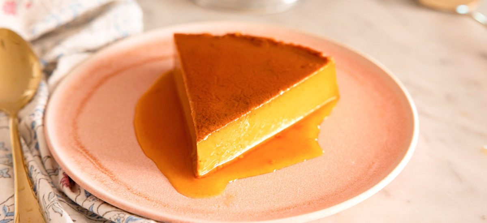

# Flan con Dulce de Leche

*Argentina's most beloved dessert finale: a baked vanilla custard set in a caramelised tin, unmoulded onto a plate, the caramel flowing down to surround it, and a generous spoon of dulce de leche piled on top with a dollop of whipped cream. The two great Argentine sweets - flan and dulce de leche - combined into the canonical Argentine restaurant dessert.*

**Serves:** 8

**Prep Time:** 20 minutes (plus 4 hours chilling)

**Cook Time:** 1 hour

## Overview
Flan con dulce de leche is the Argentine dessert that wins all the polls - the most universally beloved sweet finale in the country, served at every Argentine restaurant, every Sunday family lunch, every wedding, every birthday party. The construction combines two of Argentina's great sweets: (1) a classic flan - milk, sugar, eggs, vanilla, baked in a caramelised tin in a bain-marie until set, chilled, and unmoulded - and (2) a generous spoon of dulce de leche piled on top after unmoulding. The flan itself is identical in technique to the Brazilian pudim de leite condensado (see related recipe), but the topping transforms it: where the Brazilian version's only sweetness is the caramel sauce flowing from the tin, the Argentine version adds dulce de leche on top - meaning the dessert has TWO caramel components (the caramel sauce from the unmoulded tin, plus the dulce on top). The final assembly: a slice of flan on a plate, surrounded by caramel sauce, topped with a generous quenelle of dulce de leche, finished with a dollop of softly whipped cream. Three details: BAIN-MARIE BAKE (essential - direct heat scrambles the eggs), OVERNIGHT CHILL before unmoulding (full setting is critical), and GENEROUS DULCE ON TOP (the Argentine signature; without it, it's just flan).

## Ingredients

### Caramel layer
- 200 g granulated sugar
- 4 tablespoons water

### Flan custard
- 750 ml whole milk
- 250 ml double cream
- 250 g caster sugar
- 6 large eggs + 4 large egg yolks (room temperature)
- 1 vanilla pod (split, seeds scraped; or 1 teaspoon vanilla extract)
- A pinch of fine sea salt

### To serve
- 400 g dulce de leche (homemade or shop-bought)
- 300 ml double cream (whipped to soft peaks with 2 tablespoons icing sugar)
- A grating of dark chocolate (optional)
- A small handful of toasted almond flakes (optional)

### Equipment
- A ring-shaped flan tin (about 22 cm diameter; 1.5 litre capacity) OR a deep round cake tin
- A larger roasting tin (for the bain-marie)
- A blender or large jug + whisk
- A fine sieve

## Method

### Stage 1 - Make the caramel
1. Place the sugar and water in a heavy pan.
2. Heat over medium-high heat without stirring.
3. Boil 6-8 minutes, swirling occasionally, till the syrup is a deep amber colour.
4. Watch closely - sugar burns fast at the end.

### Stage 2 - Coat the tin
1. Pour the hot caramel immediately into the flan tin.
2. Tilt to coat the bottom evenly (the sides will get coated as the flan sets).
3. Caramel is dangerously hot; handle carefully.
4. Set aside; the caramel will set hard.

### Stage 3 - Make the custard
1. In a heavy saucepan, combine the milk, cream, half the sugar (125 g), and vanilla pod and seeds (or extract).
2. Heat gently till steaming (not boiling); about 5 minutes.
3. Take off the heat.
4. In a separate bowl, whisk the eggs, egg yolks, salt, and remaining sugar (125 g) lightly (don't froth).
5. Slowly pour the warm milk into the eggs, whisking constantly to temper.
6. Strain through a fine sieve into a clean jug (catches any cooked egg threads).

### Stage 4 - Bake
1. Preheat oven to 160°C / 140°C fan / 325°F.
2. Place the caramel-lined tin in a larger roasting tin.
3. Pour the custard into the flan tin.
4. Pour hot water into the larger tin so it comes halfway up the sides of the flan tin.
5. Cover loosely with foil (optional).
6. Bake 50-60 minutes till the centre still jiggles slightly when shaken (but the outer 4 cm is set).

### Stage 5 - Cool and chill
1. Remove from oven; lift the flan tin out of the water bath.
2. Cool to room temperature (1 hour).
3. Cover with cling film; refrigerate at least 4 hours, ideally overnight.

### Stage 6 - Unmould
1. Run a sharp knife around the inside edge of the flan tin.
2. Place a large serving plate (deep-rimmed) over the top.
3. Invert sharply - the flan should release with caramel flowing around.
4. Lift off the tin.

### Stage 7 - Finish with dulce de leche
1. With a warm spoon, spread a generous layer of dulce de leche over the top of the unmoulded flan (or pile in a generous dollop in the centre).
2. Optional: drizzle a little caramel sauce from the plate over the dulce.

### Stage 8 - Top with cream and serve
1. Add a generous dollop of softly whipped cream alongside.
2. Optional: grate dark chocolate over.
3. Sprinkle toasted almond flakes for crunch.

### Stage 9 - Slice and serve
1. Cut into wedges with a sharp wet knife.
2. Plate each slice with the caramel sauce, dulce de leche, and whipped cream.
3. Serve chilled.

## Notes
- **Bain-marie is non-negotiable:** direct heat scrambles the eggs.
- **Don't overbake:** centre should jiggle when removed.
- **Overnight chill:** 4 hours minimum; overnight better.
- **Strain the custard:** catches any cooked egg threads.
- **Generous dulce on top:** the Argentine signature. Don't be shy.

## Variations
**Flan mixto:** with both caramel sauce and dulce de leche - the canonical Argentine version (described above).
**Flan casero (homemade simple):** just flan with caramel; no dulce on top.
**Flan de coco:** add 100 g desiccated coconut to the custard before baking.
**Flan de chocolate:** add 4 tablespoons cocoa powder to the custard.
**Flan de café:** add 2 tablespoons espresso to the custard.
**Flan with creme chantilly:** the canonical Argentine restaurant version - flan + dulce de leche + chantilly cream + a wafer cigar biscuit alongside.
**Mini flans:** in 8 individual small ramekins; bake 35 minutes; same technique.
**Crème brûlée Argentine-style:** torch the dulce de leche on top after assembly - modern restaurant variant.

## Serving
At every Argentine restaurant as the dessert (the canonical setting) · at every Argentine Sunday family lunch · at an Argentine wedding · at an Argentine birthday party · at a Buenos Aires café with espresso · at home as a special-occasion dessert · alongside a glass of dessert wine or coffee.

## Storage
- Refrigerates (unmoulded) 3 days; the caramel slowly dissolves into the flan.
- Don't freeze.
- The flan alone (without dulce/cream) keeps better than fully assembled.
- A made-the-day-before flan is the Argentine standard.
- The dulce de leche on top should be added just before serving for best appearance.
