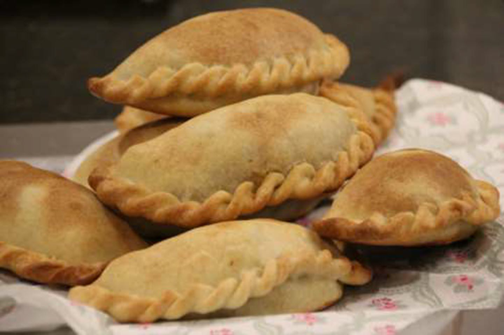

# Empanadas Salteñas

*Argentina's most refined empanadas, from the northwestern province of Salta: hand-pies filled with cubed (not minced) beef, sweated onion, hard-boiled egg, green olives, raisins, cumin and a pinch of red pepper. The dough is baked till deeply golden, with a distinctive shape, a half-moon with 13 pleated folds along the seam (the traditional Salteña crimp). The Argentine empanada that wins all the national festivals.*

**Serves:** Makes 18-20 empanadas

**Prep Time:** 45 minutes (plus 1 hour dough chill)

**Cook Time:** 25 minutes

## Overview
Empanadas salteñas are the Argentine standard against which all other empanadas are measured. The provincia of Salta in the northwest produces what the rest of Argentina (and the National Empanada Festival held annually in San Salvador de Jujuy) regards as the traditional Argentine empanada. Three features distinguish the Salteña from other Argentine versions: (1) hand-cut cubed beef rather than minced beef, labour-intensive but gives much better texture, with discernible meat chunks rather than ground paste; (2) the filling includes hard-boiled egg, green olives, and raisins, a sweet-savoury Andean signature absent from most other Argentine empanadas; (3) the traditional 13-pleat crimp along the seam (called the "repulgue") that distinguishes Salteñas visually. The dough is a simple butter-and-flour shortcrust that bakes to a deep golden brown. The filling is sweated overnight before assembly (the "carne empanada al frío" technique): the meat is cooked the day before, refrigerated, and assembled cold; this lets the filling firm up and prevents the bottoms of the empanadas from going soggy.

## Ingredients

### Filling (made day before)
- 600 g beef chuck or short rib (cubed into 5 mm pieces by hand; not minced)
- 4 tablespoons rendered beef fat or olive oil
- 2 large onions (finely diced)
- 1 large red bell pepper (finely diced)
- 4 spring onions (chopped)
- 2 teaspoons sweet paprika
- 1 teaspoon ground cumin
- ½ teaspoon hot paprika or chilli flakes
- 1 teaspoon dried oregano
- 200 ml beef stock
- 4 hard-boiled eggs (chopped)
- 16 green olives (pitted, halved)
- 4 tablespoons golden raisins (sultanas)
- 1 teaspoon fine sea salt
- 1 teaspoon coarsely ground black pepper

### Dough
- 600 g plain flour
- 1 teaspoon fine sea salt
- 200 g cold butter (cubed)
- 1 large egg yolk
- 200 ml warm water (approx)

### To finish
- 1 beaten egg (for egg wash)

## Method

### Stage 1 - Make the filling (day before)
1. Heat the beef fat in a large heavy pan over medium-high heat.
2. Brown the cubed beef in batches (about 4-5 minutes per batch). Set aside.
3. In the same pan, sweat the onions and red pepper 8-10 minutes till soft.
4. Add the spring onions, paprika, cumin, hot paprika, and oregano; cook 1 minute.
5. Return the beef to the pan.
6. Add the beef stock; simmer 15-20 minutes till the liquid has mostly evaporated.
7. Season with salt and pepper.
8. Cool to room temperature.
9. Stir in the chopped hard-boiled eggs, green olives, and raisins.
10. Refrigerate overnight (the "carne al frío" technique).

### Stage 2 - Make the dough
1. Sift the flour and salt into a bowl.
2. Rub in the cold butter till the mixture looks like fine breadcrumbs.
3. Mix the egg yolk with the warm water.
4. Add to the flour; mix till a smooth dough forms.
5. Knead briefly (1-2 minutes); form into a disc.
6. Wrap; refrigerate 1 hour.

### Stage 3 - Roll and cut
1. Preheat oven to 200°C / 180°C fan / 400°F.
2. Roll the dough to 2 mm thick.
3. Cut into 13 cm circles (with a saucer or cutter).
4. You should get 18-20 circles.

### Stage 4 - Fill
1. Place a heaped tablespoon of cold filling in the centre of each circle.
2. Don't overfill (the empanadas will burst during baking).
3. Brush the border with water.

### Stage 5 - Fold and crimp (the 13-pleat repulgue)
1. Fold each circle in half over the filling.
2. Press the edges together to seal.
3. Now create the traditional 13-pleat crimp:
   - Hold the empanada along the seam.
   - Starting from one end, fold a small (5 mm) section of the seam back on itself, pinching it down.
   - Continue along the seam, making 13 distinct folds.
4. The finished empanada has a thick decorative rope edge along the seam, the Salteña signature.

### Stage 6 - Bake
1. Place empanadas on a parchment-lined tray.
2. Brush tops with beaten egg.
3. Bake at 200°C for 20-25 minutes till deeply golden.

### Stage 7 - Serve
1. Serve warm with a glass of Argentine red.
2. Eat with the hands (the traditional Argentine technique, bite from the corner to release steam).
3. Optional: small dishes of salsa criolla or chimichurri alongside.

## Notes
- **Cube the meat (5 mm); don't mince:** the Salteña signature. Minced meat gives a different (less refined) texture.
- **Day-ahead filling:** the traditional Salteña technique. Firms up the filling and prevents soggy bottoms.
- **13-pleat repulgue:** the traditional Salteña crimp. Takes practice but distinguishes Salteñas visually.
- **Egg, olives, raisins:** the sweet-savoury Andean signature. Don't skip, they're what makes a Salteña not just an Argentine empanada.
- **Don't overbake:** golden, not dark brown. The empanadas should be just-crisp.

## Variations
- **Empanadas mendocinas:** simpler filling (beef, onion, paprika, no olives or raisins). Less elaborate than Salteñas.
- **Empanadas tucumanas:** uses minced beef and very thin dough; baked or fried; the Tucumán variant.
- **Empanadas cordobesas:** sweeter than Salteñas; with more raisins, sugar, and cinnamon.
- **Empanadas santiagueñas (Santiago del Estero):** with chopped olives but no raisins, no egg; spicier with hot paprika.
- **Empanadas patagónicas (lamb):** filling of cubed lamb instead of beef; very southern Argentina.
- **Empanadas fritas:** deep-fried instead of baked. The Tucumán style.
- **Vegetarian empanadas:** filling of corn + cheese + spring onion + paprika. Surprisingly authentic.
- **Mini empanadas (canapé):** smaller circles (8 cm); same recipe; cocktail-party portions.

## Serving
- At an Argentine asado as starter (the traditional setting) · at the National Empanada Festival in Jujuy · at a Salta family Sunday lunch · at a Buenos Aires bodegón as the everyday lunch · at an Argentine wedding canapé reception · at home as a weekend project · with a glass of Malbec for an Argentine evening.

## Storage
- Refrigerate cooked empanadas 3 days; reheat in a 180°C oven for 8 minutes.
- Freeze raw (formed but unbaked) for 2 months; bake from frozen at 200°C for 30 minutes.
- Freeze cooked for 1 month; reheat from frozen in 180°C oven for 15 minutes.
- The filling can be made 2 days ahead.
- Day-old empanadas (cold) make excellent next-day lunch.
