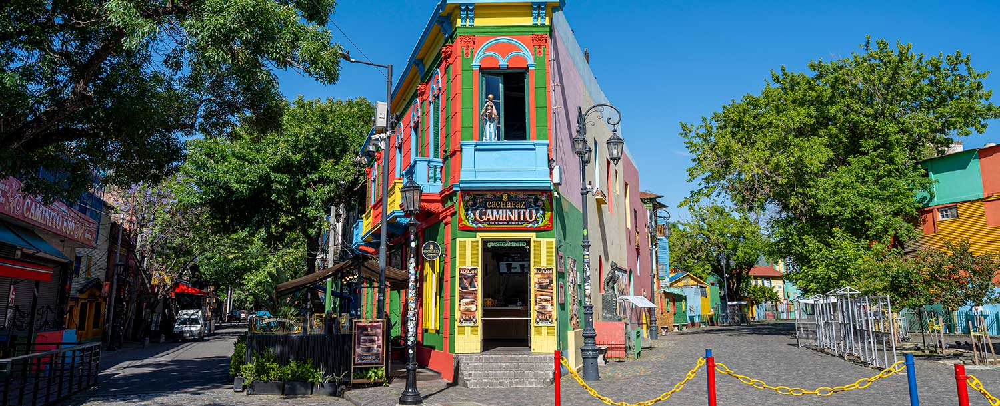

# Argentinian Cuisine

Argentina's food is beef-driven and Italian-inflected: the canonical asado (the open-fire barbecue tradition with bife de chorizo, vacío, morcilla and chorizo), milanesa a la napolitana (the breaded steak with ham, tomato and cheese, Italian-Argentine in origin), locro (the corn-and-bean stew eaten on national holidays), the legendary empanadas salteñas (spiced beef hand-pies), and provoleta (grilled provolone with oregano and chilli). Dulce de leche threads through every dessert: alfajores (sandwich biscuits), flan, and pastry fillings. Daily food revolves around mate (the bitter Yerba mate infusion drunk through a metal straw from a shared gourd), bread, and beef.
