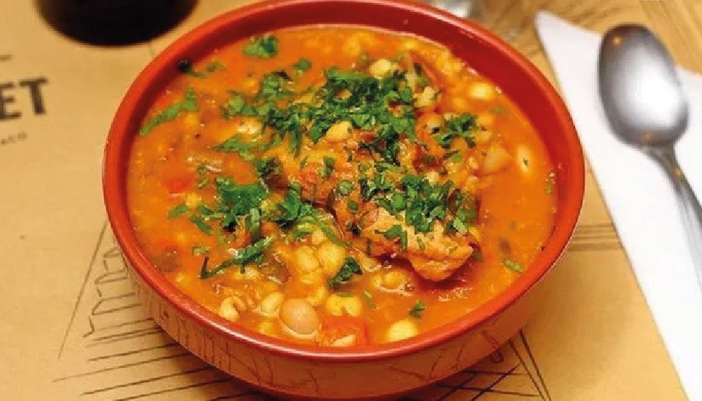

# Locro

*Argentina's national holiday stew: a thick winter pottage of dried hominy corn, white beans, several cuts of pork and beef (chorizo, panceta, pork shoulder, beef shin), squash, and a slow simmer. Eaten on Argentine national holidays (25 May Revolución, 9 July Independence Day, 17 August Death of San Martín). Pre-Columbian Andean roots adapted to colonial Spanish meats. Deep amber, fork-tender, served with quiquirimichi (spicy red oil) drizzled over.*

**Serves:** 8-10

**Prep Time:** 30 minutes (plus overnight hominy + bean soak)

**Cook Time:** 3-4 hours

## Overview
Locro is one of Argentina's most ancient dishes: a pre-Columbian Andean stew of corn, beans and squash that the colonial Spanish then layered with pork and beef. The resulting fusion became the canonical Argentine winter holiday dish, eaten with near-religious devotion on the three patriotic holidays (25 May, 9 July, 17 August) and on other cold winter days. Dried hominy (maíz blanco partido, sometimes mote) is soaked overnight, then simmered three or four hours with white beans, multiple cured and fresh meats (panceta, chorizo colorado, pork shoulder, beef shin or oxtail), butternut squash, sweet potato, onion, garlic and dried red peppers. The long simmer breaks down the corn into thick creamy starch, the meats fall apart and the squash dissolves into the broth. The canonical finish is a small drizzle of quiquirimichi at the table: a hot oil of rendered pork fat, paprika, chilli flakes and chopped spring onions.

## Ingredients

### Locro
- 400 g dried hominy/mote (white hulled corn kernels; soaked overnight)
- 200 g dried white beans (or alubias; soaked overnight)
- 300 g panceta (cured pork belly; or thick-cut smoked bacon)
- 2 chorizo colorado (Argentine red chorizo; or any cured smoked chorizo)
- 500 g pork shoulder (cubed)
- 400 g beef shin or oxtail (in chunks)
- 1 large butternut squash (1 kg, peeled, cubed)
- 1 large sweet potato (peeled, cubed)
- 2 large onions (chopped)
- 8 garlic cloves (chopped)
- 4 tablespoons olive oil
- 4 bay leaves
- 1 tablespoon sweet paprika
- 1 teaspoon cumin
- 1 teaspoon dried oregano
- 4 litres water OR beef stock
- 2 teaspoons fine sea salt (or to taste)

### Quiquirimichi (the spicy red oil finish)
- 100 g pork fat (or 100 ml olive oil)
- 2 tablespoons sweet paprika
- 1 teaspoon hot paprika (or 1 teaspoon chilli flakes)
- 1 small bunch spring onions (finely chopped)
- 4 garlic cloves (finely chopped)
- 1 teaspoon fine sea salt

### To serve
- Fresh bread
- A glass of Argentine Malbec
- Optional: a sprinkle of chopped fresh parsley over

## Method

### Stage 1 - Soak the corn and beans (overnight)
1. Rinse the dried hominy and beans.
2. Place in two separate large bowls.
3. Cover each with cold water by 5 cm.
4. Soak overnight (12+ hours).
5. Drain before using.

### Stage 2 - Brown the meats
1. In a large heavy stockpot (8+ litre), heat the olive oil.
2. Brown the cubed pork shoulder and beef shin in batches (about 6 minutes per batch).
3. Set aside.
4. Brown the diced panceta and sliced chorizo (5 minutes).
5. Set aside.

### Stage 3 - Sweat the aromatics
1. In the same pot, add the chopped onions; cook 8-10 minutes till soft.
2. Add the garlic; cook 1 minute.
3. Add the bay leaves, paprika, cumin, and oregano; cook 30 seconds.

### Stage 4 - Combine and simmer
1. Return all the browned meats to the pot.
2. Add the drained corn and beans.
3. Pour over 4 litres water or stock.
4. Bring to a boil; reduce to gentle simmer.
5. Simmer 2 hours with the lid ajar, stirring occasionally.

### Stage 5 - Add the squash and sweet potato
1. After 2 hours, add the cubed butternut squash and sweet potato.
2. Continue simmering 1 to 1.5 hours more.
3. The corn should be tender and starchy; the meats should fall apart; the squash should dissolve into the broth.

### Stage 6 - Check consistency
1. The locro should be VERY thick - a wooden spoon should stand upright in it.
2. If too thin, simmer uncovered to reduce.
3. If too thick, add hot water.
4. Taste; adjust salt.

### Stage 7 - Make the quiquirimichi
1. In a small pan, heat the pork fat or olive oil over low heat.
2. Add the sweet paprika and hot paprika; cook 30 seconds (don't burn).
3. Add the chopped spring onions and garlic; cook 1 minute.
4. Add salt.
5. Remove from heat; the oil should be bright red-orange with bits of spring onion floating in it.

### Stage 8 - Serve
1. Ladle the locro into deep bowls.
2. Drizzle a teaspoon of quiquirimichi over each bowl.
3. Pass extra at the table.
4. Serve with fresh bread.
5. Drink Malbec alongside.

## Notes
- **Soak corn and beans overnight:** non-negotiable. Without soaking, the corn stays hard.
- **Long slow simmer:** 3-4 hours minimum. The corn breaks down slowly; rushing gives undercooked corn.
- **Quiquirimichi is the canonical finish:** the spicy red oil drizzle. Without it, locro is a soup; with it, it's a complete dish.
- **Multiple meats:** pork belly + chorizo + pork shoulder + beef shin. Don't simplify; the meat variety is the depth.
- **Thick consistency:** the locro should be thick enough to stand a spoon in. Soupy locro is incorrect.

## Variations
**Locro vegetariano:** skip the meats; double the white beans + add 2 tablespoons smoked paprika + 1 teaspoon liquid smoke. Surprisingly good.
**Locro de zapallo (squash-heavy):** double the squash; lighter version, more autumnal.
**Locro patagónico:** add 200 g cubed mutton or lamb shoulder + 1 tablespoon yerba mate stock - Patagonian variant.
**Locro porteño (Buenos Aires version):** lighter on the corn; heavier on beef; faster cooking (2 hours).
**Locro norteño (northwest variant):** uses dried chillies (ají amarillo) instead of paprika; spicier; lighter colour.
**Locro andino:** with quinoa added in the last hour; pre-Hispanic touch.
**Slow-cooker locro:** all ingredients in a slow cooker on low for 10 hours. Less canonical but works for busy households.

## Serving
On the three Argentine patriotic holidays: 25 May (Revolution), 9 July (Independence), 17 August (Death of San Martín) - the canonical settings · at an Argentine winter Sunday lunch · at a Mendoza or Salta family dinner · at an Argentine harvest festival · at a Buenos Aires bodegón as the winter weekly special · at home with a bottle of Malbec on a cold winter evening.

## Storage
- Refrigerates 4 days; the flavour improves on day 2.
- Freezes 3 months; defrost overnight before reheating.
- Reheat gently with a splash of water if too thick.
- Leftover locro is the canonical second-day Argentine meal.
- The quiquirimichi keeps 2 weeks refrigerated; make extra.
