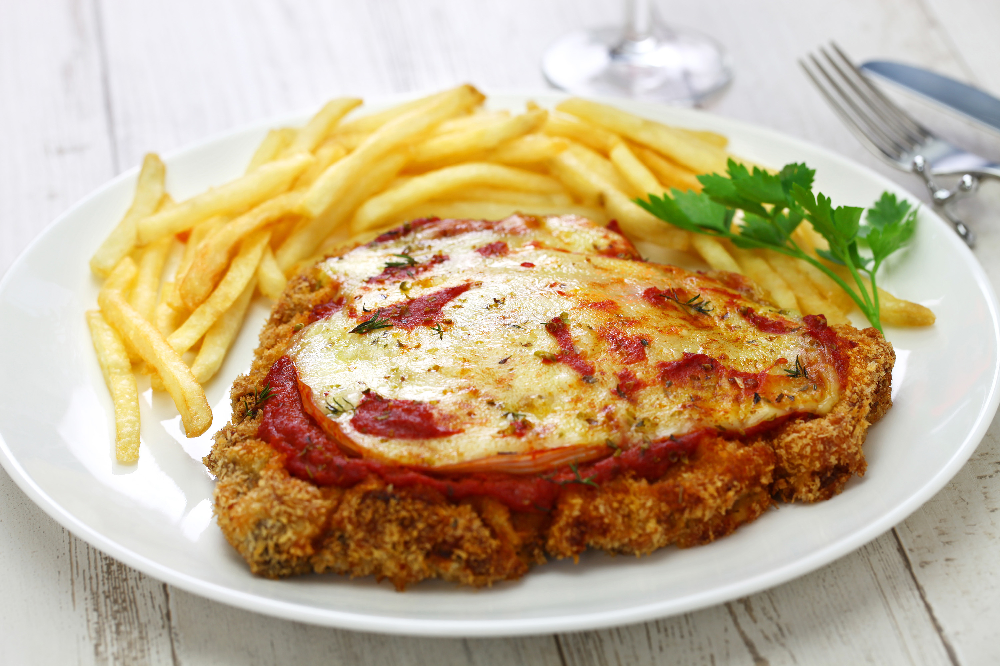

# Milanesa a la Napolitana

*Argentina's Italian-immigrant masterpiece: thin pounded beef escalopes breaded and shallow-fried, then topped with tomato sauce, slices of ham, and melted mozzarella, briefly grilled till bubbling. Named not for Naples but for "Napoli", a Buenos Aires restaurant where the dish was invented in the 1940s. The traditional Argentine weeknight dinner; the schnitzel-pizza fusion that defines Italian-Argentine cooking.*

**Serves:** 4

**Prep Time:** 20 minutes

**Cook Time:** 15 minutes

## Overview
Milanesa a la napolitana is one of Argentina's most beloved everyday dishes, a layered fusion that traces back to Italian-immigrant Buenos Aires of the 1940s. The story: chef Jose Napoli at Restaurante Napoli in Buenos Aires accidentally burned a Milanese-style breaded escalope and, to cover the burn, topped it with tomato sauce, ham, and melted cheese. The dish became immediately popular and spread across Argentina as the traditional Italian-Argentine weeknight dinner. The construction: thin slices of beef (typically nalga/topside or peceto/eye of round) are pounded thin between cling film till about 5 mm; dipped in seasoned egg, rolled in fine breadcrumbs (with grated Parmesan and garlic mixed in, the Argentine signature), and shallow-fried in oil till golden on both sides. The fried milanesas are placed on a baking tray, topped with a spoon of tomato sauce, a slice of ham, and a generous layer of mozzarella, then grilled briefly till the cheese bubbles. Served with fries (papas fritas), a green salad, and an Argentine red.

## Ingredients

### Milanesas (4 portions)
- 4 thin slices of beef (nalga/topside or peceto; about 200 g each)
- 3 eggs (beaten with 4 tablespoons milk, salt, and pepper)
- 250 g fine breadcrumbs (panko or fresh)
- 60 g grated Parmesan cheese
- 3 garlic cloves (finely chopped)
- 1 tablespoon dried oregano
- 1 teaspoon fine sea salt
- 1 teaspoon coarsely ground black pepper
- 300 ml sunflower oil (for frying)

### Topping (the napolitana element)
- 400 ml tomato sauce (a simple Italian tomato sauce; or 400 g tin tomatoes + 1 chopped onion + 4 cloves garlic + olive oil + salt, see notes)
- 8 slices cooked ham (jamón cocido)
- 400 g grated mozzarella (or sliced)
- 2 tablespoons dried oregano (extra for the top)
- A pinch of chilli flakes (optional)

### To serve
- 600 g hand-cut chips (papas fritas)
- A green salad
- A glass of Argentine Malbec
- Lemon wedges

## Method

### Stage 1 - Pound the beef
1. Place each beef slice between 2 sheets of cling film.
2. Pound gently but firmly with a meat mallet till about 5 mm thick.

### Stage 2 - Make the breading mix
1. In a shallow bowl, combine breadcrumbs, Parmesan, chopped garlic, oregano, salt, and pepper.

### Stage 3 - Bread the milanesas
1. Dip each beef slice in beaten egg (let excess drip off).
2. Press into the breadcrumb mix, coating both sides thoroughly.
3. Place on a tray; refrigerate 15 minutes (helps the coating set).

### Stage 4 - Fry
1. Heat the sunflower oil in a wide pan to 175°C (use a thermometer or test with a breadcrumb, should sizzle vigorously).
2. Fry the milanesas one at a time for 2-3 minutes per side till deeply golden.
3. Drain on kitchen paper.

### Stage 5 - Assemble the napolitana topping
1. Preheat your grill (broiler) to high.
2. Place the fried milanesas on a baking tray.
3. Spoon a generous tablespoon of tomato sauce over each.
4. Top with 2 slices of ham.
5. Cover with a thick layer of grated mozzarella.
6. Sprinkle oregano and chilli flakes (if using).

### Stage 6 - Grill briefly
1. Place under the hot grill 90 seconds to 2 minutes till the cheese melts and bubbles.
2. The milanesa underneath should still be crisp; don't grill so long that the breading goes soggy.

### Stage 7 - Serve
1. Transfer to warm plates.
2. Add a generous pile of fries (papas fritas).
3. Add a green salad.
4. Squeeze lemon over the milanesa.
5. Drink Malbec alongside.

## Notes
- **Pound thin (5 mm):** the traditional Argentine milanesa. Thicker steaks don't cook through.
- **Parmesan and garlic in the breading:** the Argentine signature. Plain breading is European; Argentine milanesa has cheese and garlic in the crumb.
- **Refrigerate after breading:** 15 minutes minimum. Lets the coating set so it doesn't fall off during frying.
- **Don't over-grill:** 90 seconds is enough to melt the cheese. Longer and the breading goes soft.
- **Lemon at the table:** the traditional Argentine touch. Squeeze over each milanesa before eating.

## Variations
- **Milanesa simple (without napolitana):** just the breaded fried milanesa with lemon, no topping. The classic version.
- **Milanesa a caballo:** topped with a fried egg ("a horseback") instead of the napolitana topping.
- **Milanesa con fugazza:** topped with caramelised onions and provolone instead of tomato sauce.
- **Milanesa de pollo:** swap beef for chicken breast (pounded thin).
- **Milanesa de berenjena:** swap beef for sliced aubergine, vegetarian version.
- **Milanesa al napolitano with pizza toppings:** add peppers, olives, anchovies, modernised pizza-style.
- **Milanesa al pan:** in a sandwich (sangu de milanesa) with lettuce, tomato, mayo, Buenos Aires lunch icon.
- **Argentine milanesa para almuerzo:** smaller, served as a hot lunch with potato salad.

## Serving
- At every Argentine weekday family dinner (the traditional setting) · at a Buenos Aires bodegón (working-class restaurant) · at an Italian-Argentine pizzeria · at home as the easy weeknight dinner · at an Argentine school cafeteria · as the traditional Argentine office-lunch box · with a glass of Malbec at home.

## Storage
- Cooked milanesas (without topping) refrigerate 3 days; reheat in a 180°C oven for 8 minutes.
- Don't freeze cooked milanesas (the breading suffers).
- Freeze breaded but uncooked milanesas (between parchment) 2 months; fry from frozen, adding 2 minutes to cooking time.
- The tomato sauce makes great pasta sauce; freezes 3 months.
- Leftover milanesa sliced cold in a sandwich (sangu de milanesa) is the traditional Argentine next-day lunch.
