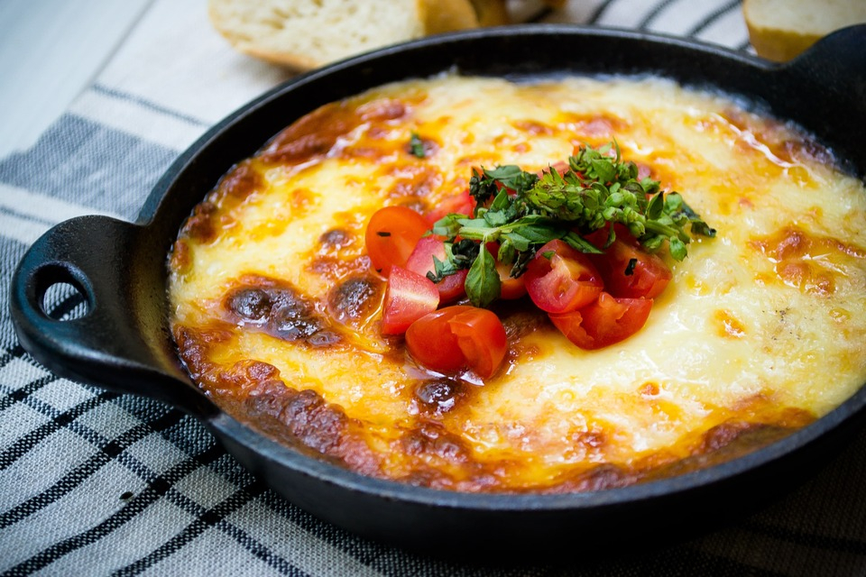

# Provoleta (Grilled Argentine Provolone)

*Argentina's most genius cheese dish: a thick disc of provolone cheese - Argentine "provoleta", aged sharper and firmer than Italian provolone - sprinkled with dried oregano and chilli flakes, grilled directly on the parrilla till the bottom is deeply caramelised, the middle softened, and the top crusted with herbs. Eaten with fresh bread, alongside chimichurri, with a glass of Malbec. The canonical Argentine asado opener.*

**Serves:** 4 (as a starter)

**Prep Time:** 5 minutes

**Cook Time:** 8-10 minutes

## Overview
Provoleta is Argentina's most clever and most universally beloved cheese starter - a uniquely Argentine adaptation of Italian provolone. Argentine provolone is aged longer than its Italian counterpart, giving it a firmer texture that holds together over high heat. The construction is brilliantly simple: a thick (3 cm) disc of Argentine provolone is sprinkled with dried oregano, chilli flakes, and a small drizzle of olive oil; placed directly on the asado parrilla (or in a cast-iron pan on the grill); grilled over medium-high heat till the bottom is deeply caramelised (3-4 minutes), then carefully flipped (or left undisturbed and just topped under the broiler) and grilled till the second side is also crusted and the middle is softened and stretchy. The finished provoleta is a golden-brown disc with crisp edges, gooey-melty centre, and a top crusted with charred oregano and chilli. Served on a wooden board with fresh bread for tearing and dipping into the molten cheese; chimichurri alongside for those who want a fresh herbal note. Three details: AGED ARGENTINE PROVOLONE (must be the firmer Argentine version; Italian provolone melts too easily and falls apart), HOT GRILL (the bottom needs to caramelise quickly; medium-high heat); and SERVE IMMEDIATELY (the cheese cools and firms within 5 minutes).

## Ingredients

### Per portion (serves 4 as starter)
- 1 thick disc of Argentine provoleta (250-300 g, 3 cm thick; available at Latin American grocers and good cheesemongers; substitute with aged Italian provolone or even a thick slice of halloumi)
- 2 tablespoons dried oregano
- 1 teaspoon chilli flakes (Argentine ají molido; or any dried chilli flakes)
- 2 tablespoons olive oil
- A pinch of flaked sea salt

### To serve
- 2 fresh baguettes or a loaf of crusty bread (torn into chunks)
- A small dish of chimichurri (optional but excellent)
- A handful of fresh oregano leaves
- A wedge of lemon
- A glass of Argentine Malbec

### Equipment
- A parrilla (open grill) OR a heavy cast-iron pan OR a grill pan
- A wide spatula

## Method

### Stage 1 - Prep the provoleta
1. Take the provoleta out of the fridge 30 minutes before grilling (lets it warm slightly).
2. Place on a board.
3. Drizzle the olive oil over the top.
4. Sprinkle the oregano, chilli flakes, and salt over.
5. Press the herbs gently into the surface.

### Stage 2 - Heat the grill
1. Heat the parrilla (or cast-iron pan, or grill pan) to medium-high heat.
2. The grate should be hot enough that water dropped on it sizzles immediately.

### Stage 3 - Grill the bottom
1. Place the provoleta directly on the hot grate (or in the pan).
2. Cook 3-4 minutes WITHOUT moving - the bottom needs to caramelise into a deep golden crust.
3. The cheese will release oil and may smoke slightly; this is normal.

### Stage 4 - Flip carefully
1. Use a wide spatula to flip the cheese disc.
2. Some bits may stick to the grate; that's fine - the bottom crust is the goal.
3. Grill the second side another 2-3 minutes.

### Stage 5 - Check the centre
1. The cheese should be soft and stretchy in the middle, with a crusted golden bottom and top.
2. If you want extra crust on top, finish under a hot broiler for 60 seconds.

### Stage 6 - Serve
1. Transfer the provoleta to a wooden board with the spatula.
2. Scatter fresh oregano leaves over.
3. Provide a small wedge of lemon for squeezing.
4. Surround with chunks of fresh bread.
5. Eat immediately - tear bread, scoop molten cheese, eat warm.

## Notes
- **Argentine provoleta, not Italian:** the Argentine version is aged longer and firmer; holds together on the grill. Italian provolone is softer and may melt apart.
- **Hot grill, fast crust:** the goal is a quick caramelised bottom, not slow melting. 3-4 minutes per side.
- **Serve immediately:** the cheese cools and firms within 5 minutes of leaving the heat. Eat while molten.
- **Don't overcook:** the centre should be soft and stretchy. Over-grilled provoleta becomes rubbery.
- **Substitute (last resort):** if Argentine provoleta is unavailable, use thick slices of aged Italian provolone, halloumi (very different but works), or even a thick slice of mozzarella (will melt too much but is acceptable).

## Variations
**Provoleta with chimichurri spooned over:** drizzle a tablespoon of chimichurri over the grilled cheese - herbal and bright.
**Provoleta with caramelised onions:** top with sweated onions before grilling.
**Provoleta with tomato:** add a slice of grilled tomato on top - Italian-Argentine fusion.
**Provoleta with figs and honey:** modernised version with fresh figs and a drizzle of honey - restaurant variant.
**Provoleta with anchovy:** top with anchovy fillets before grilling - Mediterranean-Argentine.
**Provoleta with chorizo crumbles:** crumble cooked chorizo on top - heartier variant.
**Mini provoletas:** make small individual portions (50 g each) on a cast-iron skillet - party version.
**Pan-cooked provoleta (no grill):** in a screaming-hot cast-iron pan on the stovetop, 3 minutes per side. Same result.

## Serving
At every Argentine asado as the canonical opener (the canonical setting) · at a Buenos Aires parrilla restaurant · at a Mendoza wine-country lunch · at an Argentine wedding reception (as canapés on the grill) · at home as a quick weeknight snack on a cast-iron pan · with a glass of Malbec and bread for an easy starter.

## Storage
- Best eaten immediately from the grill.
- Uncooked provoleta keeps refrigerated 2 weeks (well-wrapped).
- Freeze raw provoleta 2 months wrapped well.
- Leftover grilled provoleta refrigerates 1 day; reheat under a broiler 1 minute - never as good as fresh.
- The chimichurri keeps 2 weeks refrigerated.
