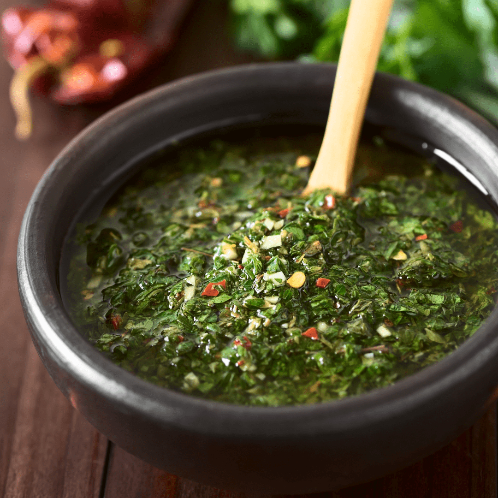

# Chimichurri

*Argentina's national herb-and-oil condiment: a bright green sauce of finely chopped parsley, oregano, garlic, red chilli flakes, red wine vinegar and a generous slug of olive oil. Spooned over grilled meat at every asado, dolloped into choripán sandwiches, drizzled over provoleta, used as a marinade. The single most important Argentine condiment; the canonical green sauce of South America.*

**Serves:** Makes about 400 ml (enough for 8 servings of grilled meat)

**Prep Time:** 15 minutes (plus 1 hour rest)

**Cook Time:** None

## Overview
Chimichurri is Argentina's most important and most universally beloved condiment - a bright green herb-and-oil sauce that appears at every asado, dressing the canonical Argentine grilled meats. The construction is brilliantly simple: fresh flat-leaf parsley is finely chopped (or pulsed in a food processor), combined with dried oregano, finely chopped garlic, red chilli flakes (ají molido), red wine vinegar, water, olive oil, and salt. Mixed in a bowl and left to rest 1 hour minimum so the flavours marry. The finished sauce is vivid green with red flecks of chilli, gently acidic from the vinegar, garlicky, herbal, with a slight peppery heat. Argentines have strong opinions about chimichurri: it must be HAND-CHOPPED parsley (a food processor purées the parsley too fine; the canonical Argentine technique is finely chopped, not blended); it must contain RED WINE VINEGAR specifically (not white, not balsamic); and the proportions of herb to oil to acid are sacred. Two regional variants exist: the Argentine standard (described here) and the chimichurri rojo (red - uses red bell pepper purée; more common in Uruguay and southern Brazil).

## Ingredients

### For 400 ml chimichurri
- 1 large bunch flat-leaf parsley (about 80 g; stems removed; finely chopped)
- 4 tablespoons dried oregano
- 8 garlic cloves (finely chopped)
- 2 teaspoons red chilli flakes (Argentine ají molido; or any dried chilli flakes)
- 4 tablespoons red wine vinegar
- 2 tablespoons water
- 250 ml extra-virgin olive oil
- 1 teaspoon fine sea salt
- 1 teaspoon coarsely ground black pepper
- 1 small bunch fresh oregano (optional; chopped - adds a fresh layer)
- 1 small bunch fresh thyme (optional; chopped)
- ½ teaspoon ground cumin (optional; less canonical but common)

## Method

### Stage 1 - Chop the parsley
1. Wash and thoroughly dry the parsley.
2. Remove the thick stems (use the thinner stems).
3. Chop FINELY by hand on a board - don't use a food processor (the canonical Argentine technique).
4. You want pieces about 2-3 mm; not paste.

### Stage 2 - Combine in a bowl
1. In a medium bowl, place the chopped parsley.
2. Add the dried oregano, chopped garlic, chilli flakes, salt, and pepper.
3. Add the red wine vinegar and water.
4. Stir well to combine.

### Stage 3 - Add the oil
1. Slowly pour in the olive oil while stirring.
2. The mixture should be loose, with the oil and vinegar layered slightly (not fully emulsified).

### Stage 4 - Rest
1. Cover with cling film or transfer to a sealed jar.
2. Leave at room temperature for AT LEAST 1 hour (the flavours marry).
3. For best results, make 4-24 hours ahead.
4. The chimichurri can be refrigerated 2 weeks; the flavour improves over the first few days.

### Stage 5 - Serve
1. Stir before serving (the oil separates).
2. Spoon over grilled meat (the canonical Argentine use).
3. Drizzle over provoleta cheese.
4. Spoon into choripán sandwiches.
5. Use as a marinade for grilled chicken or fish.
6. Use as a base for vinaigrettes.

## Notes
- **Hand-chop the parsley:** the canonical Argentine technique. A food processor purées too fine.
- **Red wine vinegar:** not white, not balsamic. Red wine vinegar is non-negotiable.
- **Olive oil:** use a decent extra-virgin. The flavour shows.
- **Rest 1 hour minimum:** the flavour develops dramatically. Don't make and use immediately.
- **Don't add lemon juice:** some non-Argentine recipes do this; it's incorrect. Vinegar only.

## Variations
**Chimichurri rojo (red):** add 1 small red bell pepper finely chopped + 1 teaspoon sweet paprika. The Uruguayan / southern Brazilian variant.
**Chimichurri picante (spicy):** double the chilli flakes; add 1 fresh chopped chilli.
**Chimichurri verde (green Mexican-style):** add chopped fresh coriander - non-Argentine but excellent.
**Chimichurri criollo:** add ½ chopped tomato; semi-criollo (between chimichurri and salsa criolla).
**Chimichurri with lemon zest:** add zest of 1 lemon - modern variant; non-canonical.
**Chimichurri butter:** mix 2 tablespoons of chimichurri into 60 g softened butter; serve as a compound butter on grilled steak.
**Chimichurri aioli:** mix 4 tablespoons into 200 g mayonnaise - modern Argentine restaurant variant.

## Serving
At every Argentine asado on every grilled cut of meat (the canonical setting) · in every choripán sandwich · on grilled provoleta · as a marinade for grilled chicken or fish · drizzled over avocado toast · alongside grilled vegetables · at home as a green-sauce-for-everything.

## Storage
- Refrigerates in a sealed jar for 2 weeks; the flavour improves over the first week.
- Don't freeze (the parsley texture suffers).
- A small layer of olive oil on top helps preserve the colour.
- Bring to room temperature before serving (cold chimichurri is muted).
- The vinegar gradually softens the parsley; after 2 weeks the texture is silkier but the brightness fades.
