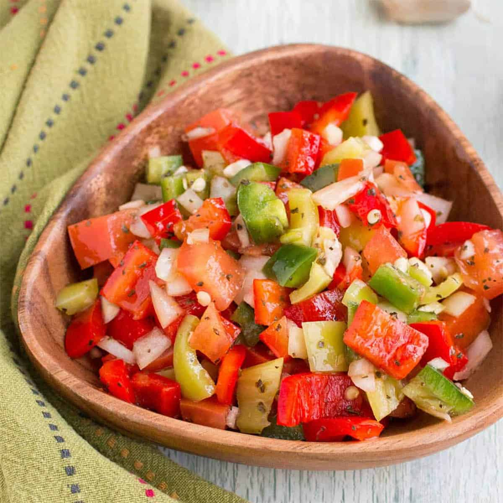

# Ensalada Criolla (Argentine Tomato-Onion-Pepper Salad)

*Argentina's everyday salsa-salad hybrid: finely diced tomato, red onion, green bell pepper, fresh parsley and a sharp red wine vinaigrette. Eaten at every Argentine asado, alongside churrasco, in choripán sandwiches, on top of provoleta, with bread. The Argentine answer to pico de gallo; bright, sharp, refreshing, the perfect foil to grilled red meat.*

**Serves:** 6-8 (as a side)

**Prep Time:** 15 minutes (plus 30 minutes rest)

**Cook Time:** None

## Overview
Ensalada criolla (literally "creole salad" - referring to the Spanish-colonial-era mixed Argentine identity) is one of Argentina's most ubiquitous everyday dishes - a finely diced mixture of tomato, red onion, green pepper, garlic, fresh parsley, dressed with a simple red wine vinaigrette. Found at every Argentine asado, every parrilla restaurant, every bodegón, every family table - it's both a salad (eaten as a side) and a salsa (spooned over grilled meat). The construction is straightforward: ripe tomatoes are diced 5 mm (with juices retained); red onion is sliced into thin half-moons or finely diced (the canonical Argentine cut is half-moons, slightly larger than the tomato dice); green bell pepper is diced 5 mm; fresh parsley is chopped; everything is combined with red wine vinegar, olive oil, salt, and a small amount of water (the water "softens" the acid and lets it cling to the vegetables). Rested 30 minutes for flavours to marry. Three details: RIPE TOMATOES (the dish depends on tomato flavour; off-season tomatoes need a pinch of sugar), RED WINE VINEGAR (canonical Argentine; not balsamic), and REST 30 MINUTES (essential - the salt draws moisture from the tomato and the dressing infuses).

## Ingredients

### For 6-8 servings
- 4 large ripe tomatoes (about 600 g; diced 5 mm)
- 1 large red onion (sliced into thin half-moons OR finely diced)
- 1 large green bell pepper (diced 5 mm)
- 1 small red bell pepper (diced 5 mm; optional, for colour)
- 4 garlic cloves (finely chopped)
- 1 large bunch fresh parsley (chopped)

### Dressing
- 4 tablespoons red wine vinegar
- 6 tablespoons extra-virgin olive oil
- 2 tablespoons water
- 1 teaspoon fine sea salt
- 1 teaspoon coarsely ground black pepper
- ½ teaspoon dried oregano
- A pinch of caster sugar (if the tomatoes are out of season)
- A pinch of chilli flakes (optional)

### To serve
- Alongside any Argentine asado
- Spooned into choripán sandwiches
- On top of provoleta
- Alongside milanesa
- With fresh bread for soaking up the dressing

## Method

### Stage 1 - Dice the vegetables
1. Dice the tomatoes into 5 mm pieces (retain all the juice).
2. Slice the red onion into thin half-moons (or finely dice - both are canonical).
3. Dice the green and red bell peppers 5 mm.
4. Chop the parsley.
5. Finely chop the garlic.

### Stage 2 - Combine
1. In a medium bowl, combine all the diced vegetables and chopped parsley.
2. Add the chopped garlic.

### Stage 3 - Dress
1. Whisk the red wine vinegar, olive oil, water, salt, pepper, oregano, sugar (if using), and chilli flakes (if using) together.
2. Pour over the vegetables.
3. Stir to combine.

### Stage 4 - Rest
1. Cover; let stand at room temperature for 30 minutes (or refrigerate 1 hour).
2. The salt draws moisture from the tomatoes; the dressing infuses the vegetables.

### Stage 5 - Serve
1. Stir before serving.
2. Taste; adjust salt and acid.
3. Serve at room temperature alongside grilled meat, or spooned into bread sandwiches.

## Notes
- **Ripe tomatoes are essential:** the dish lives or dies by tomato quality. Off-season tomatoes need a pinch of sugar to compensate.
- **Red wine vinegar:** not white, not balsamic.
- **The water in the dressing:** softens the acid and lets it cling to the vegetables. Don't skip.
- **Rest 30 minutes minimum:** flavours marry during resting.
- **Eat at room temperature:** not fridge-cold. The flavours are muted when too cold.

## Variations
**With cucumber:** add 1 diced cucumber (deseeded) for refreshing crunch - modern variant.
**With avocado:** add ½ diced avocado just before serving - Argentine modern; not canonical.
**With corn:** add 100 g cooked corn kernels - summer variant.
**With anchovy:** add 4 chopped anchovy fillets to the dressing - Spanish-influenced.
**Spicy criolla:** double the chilli flakes; add 1 chopped fresh chilli.
**With olives:** add 30 g chopped green olives - Mediterranean-Argentine.
**With egg:** stir in 2 chopped hard-boiled eggs - heartier version, almost a meal.

## Serving
At every Argentine asado as a side (the canonical setting) · in choripán sandwiches · on grilled provoleta · alongside milanesa · with fresh bread for soaking · at an Argentine wedding reception · at home as the daily vegetable side.

## Storage
- Refrigerates 2 days; the texture softens but the flavour intensifies.
- Don't freeze (texture suffers).
- Best at room temperature; bring up from fridge 20 minutes before serving.
- Leftover ensalada criolla makes excellent next-day topping for grilled fish or chicken.
- The vegetables can be diced 1 day ahead; dress just before serving for best texture.
