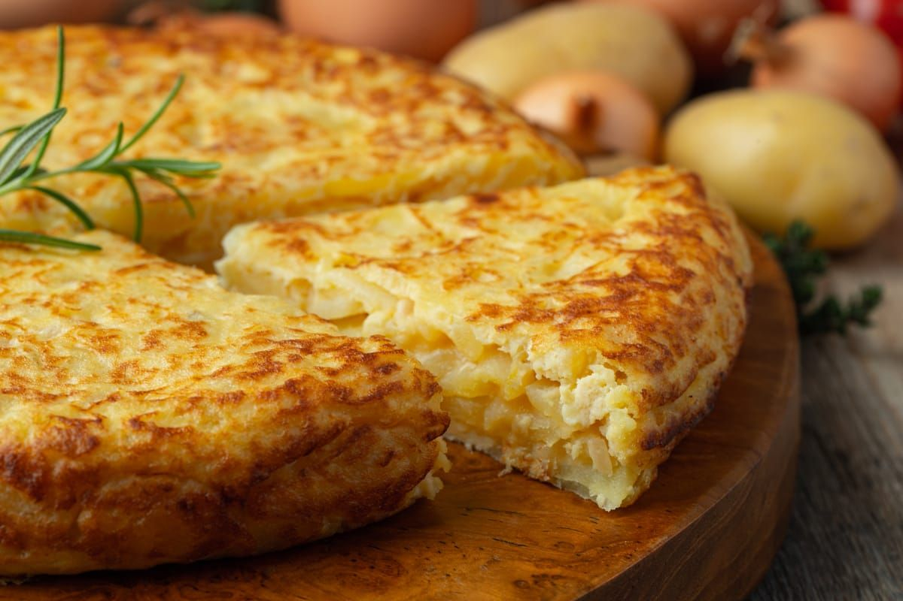

# Tortilla de Papa Argentina

*Argentina's Spanish-immigrant potato omelette: thin slices of potato and onion gently cooked in olive oil till tender and golden, then bound with beaten egg and cooked flat in a heavy pan till just-set with a slightly runny centre. Eaten warm or cold, sliced into wedges, served as a tapa, a side, or as the filling for a Spanish-Argentine sandwich (sandwich de tortilla). The everyday Argentine kitchen staple.*

**Serves:** 6 (as a side; 4 as a main)

**Prep Time:** 15 minutes

**Cook Time:** 30 minutes

## Overview
Tortilla de papa (literally "potato tortilla"; called "tortilla española" in Spain and most of Latin America) arrived in Argentina with Spanish immigrants in the 19th and early 20th centuries and was rapidly adopted as a canonical Argentine kitchen staple. The Argentine version stays faithful to the Spanish original: thin slices of waxy potato and yellow onion are gently confit-cooked in olive oil till soft and golden (not browned - the canonical Spanish technique); drained well; combined with beaten egg seasoned with salt; cooked flat in a heavy pan till the bottom sets, then flipped (the canonical Spanish "plate flip" technique - invert onto a plate, slide back into the pan) and cooked till just-set with a slightly soft centre. Sliced into wedges and served warm or cold. The Argentine adaptation: extra garlic in the onion, sometimes chopped parsley folded in, and a generous touch of olive oil. Served as a tapa with a glass of red wine, as a side with asado, or split into a roll for the classic "sandwich de tortilla" - the Argentine office-lunch staple. Three details: CONFIT THE POTATOES (low slow cooking in olive oil; not deep-frying), DON'T BROWN THE POTATOES (soft and golden, not crispy), and FLIP TECHNIQUE (the plate-and-slide-back is the canonical Spanish move).

## Ingredients

### For one tortilla (serves 6)
- 800 g waxy potatoes (Charlotte, Anya, or Maris Peer; peeled and sliced 3 mm)
- 2 large yellow onions (sliced thin into half-moons)
- 6 large eggs
- 4 garlic cloves (finely chopped; the Argentine touch)
- 300 ml olive oil (for confit)
- 2 tablespoons chopped fresh parsley (optional; Argentine variant)
- 1 teaspoon fine sea salt (plus more to taste)
- 1 teaspoon coarsely ground black pepper

### To serve
- Crusty bread
- A green salad
- A wedge of lemon
- A glass of Argentine Malbec or chilled white
- Optional: a small dish of chimichurri alongside

### Equipment
- A heavy non-stick pan, 22-24 cm diameter (essential for the flip)
- A large plate (for flipping)

## Method

### Stage 1 - Confit the potatoes and onion
1. Heat the olive oil in the heavy pan over LOW heat.
2. Add the sliced potatoes and onions; stir gently.
3. Add the chopped garlic.
4. The oil should just cover the potatoes; if not, add a little more.
5. Cook gently for 20-25 minutes, stirring occasionally with a wooden spoon, till the potatoes and onions are soft, golden, and breaking down slightly at the edges.
6. The vegetables should NOT brown deeply; the goal is soft and golden, not crispy.

### Stage 2 - Drain
1. Drain the cooked potato-onion mixture through a sieve set over a bowl (reserve the oil for next time; it's now beautifully flavoured).
2. Press lightly to extract excess oil.
3. Season with 1 teaspoon salt and the black pepper.

### Stage 3 - Beat the eggs
1. In a large bowl, beat the eggs with a fork (don't over-whisk; just combine).
2. Stir in the chopped parsley (if using).

### Stage 4 - Combine
1. Add the drained warm potato-onion mixture to the eggs.
2. Stir gently to combine (the potatoes should be fully coated with egg).
3. Let stand 5 minutes (the potatoes absorb some egg).

### Stage 5 - Cook the tortilla
1. Wipe the pan clean; add 2 tablespoons of the reserved oil.
2. Heat over medium heat till hot.
3. Pour in the egg-potato mixture; spread evenly with a spatula.
4. Reduce heat to LOW.
5. Cook 6-8 minutes till the bottom is set and golden, the edges firming, and the centre still soft.

### Stage 6 - The Spanish flip
1. Place a large plate over the pan.
2. Holding the plate firmly against the pan, invert the whole thing (the tortilla drops onto the plate, cooked-side-up).
3. Slide the tortilla back into the pan (the uncooked side now on the bottom).
4. Cook another 3-4 minutes till the new bottom is set but the centre stays slightly soft.

### Stage 7 - Serve
1. Slide onto a serving plate.
2. Rest 2 minutes.
3. Cut into 6-8 wedges with a sharp knife.
4. Serve warm or at room temperature.
5. Pair with bread, a green salad, and Argentine red wine.

## Notes
- **Confit, not fry:** the potatoes should cook slowly in oil, not deep-fry. Soft and golden.
- **Use a heavy non-stick pan:** the flip is hard without one.
- **Slightly soft centre:** the canonical Spanish-Argentine tortilla has a slightly runny middle. Don't overcook to dry.
- **Rest before slicing:** lets the egg settle.
- **Reserve the oil:** the potato-onion-infused olive oil is excellent for next time, or for vinaigrettes.

## Variations
**Tortilla con chorizo:** add 100 g sliced Argentine chorizo to the potato mix.
**Tortilla con jamón crudo:** add 100 g chopped jamón crudo (cured ham).
**Tortilla con espinaca:** add 200 g wilted spinach to the egg mixture.
**Tortilla con cebolla caramelizada:** caramelise the onions deeply for a sweeter variant.
**Tortilla con pimiento (with red pepper):** add 1 sliced red bell pepper to the confit.
**Sandwich de tortilla:** the Argentine office-lunch icon - slice the cold tortilla, place in a fresh roll with mayo and lettuce.
**Mini tortillas:** make small individual tortillas in a frying pan or muffin tin - canapé portions.

## Serving
At an Argentine bodegón as a tapa starter (the canonical setting) · alongside an asado as a side · split into a roll for "sandwich de tortilla" (the office-lunch staple) · at an Argentine wedding canapé reception · with a glass of Malbec at a Buenos Aires café · at home as a quick weekday supper with a green salad.

## Storage
- Refrigerates 3 days; eat cold or reheat briefly in a hot pan.
- Cold tortilla in a sandwich is the canonical Argentine next-day lunch.
- Don't freeze (the egg texture suffers).
- The flavour deepens overnight; many Argentines think day-2 tortilla is better than fresh.
