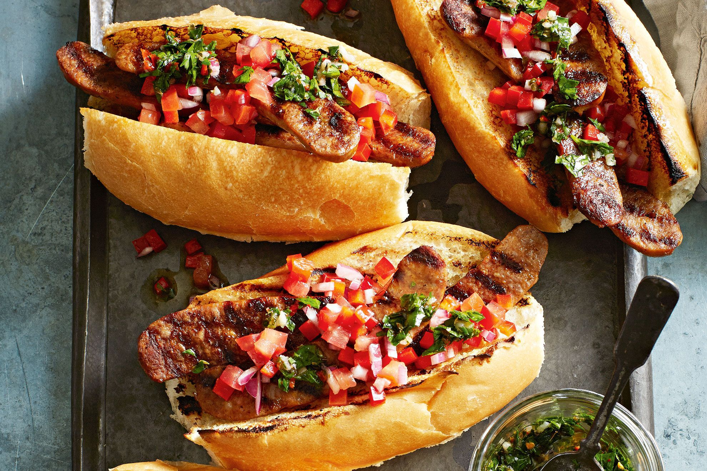

# Argentine Chorizo Hot Dog (Choripán Dog)

*Argentina's grilled chorizo sandwich-dog: a butterflied Argentine chorizo grilled hard over coals, tucked into a soft baguette-style roll, smothered in bright green chimichurri sauce, with a scatter of chopped pickled red onion and tomato. The Buenos Aires choripán raised to hot-dog status; the traditional Argentine grill-side snack.*

**Serves:** 4

**Prep Time:** 20 minutes

**Cook Time:** 12 minutes

## Overview
The Argentine choripán (a portmanteau of chorizo + pan/bread) is more sandwich than hot dog in shape, but in Argentine asado culture, it's the traditional between-the-grilling snack and a national institution. The construction is structural sister to the hot dog: a length of Argentine chorizo (a coarse-ground pork-and-beef sausage seasoned with sweet paprika, garlic, salt and white wine; thicker and more rustic than a frankfurter) butterflied by being sliced lengthwise without cutting all the way through, then grilled hard over wood-coal embers till the cut faces caramelise deeply and the casing crisps. Placed inside a soft baguette-style French roll (often called a "rosa de pan" in Argentina; lightly toasted on the grill on its cut sides), smothered in a fistful of bright green chimichurri sauce (the Argentine herb-vinegar sauce of fresh parsley, oregano, garlic, red wine vinegar, olive oil, dried red chilli flakes and salt), and finished with chopped pickled red onion + tomato mix (called "salsa criolla", the Argentine table relish).

## Ingredients

### Chorizo
- 4 Argentine-style chorizo sausages (about 18cm long; coarse pork-and-beef, sweet paprika; or substitute with quality Spanish chorizo or Italian sweet sausage)

### Chimichurri (makes about 250 ml)
- 1 large bunch fresh flat-leaf parsley (leaves and tender stems; about 80 g)
- 6 garlic cloves
- 1 tablespoon dried oregano
- 1 teaspoon dried red chilli flakes (or 1 fresh red chilli, chopped)
- 100 ml red wine vinegar
- 150 ml extra-virgin olive oil
- 1 teaspoon fine sea salt
- ½ teaspoon ground black pepper
- 2 tablespoons cold water

### Salsa criolla (chopped pickled red onion + tomato)
- 1 medium red onion (finely chopped)
- 2 medium tomatoes (deseeded, finely chopped)
- 1 green bell pepper (finely chopped)
- 4 tablespoons red wine vinegar
- 4 tablespoons olive oil
- 1 teaspoon caster sugar
- 1 teaspoon fine sea salt
- ½ teaspoon ground black pepper

### Bread
- 4 long soft French-style rolls (about 20cm; with a slightly crisp crust and pillowy interior)
- 2 tablespoons olive oil (for brushing the bread before grilling)

### To serve
- A cold Quilmes or Patagonia beer
- Or a glass of Argentine Malbec
- A side of homemade chips

## Method

### Stage 1 - Make chimichurri
1. Finely chop the parsley by hand (a blender turns it sludgy; the Argentine traditional is hand-chopped).
2. Crush the garlic with the side of a knife, then chop finely.
3. In a wide bowl, combine parsley, garlic, oregano, chilli flakes, vinegar, olive oil, salt, pepper, water.
4. Stir; let stand 30 minutes for the flavours to meld.

### Stage 2 - Make salsa criolla
1. Chop the red onion, tomato, bell pepper into small dice (about 5mm).
2. Whisk vinegar, olive oil, sugar, salt, pepper.
3. Toss the vegetables with the dressing.
4. Rest 20 minutes for the onion to soften slightly.

### Stage 3 - Butterfly and grill the chorizo
1. Place each chorizo on a board.
2. With a sharp knife, slice lengthwise down the middle without cutting all the way through; open it up like a book ("a la mariposa", butterflied).
3. Heat a barbecue, grill pan, or wide cast-iron pan to high.
4. Place chorizo cut-side down first; grill 4-5 minutes till deeply caramelised.
5. Flip; grill the rounded side 3-4 minutes till the casing crisps and starts to char in spots.

### Stage 4 - Toast the bread
1. Slice each roll lengthwise but not all the way through (hinge-cut).
2. Brush the cut sides with olive oil.
3. Grill cut-side-down on the same grill for 60 seconds till golden and crispy.

### Stage 5 - Build the choripán-dog
1. Open each toasted roll.
2. Spread a generous spoonful of chimichurri on the inside of the bottom half of each roll.
3. Place a butterflied grilled chorizo on top.
4. Spoon more chimichurri over the chorizo (don't be shy).
5. A heap of salsa criolla piled across the top.

### Stage 6 - Serve immediately
1. Close the roll; press gently.
2. Eat with both hands.
3. Cold beer or Malbec.
4. Chips on the side.

## Notes
- **Butterflied chorizo:** the structural signature. Whole chorizo doesn't get the caramelisation surface.
- **Hand-chopped chimichurri:** blended is wrong (turns to sludge).
- **Both inside AND on top with chimichurri:** generous on both surfaces.
- **Salsa criolla:** the traditional Argentine table relish; don't skip.

## Variations
- **Bondiola-pan:** swap the chorizo for grilled pork shoulder (bondiola) slices.
- **Morcilla-pan:** swap for grilled Argentine black pudding (morcilla); rich and iron-y.
- **With provoleta cheese:** add a small slice of grilled Argentine provoleta cheese inside.
- **Spicier chimichurri:** double the chilli flakes; add fresh chopped chilli.
- **Vegetarian:** swap chorizo for a portobello mushroom marinated in red wine and grilled.

## Serving
- At a Buenos Aires asado (barbecue) as the appetiser before the main grilled meats; at a street-corner choripán cart on a Sunday in Mendoza; at a Pampas-style cookout; at home with a glass of Malbec.

## Storage
- Chimichurri keeps refrigerated 1 week; the flavour deepens in the first 24 hours.
- Salsa criolla keeps refrigerated 3 days.
- Grilled chorizo refrigerates 4 days.
- Don't assemble in advance.
