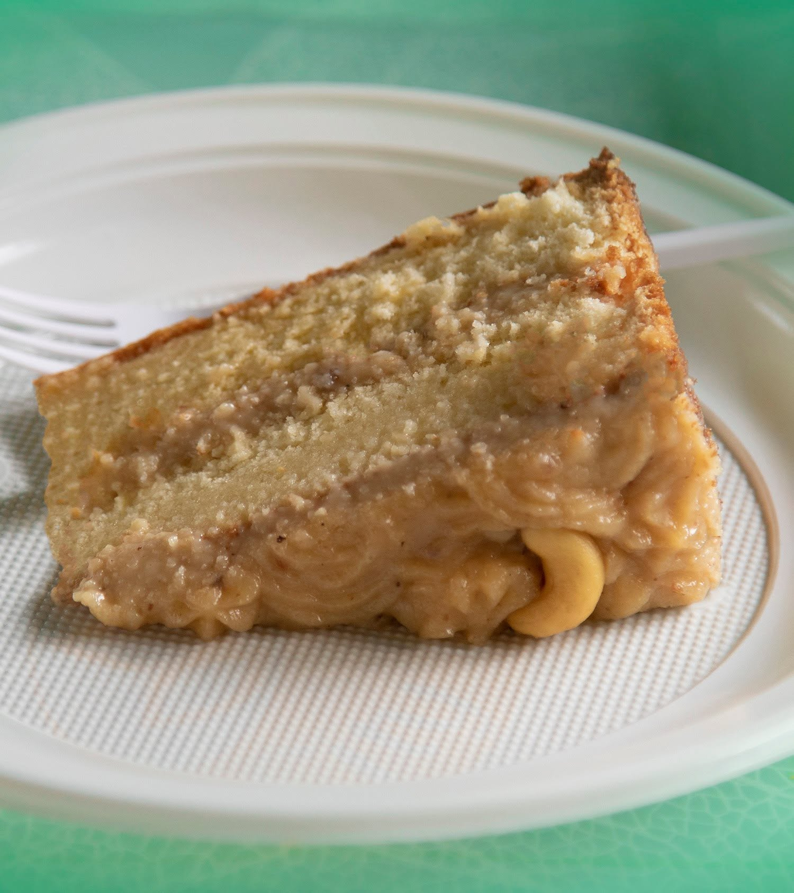

# Bolo di Kashupete (Aruban Cashew Cake)

*The Aruban wedding cake: three layers of soft ground-cashew sponge sandwiched and topped with a sweet cashew-butter cream, a long-keeping celebration cake glazed in white and pressed with toasted cashew halves.*

**Serves:** 12

**Prep Time:** 40 minutes

**Cook Time:** 45 minutes plus cooling

## Overview
Bolo di kashupete is the Aruban signature dessert, the cake that appears at every wedding, first communion, eighteenth birthday and milestone Sunday lunch from one end of the island to the other. The cashew (kashupete in Papiamento) is the island's signature nut, grown wild on the Aruban kunuku hills since the Spanish brought trees from Brazil in the seventeenth century, and the festive cakes built around it are the Aruban contribution to the Caribbean dessert table. The cake is a three-layer butter sponge made with finely ground cashews folded into the batter, baked low so the layers stay tender, then sandwiched and crowned with a buttercream of finely ground roasted cashews, butter and icing sugar. A thin smooth white glaze finishes the top, and toasted cashew halves circle the edge. The cake keeps for over a week (the cashew oil acts as a preservative), which is why it is the Aruban gift-cake of choice when a relative is visiting from the Netherlands.

## Ingredients

### The cake (3 x 22 cm sandwich tins)
- 300 g raw cashew nuts, finely ground in a processor (to a coarse meal, not paste)
- 250 g plain flour
- 2 tsp baking powder
- 1/2 tsp salt
- 250 g unsalted butter, softened
- 250 g caster sugar
- 4 large eggs
- 1 tsp vanilla extract
- 1/2 tsp ground cinnamon
- 200 ml whole milk

### The cashew buttercream
- 150 g roasted cashews, finely ground to a paste in a processor
- 200 g unsalted butter, softened
- 400 g icing sugar, sifted
- 2 tbsp whole milk
- 1 tsp vanilla extract
- A pinch of salt

### The glaze and finish
- 250 g icing sugar, sifted
- 3-4 tbsp warm water
- 1 tsp vanilla extract
- 100 g roasted cashew halves to decorate

## Method

### Stage 1 - Prepare the tins and oven
1. Heat the oven to 170 C.
2. Butter and line three 22 cm sandwich tins.

### Stage 2 - Make the cake batter
1. Cream the butter and sugar in a stand mixer for 5 minutes until very pale and fluffy.
2. Add the eggs one at a time, beating well between each (a tablespoon of the flour with the last egg if the mixture looks split).
3. Whisk the flour, ground cashews, baking powder, salt and cinnamon in a bowl.
4. Fold the dry ingredients into the butter mixture in three additions, alternating with the milk.
5. Stir in the vanilla.

### Stage 3 - Bake
1. Divide the batter evenly between the three tins; level the tops.
2. Bake on the middle shelf for 25-30 minutes, until a skewer comes out clean and the sponges spring back.
3. Cool 10 minutes in the tins; turn out onto racks; cool fully.

### Stage 4 - Make the cashew buttercream
1. Beat the soft butter in a stand mixer for 4 minutes until very pale.
2. Add the ground cashew paste; beat 2 minutes.
3. Add the icing sugar in three lots, beating well after each.
4. Add the milk, vanilla and salt; beat 2 more minutes until very fluffy.

### Stage 5 - Assemble
1. Place the first sponge on a plate; spread a third of the buttercream over the top.
2. Lay the second sponge on; spread another third.
3. Top with the third sponge; spread the last of the buttercream thinly over the top and sides as a crumb coat.
4. Chill 30 minutes in the fridge to firm.

### Stage 6 - Glaze and decorate
1. Whisk the icing sugar with the warm water and vanilla until pourable and very smooth.
2. Pour over the chilled cake; smooth with a palette knife to drape the sides.
3. Ring the top edge with the toasted cashew halves.
4. Let the glaze set 30 minutes.

## Notes
- **Roast and grind the cashews fresh:** pre-ground cashew meal is dry and tastes of nothing. The flavour of bolo di kashupete is the freshly ground nut.
- **Cream the butter properly:** five minutes of beating is what gives the soft Aruban-bakery texture. Cutting this short gives a dense cake.
- **Bake low and slow:** 170 C keeps the layers tender. 180 C dries the cake out and bolo di kashupete must never be dry.
- **A thin crumb coat first:** the chilled crumb coat seals the cake before the final glaze, so the white glaze sits clean.
- **Glaze, do not buttercream the outside:** the smooth white poured glaze is the Aruban look. A swirled buttercream finish would make it a Dutch sandcake.

## Variations
- **Bolo di kashupete cu chocolat:** spread the layers with a thin chocolate ganache as well as the cashew buttercream.
- **Two-layer bolo di kashupete:** halve the recipe for an everyday version with two thicker layers.
- **Bolo di kashupete cu lamunchi:** add 2 tbsp lime zest to the sponge for a citrus-edged variant.
- **Bolo di kashupete with rum-soaked cake:** brush the layers with 60 ml dark rum before assembling, the Christmas version.
- **Cashew-cream bolo (no glaze):** finish with the buttercream over the top, no poured glaze, the everyday family version.
- **Bolo pretu cu kashupete:** the festive black-cake version with dried fruits soaked in rum folded into the batter.

## Serving
- At an Aruban wedding · for a first communion · for a milestone birthday · for Christmas Eve · for the Dia di Himno y Bandera (18 March) table · as a gift to relatives in the Netherlands · with a small glass of orange liqueur · with strong black coffee or pega-pega.

## Storage
- The frosted cake keeps 5 days at room temperature in a cake tin (the cashew oil preserves it).
- Refrigerates 10 days covered; bring back to room temperature before eating.
- Freezes 2 months wrapped tightly; thaw overnight in the fridge.
- The buttercream keeps 4 days refrigerated; bring to room temperature and re-whip before using.
- The unfrosted sponge layers freeze 2 months wrapped tightly.
