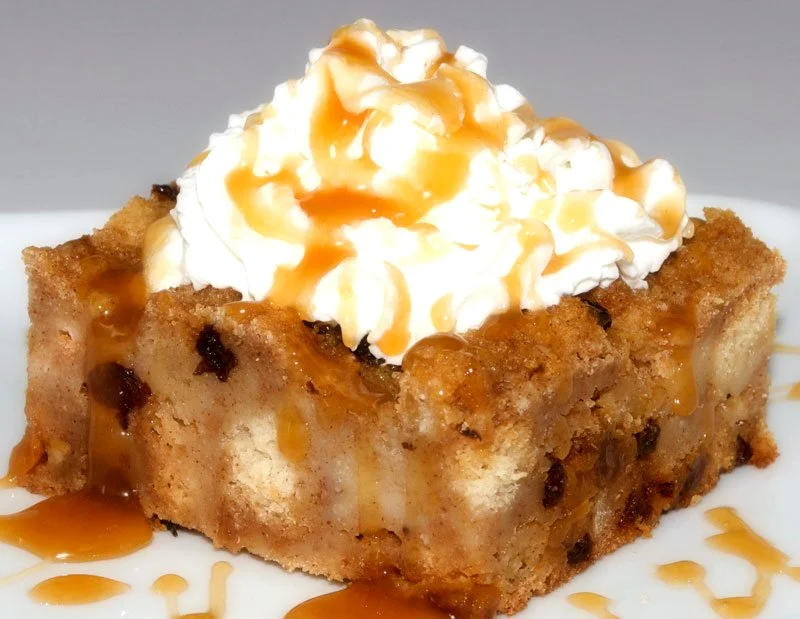

# Pan Bolo (Aruban Sweet Cornmeal Cake)

*A dense, lightly sweet baked cornmeal cake with raisins and a hint of anise, sliced into wedges for the four-o-clock Aruban coffee break.*

**Serves:** 10

**Prep Time:** 15 minutes

**Cook Time:** 50 minutes

## Overview
Pan bolo (literally "bread cake") is the Aruban afternoon-coffee cake: a dense yellow corn-and-flour bake somewhere between an Italian polenta cake and a Caribbean cornbread, baked in a round tin and cut into wedges for the daily four-o-clock coffee. The base is half cornmeal, half flour, with butter, eggs, milk, brown sugar and a small amount of anise that gives pan bolo its faint liquorice perfume (the Papiamento bakery signature). Raisins or sometimes a handful of chopped toasted cashews fold into the batter. Baked low for nearly an hour, the top goes the colour of caramel, the inside stays moist and crumbly. Pan bolo is what Aruban families bring to a neighbour's house when stopping by, what a guesthouse serves on the breakfast tray, what the kunuku (interior) bakeries box up for the bus drivers and roadworkers to take home. It keeps well, three days at least, which is how it earned its everyday status.

## Ingredients

- 250 g fine yellow cornmeal
- 200 g plain flour
- 1 tbsp baking powder
- 1 tsp salt
- 1 tsp ground cinnamon
- 1 tsp crushed anise seed
- 250 g unsalted butter, softened
- 220 g soft light-brown sugar
- 4 large eggs
- 1 tsp vanilla extract
- 350 ml whole milk
- 150 g raisins
- 50 g toasted cashews, roughly chopped (optional)
- Extra butter for the tin

## Method

### Stage 1 - Prepare
1. Heat the oven to 170 C.
2. Butter a 24 cm round springform tin and line the base with baking paper.
3. Toss the raisins with 1 tbsp of the flour (stops them sinking).

### Stage 2 - Mix the dry
1. Whisk the cornmeal, flour, baking powder, salt, cinnamon and crushed anise in a bowl.

### Stage 3 - Cream the wet
1. Beat the butter and sugar in a stand mixer for 4 minutes until pale and fluffy.
2. Add the eggs one at a time, beating well after each.
3. Stir in the vanilla.

### Stage 4 - Combine
1. Fold the dry ingredients into the butter mixture in three additions, alternating with the milk.
2. Fold in the floured raisins and the optional cashews.

### Stage 5 - Bake
1. Spoon the batter into the prepared tin; level the top.
2. Bake on the middle shelf for 45-50 minutes, until a skewer comes out with moist crumbs (not wet batter) and the top is deep golden.
3. Cool 15 minutes in the tin; release the springform and cool fully on a rack.

### Stage 6 - Serve
1. Cut into wedges or thick slabs.
2. Dust lightly with icing sugar if liked.

## Notes
- **Fine cornmeal:** medium-grind makes the cake gritty. Pan bolo should be soft-crumbed, not coarse.
- **Crushed anise seed is the signature:** the small amount perfumes the whole cake. Star anise is not a substitute.
- **Toss the raisins in flour:** keeps them from sinking to the base.
- **Bake low:** 170 C keeps the inside moist while the top browns slowly. Hotter dries out the centre.
- **Cool before slicing:** a hot pan bolo crumbles. Let it set.

## Variations
**Pan bolo cu coco:** swap 150 ml of the milk for coconut milk for a richer crumb.
**Pan bolo cu papaya:** fold in 100 g diced dried papaya in place of half the raisins.
**Pan bolo with rum-soaked raisins:** soak the raisins in 60 ml dark rum overnight before adding, the festive version.
**Pan bolo cu kashupete:** double the cashews and skip the raisins, the all-nut version.
**Loaf-tin pan bolo:** bake in a 1 kg loaf tin for 60 minutes; slice for breakfast.
**Lighter pan bolo:** reduce the butter to 180 g for an everyday slim version.

## Serving
At the Aruban four-o-clock coffee · with pega-pega coffee · at breakfast with butter · as a hostess gift when visiting · at an afternoon Easter coffee table · with a glass of milk for the children · with a small glass of orange liqueur for the grown-ups.

## Storage
- Keeps 4 days at room temperature in a tin; the crumb stays moist.
- Refrigerates 1 week (bring back to room temperature before serving).
- Freezes 2 months in slices wrapped tightly.
- A few-day-old pan bolo, lightly toasted under the grill, makes the best version of itself.
