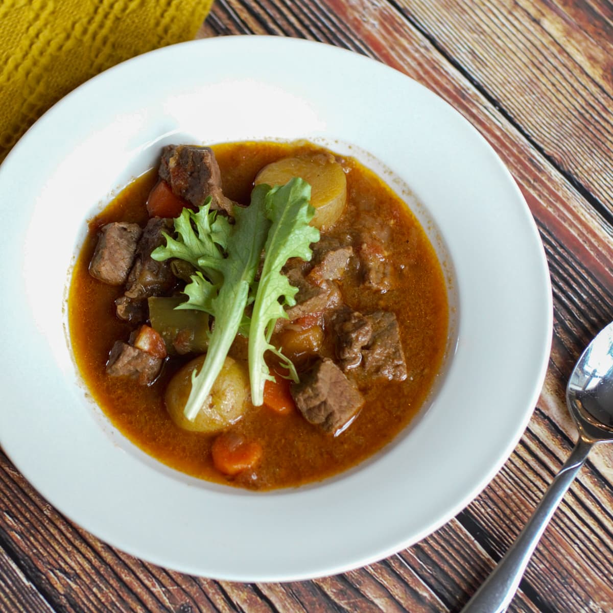

# Karni Stoba Aruban (Aruban Beef Stew)

*The Aruban weeknight everyday: beef shoulder slow-braised with onion, garlic, tomato, capers, olives and a slug of vinegar; spooned over a wedge of funchi or pan bati so the sauce soaks into the cornmeal.*

**Serves:** 4-6

**Prep Time:** 20 minutes

**Cook Time:** 2 hours 15 minutes

## Overview
Karni stoba is the Aruban beef cousin of the goat stoba di cabritu, and the more common weeknight choice across the island. The technique sits between a Spanish ropa vieja and a Curaçaoan karni stoba (essentially the same dish, with each island tweaking the spice mix): cubed beef shoulder is browned hard in oil, then slow-braised with onion, garlic, tomato, bay, allspice and a quartet of Caribbean-Spanish accents (capers, green olives, a slosh of vinegar, a finishing dash of Worcestershire). The stew goes low and slow for two hours till the beef shreds with a fork and the sauce thickens around it. Aruban home cooks plate it over a wedge of funchi (cornmeal mush) or pan bati (Aruban cornmeal-pancake) so the sauce has something to soak into; a side of fried sweet plantain (banana frita) closes the plate.

## Ingredients

### Stew
- 1 kg beef shoulder or chuck (cut into 3 cm cubes)
- 2 tablespoons plain flour
- 2 teaspoons fine sea salt
- 1 teaspoon coarsely cracked black pepper
- 3 tablespoons vegetable oil
- 2 large onions (finely sliced)
- 6 cloves garlic (finely chopped)
- 1 small handful fresh thyme (leaves picked)
- 4 fresh bay leaves
- 6 whole allspice berries (lightly cracked)
- 1 small cinnamon stick
- 2 tablespoons tomato paste
- 1 tin (400 g) chopped tomatoes
- 200 ml beef stock
- 3 tablespoons red wine vinegar
- 1 tablespoon Worcestershire sauce
- 2 tablespoons capers (drained)
- 12 green olives (pitted, sliced in half)
- 1 small handful fresh coriander (chopped, to finish)
- 1 small handful fresh parsley (chopped, to finish)

### To serve
- A wedge of funchi (cornmeal mush) OR pan bati (Aruban cornmeal pancake)
- A side of banana frita (fried sweet plantain)
- A few rounds of pickled scotch bonnet (Aruban pickapeppa)

## Method

### Stage 1 - Prep the beef
1. Pat the beef cubes dry with kitchen paper (essential for a good sear).
2. Combine the flour, salt and pepper in a wide bowl; toss the beef through till lightly coated.

### Stage 2 - Brown the beef
1. Heat the oil in a heavy lidded casserole over medium-high heat.
2. Working in 2-3 batches (don't crowd the pan), brown the beef on all sides till deeply caramelised; 5-6 minutes per batch.
3. Lift each browned batch onto a plate; set aside.

### Stage 3 - Aromatics
1. Drop the heat to medium.
2. Add the sliced onion to the same pot; cook 10 minutes till soft and golden.
3. Add the chopped garlic, thyme leaves, bay leaves, allspice and cinnamon stick; cook 1 minute.
4. Stir in the tomato paste; cook 2 minutes till it darkens.

### Stage 4 - Build the braise
1. Pour in the chopped tomatoes; simmer 5 minutes till thickened slightly.
2. Add the beef stock, vinegar and Worcestershire sauce; stir.
3. Return the browned beef (and any resting juices) to the pot.
4. Bring to a gentle simmer.

### Stage 5 - Slow braise
1. Cover loosely with the lid (a small gap lets the sauce reduce).
2. Simmer over low heat for 1 hour 45 minutes; stir every 20 minutes.
3. The beef should shred easily with a fork; the sauce should be thick enough to coat the back of a spoon.

### Stage 6 - Finish
1. Add the capers and olives; simmer another 10 minutes (any earlier and they go soft).
2. Fish out the bay leaves, cinnamon stick and any whole allspice berries you can find.
3. Check seasoning; adjust salt only if needed (the olives and capers carry salt).
4. Stir in half the coriander and parsley.

### Stage 7 - Serve
1. Spoon a generous wedge of funchi or pan bati onto each plate.
2. Ladle the stoba alongside, letting the sauce run into the cornmeal.
3. Scatter the remaining herbs over.
4. Serve banana frita on the side and the pickled scotch bonnet for those who want heat.

## Notes
- **Dry the beef before searing:** wet beef steams instead of browns; the brown crust is half the flavour.
- **Brown in batches:** crowding the pan drops the temperature and you get grey stewed beef, not crusted.
- **Low and slow:** the collagen in beef shoulder needs 1.5-2 hours at gentle simmer to break down. A quick high boil makes the meat tight.
- **Capers and olives at the end:** they're already salted and pickled; long cooking turns them soft and bitter.
- **The vinegar is essential:** the Caribbean-Spanish stoba signature note; without it the dish reads flat.

## Variations
- **Karni stoba di kabritu:** swap the beef for kid goat shoulder; extend the braise to 2 hours 30 minutes.
- **With pumpkin:** add 300 g diced calabaza pumpkin in the last 30 minutes for a sweeter sauce.
- **With white wine:** swap half the stock for dry white wine; the Aruban Sunday-lunch upgrade.
- **With raisins and capers (the wedding version):** add 50 g raisins with the olives for a sweet-salt-sour balance.
- **Spicy stoba:** add 1 whole scotch bonnet at the start (don't pierce); fish out before serving for perfume; pierce for fierce heat.

## Serving
- At an Aruban Sunday lunch (the traditional setting) · over a wedge of funchi or pan bati at a Curaçao-Aruba shared family table · with banana frita and rice on the side at a Papiamento-speaking islands gathering · at an Antillean-Dutch restaurant in Amsterdam · with a glass of cold Balashi beer · at a Caribbean-Dutch wedding buffet.

## Storage
- Refrigerates 4 days in a sealed container; the flavour deepens overnight.
- Reheat gently in a covered pan with a splash of stock to revive the moisture.
- Freezes well 3 months; defrost in the fridge overnight before reheating.
- Stoba is one of the dishes that's better day 2 than day 1; the flavours marry.
