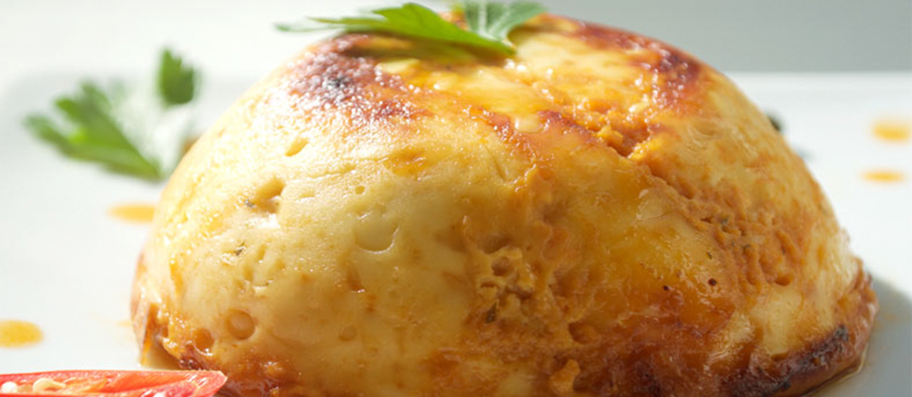

# Keshi Yena (Aruban)

*The Aruban Sunday-lunch centrepiece: a hollowed Edam or Gouda shell stuffed with a sweet-savoury chicken stew of raisins, olives, capers and tomato, then baked until the cheese collapses around the filling.*

**Serves:** 6

**Prep Time:** 30 minutes

**Cook Time:** 1 hour 15 minutes

## Overview
Keshi yena (Papiamento for "stuffed cheese") is the dish every Aruban household claims as its own, eaten across the ABC islands but with the Aruban version leaning sweeter and slightly drier than the Curacao take. The story is that enslaved cooks on Dutch colonial estates were given the empty wax-coated rinds of the Edam wheels their employers had finished with, and stuffed them with whatever stewed meat and leftovers were going. What started as a thrift dish became the island's most celebrated festive plate. A whole Edam or Gouda is sliced open like a lid, the inside scooped out till only a centimetre of cheese remains, and the cavity packed with stewed chicken cooked down with onion, tomato, raisins, green olives, capers and a small amount of curry powder. Baked in a covered dish, the cheese melts inward against the filling, the top browns, and the lid is set back on as if nothing has been disturbed. Cut at the table, the cheese sags and the spiced filling spills out.

## Ingredients

### The cheese shell
- 1 whole Edam or young Gouda, 1.2-1.5 kg (red or yellow wax)
- A sharp knife and a soup spoon for hollowing

### The chicken filling
- 600 g boneless chicken thighs, cut in 2 cm pieces
- 2 tbsp sunflower oil
- 1 large onion, finely chopped
- 1 green bell pepper, finely chopped
- 3 cloves garlic, finely chopped
- 2 medium tomatoes, chopped (or 200 g tinned chopped tomatoes)
- 2 tbsp tomato paste
- 1 tsp mild [curry powder](../../base-ingredients/curry-powder/bir-curry-powder.md)
- 1 tsp sweet paprika
- 1 bay leaf
- 60 g raisins
- 60 g pitted green olives, halved
- 2 tbsp small capers, drained
- 1 tbsp Worcestershire sauce
- 1 tbsp piccalilli or sweet mustard pickle (the traditional Aruban touch)
- 150 ml chicken stock
- Salt and black pepper

### To finish
- 2 eggs, lightly beaten (binds the filling)
- 50 g breadcrumbs
- A little butter to grease the baking dish

## Method

### Stage 1 - Hollow the cheese
1. Slice a 2 cm cap off the top of the Edam; set the cap aside as the lid.
2. With a soup spoon, scoop out the inside of the wheel leaving a 1 cm shell all round.
3. Grate the scooped-out cheese (about 400 g); reserve 200 g for the filling and 200 g for topping.
4. Soak the empty shell and lid in cold water for 1 hour; pat dry. (This softens the rind so it does not crack in the oven.)

### Stage 2 - Cook the filling
1. Heat the oil in a wide pan over medium heat.
2. Brown the chicken in two batches, 5 minutes per batch; transfer to a bowl.
3. In the same pan, soften the onion and pepper for 6 minutes.
4. Add the garlic, curry powder and paprika; stir 30 seconds.
5. Return the chicken; add the tomatoes, tomato paste, bay, Worcestershire, piccalilli and stock.
6. Simmer uncovered for 25 minutes; the sauce should be thick and clinging.
7. Stir in the raisins, olives and capers; cook 5 more minutes.
8. Off the heat, taste for salt and pepper; cool 15 minutes.
9. Stir in the beaten eggs and 200 g of the grated cheese.

### Stage 3 - Stuff and bake
1. Heat the oven to 180 C.
2. Butter a deep round baking dish that holds the cheese snugly.
3. Sit the hollow cheese in the dish; pack the filling in firmly to the brim.
4. Scatter the breadcrumbs and the remaining grated cheese over the top.
5. Set the cap loosely on top.
6. Cover the dish with foil; bake 40 minutes.
7. Remove the foil and the cap; bake 15 more minutes until the top is bronzed and the cheese walls are bulging.
8. Rest 10 minutes before serving.

## Notes
- **Edam or young Gouda only:** a hard aged cheese will split rather than slump. The young waxed wheels of Edam are made for this dish.
- **Soak the shell:** the brief water bath rehydrates the rind and stops it cracking in the oven.
- **Sweet and savoury balance:** the raisins and piccalilli are not optional, they are what makes keshi yena Aruban rather than a generic stuffed cheese.
- **Cool the filling before adding the eggs:** hot stew will scramble them.
- **Carve at the table:** lift the cap, then cut wedges right through the cheese wall so each plate gets cheese and stew.

## Variations
- **Keshi yena di galina kabaron:** add 200 g peeled prawns with the chicken for the seafood-and-poultry Sunday version.
- **Keshi yena di karne:** swap the chicken for diced stewing beef and extend the simmer to 90 minutes.
- **Keshi yena di pisca:** flake 500 g cooked salt cod in place of the chicken for the Friday Lent version.
- **Individual keshi yena:** line ramekins with thin Edam slices and bake 25 minutes for a starter portion.
- **Modern oven-dish version:** layer the filling between sheets of Edam in a casserole, the home-cook shortcut.

## Serving
- At Aruban Sunday lunch · for Christmas Eve dinner · at a Dia di Himno y Bandera (18 March) family table · paired with funchi or pan bati · with a bowl of stewed black beans alongside · with a glass of cold Balashi lager.

## Storage
- Refrigerates 3 days covered.
- Reheats well at 160 C for 25 minutes, covered.
- The cooked filling on its own freezes 2 months; the stuffed cheese does not freeze well (the rind weeps).
- Leftover cold wedges are eaten Aruban-style with pan bati for next-day breakfast.
