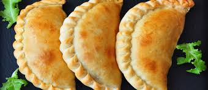

# Pasthechi (Aruban)

*The bakery-counter staple of every Aruban morning: a crescent-shaped deep-fried turnover with a soft yellow pastry shell, filled with melted Edam or Gouda and eaten warm from a paper bag on the way to work.*

**Serves:** 12 turnovers

**Prep Time:** 40 minutes plus 30 minutes rest

**Cook Time:** 25 minutes

## Overview
Pasthechi is the snack of Aruban daily life: every bakery, every petrol-station counter, every roadside stall sells them from early morning, and most office workers eat one at their desk by 9 am. The pastry is unusual, an enriched short dough made with butter, egg yolk, a little sugar and a splash of milk, which fries to a soft golden shell that is closer to a Cornish pasty crust than to a flaky filo. The classic filling is grated young Gouda or Edam bound with a roux into a thick cheese sauce, packed warm into the dough rounds, sealed with a crimped edge, and deep-fried until the outside is the colour of straw. Other fillings (spiced beef, salt-cod, ham-and-cheese, tuna) all rotate through the bakery cases, but the pasthechi di keshi (cheese pasthechi) is the original and still the most-ordered. The Aruban version is slightly sweeter in the pastry than the Curacao or Bonaire takes.

## Ingredients

### The pastry (makes 12 turnovers)
- 500 g plain flour
- 1 tbsp sugar
- 1 tsp salt
- 1 tsp baking powder
- 150 g cold butter, cubed
- 2 egg yolks
- 180 ml cold milk
- 1 tbsp white vinegar

### The cheese filling
- 30 g butter
- 30 g plain flour
- 250 ml whole milk
- 300 g young Gouda or Edam, grated
- 1 tsp Dijon mustard
- 1 tsp sweet paprika
- A grating of fresh nutmeg
- Salt and black pepper

### To finish
- 1 egg, beaten (for sealing)
- 1.5 litres sunflower oil for deep-frying

## Method

### Stage 1 - Make the pastry
1. In a bowl, whisk the flour, sugar, salt and baking powder.
2. Rub in the cold butter with your fingertips until the mixture resembles coarse breadcrumbs.
3. Whisk the egg yolks, milk and vinegar in a jug.
4. Pour the wet into the dry; bring together with a knife, then knead briefly on the bench for 1 minute until smooth.
5. Wrap and rest in the fridge for 30 minutes.

### Stage 2 - Make the cheese filling
1. Melt the butter in a small pan over medium heat.
2. Stir in the flour; cook 1 minute to make a pale roux.
3. Whisk in the milk gradually; bring to a simmer, whisking, until thick (4 minutes).
4. Off the heat, stir in the grated cheese, mustard, paprika and nutmeg until smooth.
5. Season; cool to room temperature so the filling firms up.

### Stage 3 - Shape the pasthechi
1. Divide the dough into 12 equal pieces (about 75 g each).
2. Roll each into a 14 cm circle on a lightly floured bench.
3. Place a heaped tablespoon of cooled filling on one half of each circle.
4. Brush the edge with beaten egg.
5. Fold over to a half-moon; press the edges together; crimp with a fork or twist a rope edge.
6. Set on a tray lined with baking paper; rest 10 minutes.

### Stage 4 - Deep-fry
1. Heat the oil in a deep heavy pot to 170 C.
2. Fry the pasthechi in batches of 3, turning once, for 3-4 minutes until golden brown.
3. Lift out with a slotted spoon onto kitchen paper.
4. Let the oil come back to temperature between batches.

## Notes
- **A short dough, not flaky:** Aruban pasthechi pastry should be soft and slightly cake-like, not shatter-crisp. Do not over-knead.
- **Cool the filling first:** a warm filling will burst through the dough during frying.
- **170 C is the right oil temperature:** higher browns too fast and leaves the dough raw; lower greases up the shell.
- **Crimp firmly:** a loose edge will weep cheese into the fryer.
- **Eat warm:** pasthechi go from peak to acceptable within 30 minutes. The bakery sells them straight from the fryer for a reason.

## Variations
**Pasthechi di karni:** fill with spiced minced beef sweated with onion, raisins and olives.
**Pasthechi di pisca:** flaked salt-cod with onion and tomato, the Lenten version.
**Pasthechi di galina:** shredded stewed chicken bound in a little gravy.
**Pasthechi di tuna:** tinned tuna mashed with mayonnaise, onion and parsley, the kids' lunchbox version.
**Oven-baked pasthechi:** brush with egg and bake at 200 C for 18 minutes, the lighter version (texture is less authentic).
**Mini pasthechi:** roll to 8 cm circles for cocktail-hour bite-sized turnovers.

## Serving
For breakfast on the way to work · at a school break · at the Aruban office mid-morning · with a paper cup of pega-pega coffee · at a bakery counter (Maggy's, Java's, Huchada) · at the airport before a flight · with a small dish of pepper sauce on the side.

## Storage
- Eat warm the same day for the best texture.
- Refrigerate up to 2 days; reheat at 180 C for 8 minutes to crisp.
- Freeze unfried, sealed pasthechi up to 1 month; fry from frozen for 5 minutes at 165 C.
- The cooled cheese filling refrigerates 3 days on its own.
