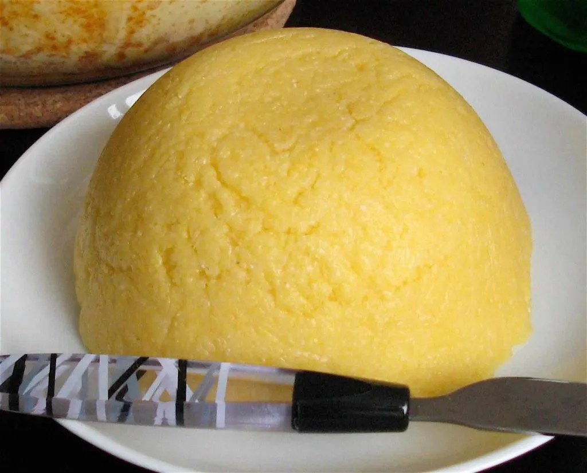

# Funchi (Aruban Cornmeal Side)

*The Aruban polenta: yellow cornmeal stirred slowly with salted water and a knob of butter until it pulls away from the pot, then turned out as a glossy mound to soak up the gravy from stoba or sopi.*

**Serves:** 6

**Prep Time:** 5 minutes

**Cook Time:** 25 minutes

## Overview
Funchi is the everyday Aruban starch, the one cornmeal mush that turns up alongside stoba di cabritu on Sunday, alongside the Friday sopi di pisca, alongside the cheese pasthechi at a bakery counter. The Aruban version is plainer than the Bajan cou-cou (no okra) and less coconut-rich than the Bonaire one, just yellow cornmeal, water, a hard pinch of salt and butter, cooked low and stirred with a flat wooden paddle called a mealie until it pulls cleanly from the sides of the pot. The texture sits between Italian polenta and a firm Caribbean fufu, holding its shape on the plate but soft enough to break with the side of a fork. Funchi is often pressed into a small bowl and inverted onto the dinner plate so it lands as a smooth dome, ready for gravy to be ladled over the top. Day-old funchi, sliced and pan-fried in butter, is the Aruban breakfast traditional.

## Ingredients

- 250 g medium-grind yellow cornmeal (not instant)
- 900 ml water
- 1.5 tsp salt
- 30 g butter
- A flat wooden paddle or sturdy wooden spoon

## Method

### Stage 1 - Bring the water to the boil
1. Bring the water and salt to a rolling boil in a wide heavy pan.

### Stage 2 - Stir in the cornmeal
1. Pour the cornmeal into the boiling water in a thin steady stream, whisking constantly to prevent lumps.
2. Once all the cornmeal is in, switch from a whisk to a wooden paddle.

### Stage 3 - Cook and stir
1. Lower the heat to medium-low.
2. Stir continuously and vigorously for 15 minutes, the cornmeal will go from a loose porridge to a thick mass that pulls away from the sides of the pot.
3. If the funchi thickens too fast, add 50 ml hot water and keep stirring.
4. Taste a small spoonful, the cornmeal should be tender with no raw graininess.

### Stage 4 - Finish with butter
1. Add the butter; stir in until fully melted and the surface is glossy.
2. Taste for salt.

### Stage 5 - Shape and serve
1. Wet a small bowl with cold water.
2. Spoon hot funchi into the bowl; press to compact.
3. Invert onto a warm plate, you should have a smooth dome.
4. Serve immediately, with stoba, sopi, or any gravy-heavy dish.

## Notes
- **Stir constantly:** funchi is made by the stirring, not by the cooking. A passive stir leaves the cornmeal lumpy.
- **Medium-grind cornmeal only:** fine cornmeal turns into pap; coarse polenta-grind takes 40 minutes.
- **Wet the moulding bowl:** the funchi releases cleanly and gives the signature dome.
- **Eat hot:** funchi sets quickly as it cools and loses the soft-glossy texture.
- **Day-old funchi is a feature:** slice cold leftover funchi into 1 cm slabs, pan-fry in butter, and serve with eggs for the Aruban breakfast.

## Variations
- **Funchi cu keshi:** stir in 100 g grated Edam at the buttering stage for cheese funchi.
- **Funchi cu coco:** swap 200 ml of the water for coconut milk for a richer, slightly sweet side.
- **Funchi pretu:** use blue cornmeal for the rarer dark version (mostly historical).
- **Pan-fried funchi cakes (next-day):** cut cold funchi into squares; pan-fry in butter till golden on both sides; serve with eggs.
- **Funchi rolls:** pipe hot funchi into small ramekins and chill; slice into rounds and pan-fry, the modern Aruban restaurant version.

## Serving
- With stoba di cabritu · with sopi di pisca · with keshi yena · with a fried whole fish · with stewed black beans · alongside any gravy-led Aruban plate · for breakfast as a pan-fried slab with a fried egg.

## Storage
- Best fresh from the pot; the texture firms quickly.
- Refrigerated funchi turns into a sliceable cake, 4 days in a covered container.
- Slice and pan-fry leftovers in butter for breakfast or as a starch alongside eggs.
- Do not freeze (the texture turns gritty on thawing).
