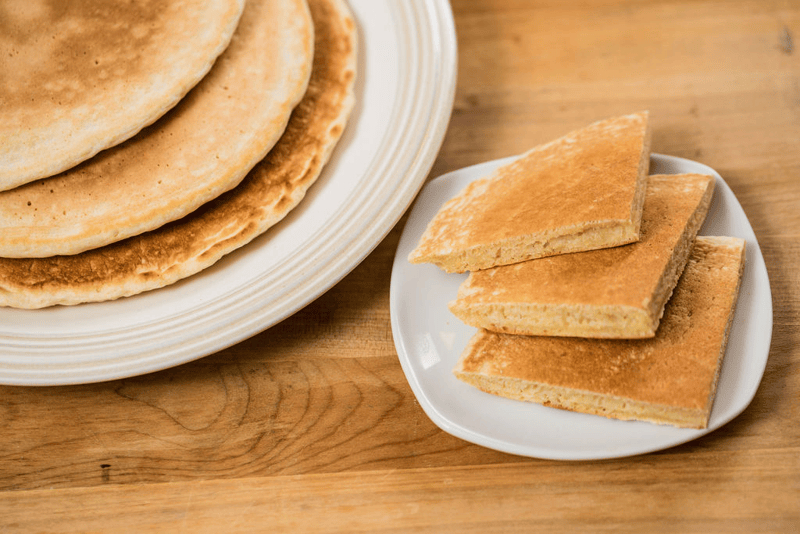

# Pan Bati (Aruban Cornmeal Pancake)

*The Aruban table bread: a thin cornmeal-and-flour pancake with a faint coconut sweetness, cooked on a hot pan and stacked beside every plate of stoba or fish soup for sopping up gravy.*

**Serves:** 6 (makes 6 pancakes)

**Prep Time:** 10 minutes

**Cook Time:** 18 minutes

## Overview
Pan bati, Papiamento for "beaten bread", is the bread of the Aruban dinner table. Where Italians put down a basket of bread, Arubans put down a stack of warm pan bati. The batter is half fine cornmeal and half flour, sweetened lightly with sugar, enriched with a little milk or coconut milk, and beaten well to develop a smooth pourable consistency closer to a thick pancake batter than a bread dough. It cooks on a hot oiled pan in two-minute rounds, the surface goes golden and faintly speckled, the inside stays soft and yielding. The slight sweetness is not optional, it is what makes pan bati pan bati rather than a Mexican gordita or a thin polenta cake. Every Aruban household has its own ratio, but the family staple is roughly 1:1 cornmeal and flour with a tablespoon of sugar and a pinch of salt. Stacked under a cloth to stay warm and torn at the table, pan bati is the Aruban equivalent of dipping bread.

## Ingredients

- 150 g fine yellow cornmeal
- 150 g plain flour
- 2 tbsp sugar
- 1 tsp salt
- 1 tsp baking powder
- 300 ml whole milk (or 150 ml milk plus 150 ml coconut milk)
- 1 egg
- 30 g butter, melted
- Sunflower oil or butter for the pan

## Method

### Stage 1 - Make the batter
1. Whisk the cornmeal, flour, sugar, salt and baking powder in a bowl.
2. Whisk the milk, egg and melted butter in a jug.
3. Pour the wet into the dry; whisk for a full minute until smooth and pourable.
4. Rest 10 minutes; the cornmeal absorbs liquid and the batter thickens slightly.

### Stage 2 - Cook the pan bati
1. Heat a 22 cm non-stick or cast-iron pan over medium heat.
2. Brush lightly with oil.
3. Pour in about 150 ml of batter; tilt to spread to a 20 cm round.
4. Cook 3 minutes until the underside is golden and the top dries at the edges.
5. Flip with a wide spatula; cook 2 more minutes.
6. Slide onto a plate; cover with a clean cloth to keep warm.
7. Repeat with the remaining batter, re-oiling the pan as needed.

### Stage 3 - Serve warm
1. Stack the pan bati on a board.
2. Tear at the table; use to scoop stew and mop gravy.

## Notes
- **Beat the batter well:** the name says "beaten bread" for a reason. A minute of vigorous whisking gives the soft elastic crumb.
- **Rest the batter:** the cornmeal needs the 10 minutes to absorb liquid, or the inside stays gritty.
- **Sweetness is part of the recipe:** the small sugar amount is what makes pan bati taste Aruban, not just like a corn pancake. Do not skip.
- **Medium heat:** too hot scorches the outside before the inside cooks; too low gives a pale lifeless surface.
- **Stack under a cloth:** the steam keeps the pancakes soft as you cook the next.

## Variations
**Pan bati cu coco:** swap all the milk for coconut milk for the richer version.
**Pan bati cu keshi:** stir 80 g grated Edam into the batter for cheese pan bati.
**Sweet pan bati (breakfast):** double the sugar and serve with butter and jam at breakfast.
**Pan bati cu anijs:** add 1 tsp crushed anise seed for the traditional spiced version.
**Thicker pan bati:** use 100 ml less milk for a heartier slab-style pan bati.
**Mini pan bati:** cook 10 cm rounds for individual portions, the restaurant version.

## Serving
With stoba di cabritu · with sopi di pisca · with keshi yena · with stewed beans · at breakfast with butter and gouda · torn at the table to mop gravy · stacked warm under a cloth.

## Storage
- Best warm from the pan; texture stiffens as they cool.
- Refrigerate up to 2 days, wrapped; reheat in a hot dry pan for 30 seconds per side.
- Freeze 1 month, layered with baking paper; reheat from frozen in a 180 C oven for 5 minutes.
- The dry mix (cornmeal, flour, sugar, salt, baking powder) keeps a month sealed.
