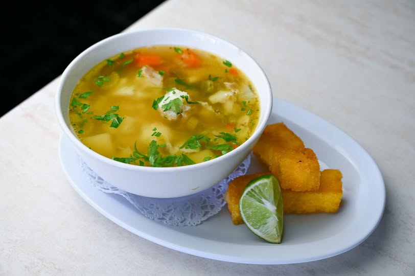

# Sopi di Pisca (Aruban Fish Soup)

*The Aruban Friday-lunch tradition: a clear-but-rich fish soup of grouper or snapper simmered with onion, tomato, sweet pepper, a pricked aji and a squeeze of lime, ladled over white rice.*

**Serves:** 6

**Prep Time:** 20 minutes

**Cook Time:** 50 minutes

## Overview
Sopi di pisca is the Friday lunch you find at every Aruban household kitchen and at almost every neighbourhood eetcafe. The Catholic tradition of meatless Fridays settled into a weekly fish soup that no Aruban Friday is complete without. The base is a clear stock built from fish heads, bones and the dry-island aromatics of onion, tomato, sweet pepper, garlic and a single pricked Madame Jeanette or aji pepper for warmth. The flesh, snapper or grouper, sometimes king mackerel, goes in at the end and poaches in the gentle broth for five minutes only. Lime, fresh coriander and a dash of pepper sauce finish each bowl. Served over a mound of plain white rice, this is the Aruban take on the Caribbean light-broth fish soup, lighter than Bonaire's coconut version and clearer than the Curacao tomato-heavy take. A piece of pan bati alongside for sopping the broth is the proper accompaniment.

## Ingredients

### The fish stock
- 1 kg fish heads, frames and trimmings (snapper, grouper, mackerel) from the fishmonger
- 1 onion, halved
- 1 carrot, halved
- 1 stick celery, halved
- 1 bay leaf
- 1 tsp black peppercorns
- 1 tbsp white vinegar
- 1.8 litres cold water

### The soup base
- 3 tbsp sunflower oil
- 1 large onion, finely chopped
- 1 green bell pepper, finely chopped
- 1 red bell pepper, finely chopped
- 4 cloves garlic, finely chopped
- 3 medium tomatoes, chopped (or 400 g tinned chopped tomatoes)
- 2 tbsp tomato paste
- 1 tsp sweet paprika
- 1 tsp ground cumin
- 1 tsp dried thyme
- 2 bay leaves
- 1 small Madame Jeanette or aji pepper, pricked twice with a knife (left whole)
- 1 tbsp Worcestershire sauce
- 1 tbsp Maggi seasoning sauce
- Salt and black pepper

### The fish
- 800 g firm white fish fillets (snapper, grouper, mahi-mahi), skin off, cut into 4 cm chunks
- Juice of 1 lime
- 1 tsp salt

### To finish
- A handful of fresh coriander leaves, roughly chopped
- 2 spring onions, sliced
- Lime wedges
- Aruban yellow pepper sauce on the side
- Steamed white rice or pan bati to serve

## Method

### Stage 1 - Make the stock
1. Rinse the fish heads and bones under cold water to clear blood.
2. Combine in a large pot with the onion, carrot, celery, bay, peppercorns, vinegar and cold water.
3. Bring to a bare simmer, skimming the grey foam.
4. Simmer gently uncovered for 30 minutes. Do not boil hard or the stock turns bitter.
5. Strain through a fine sieve; you should have about 1.5 litres. Discard the solids.

### Stage 2 - Build the soup base
1. Heat the oil in a wide heavy pot over medium heat.
2. Add the onion and peppers; sweat 8 minutes until soft.
3. Add the garlic, paprika, cumin and thyme; stir 30 seconds.
4. Stir in the tomatoes and tomato paste; cook 5 minutes until broken down.
5. Pour in the strained fish stock; add the bay leaves, the whole pricked Madame Jeanette, the Worcestershire and Maggi.
6. Bring to a gentle simmer; cook 15 minutes for the flavours to merge.
7. Taste; adjust salt.

### Stage 3 - Marinate the fish
1. Toss the fish chunks with the lime juice and salt; sit 5 minutes.

### Stage 4 - Poach the fish
1. Bring the broth to a very gentle simmer (not a rolling boil).
2. Slide the fish chunks in.
3. Poach 5 minutes until just opaque; the fish flakes gently and is still juicy at the centre.
4. Lift out the whole Madame Jeanette pepper.

### Stage 5 - Serve
1. Mound steamed rice in each warm bowl.
2. Ladle broth and fish over the top.
3. Scatter coriander and spring onion.
4. Squeeze a wedge of lime; pass pepper sauce at the table.

## Notes
- **The stock is the soup:** a deep fish stock made from heads and bones is what gives sopi di pisca its body. Stock cubes will not do.
- **Skim the stock and never boil it:** a clean clear stock keeps the soup elegant. A churned hard boil makes it muddy.
- **Whole pricked pepper, lifted out at the end:** Madame Jeanette gives warmth and fruit without raw heat. If it bursts, the soup will be incendiary.
- **Five minutes of poach is enough:** firm fish toughens if it goes longer.
- **Lime and coriander at the end:** both lose their punch in the simmer; finish each bowl bright.

## Variations
- **Sopi di pisca cu coco:** add 200 ml coconut milk with the stock for the Bonaire-leaning version.
- **Sopi di kabaron:** prawns in place of fish, poached for 2 minutes only.
- **Sopi di concha:** with conch, sliced thin and added with 30 minutes of extra simmer.
- **Sopi di pisca cu funchi:** serve over funchi instead of rice for the older traditional pairing.
- **Mixed seafood sopi:** add prawns, mussels and squid in the last 4 minutes.
- **Lighter sopi:** skip the tomato paste for a clearer, more delicate broth.

## Serving
- For Friday lunch (the Catholic tradition) · at an Aruban eetcafe like the Old Cunucu House · at home with rice or pan bati · for a beach-day lunch · with a small dish of yellow pepper sauce and lime wedges · with a cold Balashi lager or awa di lamunchi.

## Storage
- The broth and fish are best fresh; the fish overcooks on reheating.
- The soup base without the fish refrigerates 3 days and freezes 2 months; poach fresh fish on serving.
- The stock alone refrigerates 3 days and freezes 3 months.
- Reheat the broth gently; never bring to a rolling boil with fish in it.
