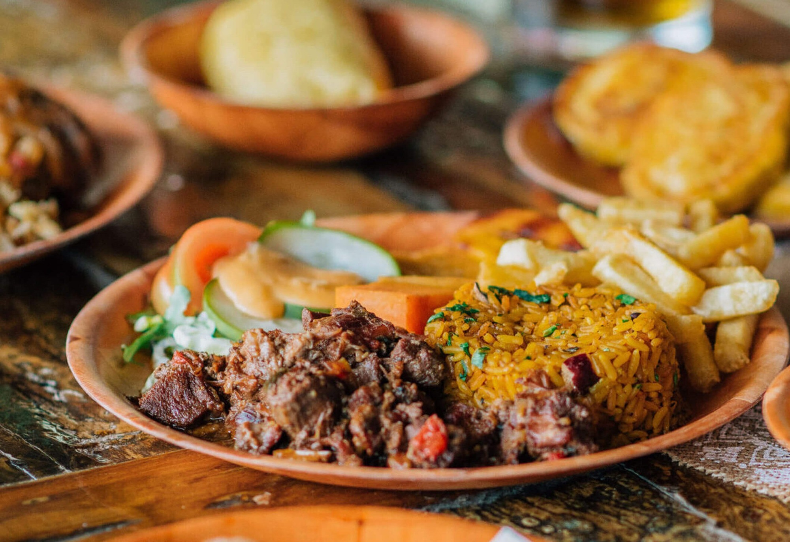

# Stoba di Cabritu (Aruban Goat Stew)

*The everyday Aruban pot: bone-in goat slow-stewed with onion, tomato, annatto and bay until the meat falls off the bone and the sauce turns the deep orange-red of the island's dry hills.*

**Serves:** 6

**Prep Time:** 20 minutes plus overnight marinade

**Cook Time:** 2 hours 30 minutes

## Overview
Stoba di cabritu is the workhorse of the Aruban kitchen, a slow-simmered goat stew that turns up at family Sunday lunches, beach cookouts and the Dande street parties of New Year. Goats have run wild on Aruba's dry interior since the Dutch West India Company stocked the island in the seventeenth century, and the meat is the most common red protein on local plates. The animal is butchered bone-in, marinated overnight in vinegar, lime, garlic and Maggi (a non-negotiable Aruban touch), then browned and stewed with onion, sweet pepper, tomato and the deep red of annatto-infused oil. Bay, thyme and a single piquant aji pepper carry the seasoning. The pot bubbles low and slow for two hours, until the sauce reduces to a glossy gravy that clings to each piece. Spooned over funchi or pan bati, a wedge of lime on the side, this is the dish that says Aruban home cooking more than any other.

## Ingredients

### The marinade
- 1.5 kg bone-in goat shoulder or leg, cut into 4-5 cm pieces (ask the butcher to chop through the bones)
- 4 tbsp white vinegar
- 2 tbsp fresh lime juice
- 4 cloves garlic, crushed
- 1 tsp salt
- 1 tsp black pepper
- 1 tsp dried thyme
- 1 tbsp Maggi seasoning sauce (the traditional Aruban touch)

### The annatto oil
- 4 tbsp sunflower oil
- 2 tbsp annatto seeds (also called achiote)

### The stew
- 2 large onions, sliced
- 1 green bell pepper, diced
- 1 red bell pepper, diced
- 4 cloves garlic, finely chopped
- 3 medium tomatoes, chopped (or 400 g tinned chopped tomatoes)
- 2 tbsp tomato paste
- 1 small aji or Madame Jeanette pepper, deseeded and chopped (or 1 tsp pepper sauce)
- 2 bay leaves
- 1 tsp dried thyme
- 1 tsp ground cumin
- 1 tbsp Worcestershire sauce
- 500 ml water or light beef stock
- Salt and black pepper

## Method

### Stage 1 - Marinate the goat
1. Rinse the goat pieces under cold water; pat dry.
2. In a large bowl, combine the vinegar, lime juice, garlic, salt, pepper, thyme and Maggi.
3. Add the goat; turn to coat thoroughly.
4. Cover and refrigerate overnight, or at least 4 hours.

### Stage 2 - Make the annatto oil
1. Warm the oil and annatto seeds in a small pan over the lowest heat for 5 minutes; the oil should turn a deep red-orange but the seeds must not fry.
2. Strain through a fine sieve into a heatproof bowl; discard the seeds.

### Stage 3 - Brown the goat
1. Lift the goat from the marinade; reserve any liquid.
2. Pat the pieces lightly dry on kitchen paper.
3. Heat the annatto oil in a heavy pot over medium-high heat.
4. Brown the goat in two batches, 6 minutes per batch, until well coloured on all sides.
5. Transfer the goat to a bowl.

### Stage 4 - Build the stew
1. Lower the heat to medium; add the onions to the pot.
2. Cook 8 minutes until soft and lightly caramelised at the edges.
3. Add the bell peppers; cook 5 more minutes.
4. Stir in the garlic, cumin, thyme and chopped aji; cook 30 seconds.
5. Add the tomatoes and tomato paste; cook 5 minutes until the tomatoes break down.
6. Return the goat with any resting juices and the reserved marinade.
7. Add the bay leaves, Worcestershire and stock.
8. Bring to a simmer; lower to the gentlest bubble.

### Stage 5 - Slow simmer
1. Cover the pot and simmer 2 hours, stirring every 20 minutes, until the goat is fork-tender and the meat is releasing from the bone.
2. Uncover for the final 20 minutes to reduce the sauce to a glossy gravy.
3. Taste for salt and pepper; pluck out the bay leaves.

## Notes
- **Bone-in is the point:** the bones thicken the gravy and carry deep flavour. Boneless mutton makes a thinner stew.
- **Annatto for colour and flavour:** the seeds give the Aruban-orange hue and a faint earthy-peppery taste. Sweet paprika is a poor substitute but workable.
- **The Maggi is traditional:** every Aruban kitchen has a bottle. Use it.
- **Low and slow only:** a hard boil toughens the meat; a gentle bubble dissolves the connective tissue into the sauce.
- **Rest the pot before serving:** 15 minutes off the heat lets the gravy thicken and the flavours settle.

## Variations
**Stoba di carni:** swap goat for diced stewing beef, the most common everyday version.
**Stoba di galina:** chicken thighs in place of goat, simmered for 45 minutes only.
**Stoba di yuana:** the rare traditional iguana stew, prepared the same way (now uncommon).
**Stoba di concomber:** add 400 g cubed Caribbean cucumber-squash 30 minutes before the end.
**Spicier stoba:** add a whole pricked Madame Jeanette pepper and remove before serving.
**Slow-cooker stoba:** brown the goat then transfer everything to a slow cooker on low for 6 hours.

## Serving
At an Aruban Sunday family lunch · for Dande (Aruban New Year street singing) · at a beach BBQ at Baby Beach · paired with funchi, pan bati or steamed white rice · with stewed black beans alongside · with a wedge of lime · with a cold Balashi lager.

## Storage
- Refrigerates 4 days; reheats well and the flavour deepens on day two.
- Freezes 3 months in portion-sized containers.
- Reheat in a covered pan with a splash of water over a low flame.
- The annatto oil keeps refrigerated for 2 months.
