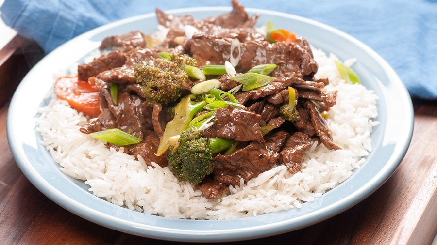

# Ginger Beef and Onion Rice Bowls

*A weeknight rice bowl: strips of sirloin braised in a ginger-garlic-soy bath with thin sliced onion, piled over hot white rice and finished with sesame.*

**Serves:** 6

**Prep Time:** 10 minutes (plus 4 hours marinating)

**Cook Time:** 30 minutes

## Overview
A bowl dinner that punches above its ingredient list. Sirloin is sliced into thin strips and marinated for several hours with garlic, fresh ginger, soy sauce, rice vinegar, sliced onions and a touch of brown sugar; the result, once cooked, is tender beef in a thin, glossy sauce, with onions that have collapsed into ribbons of sweetness. The technique is unusual for an Asian-style beef dish: instead of a flash stir-fry, everything goes into a Dutch oven on a gentle medium-low heat and braises for 10-15 minutes, which lets the marinade reduce around the beef without burning the sugar. The flavour is direct, clean and very gingery, with the onion sweetness balancing the soy and just a whisper of sesame at the end. Built for piling over white rice but equally good with ramen, lo mein, cauliflower rice or steamed broccoli. Excellent for a Sunday meal prep that holds its texture through reheating, which is its real superpower.

## Ingredients

### Beef and marinade
- 900 g sirloin steak, sliced into thin strips
- 4 garlic cloves, finely minced
- 30 g fresh ginger, finely sliced (or grated)
- 120 ml soy sauce
- 60 ml rice vinegar
- 1 white onion (medium), thinly sliced
- 12 g brown sugar

### To cook and serve
- 15 ml extra virgin olive oil
- 400 g uncooked long grain white rice
- salt
- pepper
- Spring onions, sliced (to garnish)
- Sesame seeds (to garnish)

## Method

### Stage 1 - Marinate
1. Place the sirloin strips, garlic, ginger, soy sauce, rice vinegar, sliced onions and brown sugar in a large resealable bag.
1. Seal and massage until everything is evenly coated.
1. Refrigerate at least 4 hours, ideally overnight.

### Stage 2 - Cook the beef
1. Heat the olive oil in a large Dutch oven or heavy pot over medium-low heat.
1. Tip in the entire bag, beef and all the marinating liquid.
1. Cook, stirring occasionally, until the beef is fully cooked through and the onions are translucent and soft, about 10-15 minutes.
1. Taste and adjust with salt and pepper.

### Stage 3 - Rice and serve
1. While the beef cooks, prepare the rice according to package instructions.
1. Spoon hot rice into bowls.
1. Ladle the ginger beef and onion mixture over the top, including some of the pan sauce.
1. Scatter with spring onions and sesame seeds.

## Notes
- **Use fresh ginger:** jarred ginger paste loses the bright top notes that make this dish; grate it from a fresh knob.
- **Slice the onions yourself:** pre-cut store packs are usually too thick and stay crunchy where you want them silky.
- **Sirloin works best:** it holds up to the long marinate without going stringy; flank or skirt are good alternatives.
- **Low heat matters:** the sugar in the marinade will scorch if you go medium-high; medium-low is the right setting.
- **Lower-carb option:** swap rice for cauliflower rice or pile over steamed greens.

## Storage
- Keeps 4 days refrigerated in an airtight container, making it ideal for weekday lunches.
- Reheat in a covered pan over low heat with a splash of water.
- Freezes 2 months; thaw overnight in the fridge before reheating.
