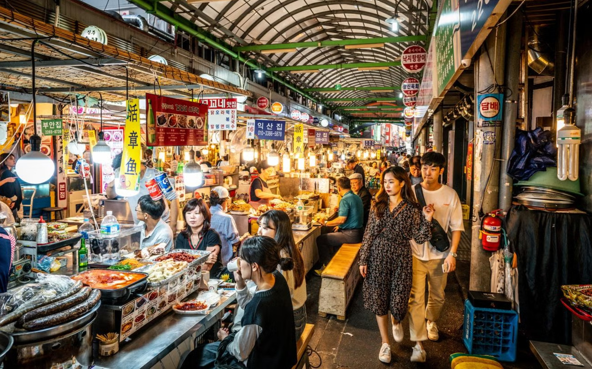

# Asian Fusion Cuisine

The modern Pan-Asian crossover: techniques and flavours from across the continent (Chinese stir-fry, Thai aromatics, Japanese precision, Vietnamese herbs, Korean ferments) recombined with Western technique and produce. Standardised in restaurants from the 1980s onwards. Soy, ginger, chilli, lime, sesame, fish sauce and rice vinegar do the seasoning; the table runs from sesame-crusted tuna over wasabi mash to crispy duck pancakes served as canapés.
