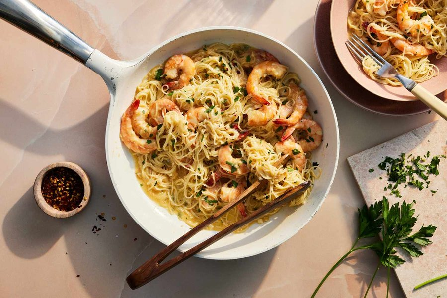

# Miso Shrimp Scampi

*A garlicky scampi rewired with white miso: lemon, wine and butter pan sauce gets a deep savoury hum from the miso. Served over pasta or with bread.*

**Serves:** 4

**Prep Time:** 15 minutes (plus 30 minutes seasoning)

**Cook Time:** 10 minutes

## Overview
This is a smart, simple twist on a familiar pan sauce. The scampi method is intact: butter foamed with shallot and a tower of garlic, deglazed with dry white wine and lemon juice, finished with a hit of chilli and parsley. The change is a couple of spoonfuls of white miso stirred into the sauce just before the shrimp return to the pan. The miso melts in without overpowering, lending a salty, umami round-out that intensifies the buttery base and gives the dish that "what is in this?" quality. The shrimp are Cajun-spiced before they ever touch the pan, which adds a low background warmth across the whole bowl. Cooking time is short because shrimp turn rubbery in moments past doneness; you are looking for an even pink colour and a tight C-curl. Serve it three ways: over hot linguine with a splash of pasta water for gloss, ladled over white rice, or in a shallow bowl with torn crusty bread for the sauce.

## Ingredients

### Shrimp
- 450 g large shrimp, peeled and deveined
- Creole (or Cajun seasoning), to taste
- 30 ml olive oil (for marinating)

### Sauce
- 30 ml olive oil (for the pan)
- 85 g unsalted butter
- 1 shallot (small), finely chopped
- 8 garlic cloves, minced (or pressed)
- 1 g red pepper flakes (optional)
- 120 ml dry white wine (sauvignon blanc, chardonnay or pinot blanc)
- 30 ml fresh lemon juice
- 120 ml chicken broth
- 30 g white miso paste
- 8 g chopped flat-leaf parsley (reserve half for garnish)

### To serve
- Crusty bread, hot rice, or 225 g cooked pasta (linguine, spaghetti or fettuccine)

## Method

### Stage 1 - Season the shrimp
1. Pat the shrimp dry with kitchen paper.
1. Season generously with Cajun seasoning.
1. Drizzle with 30 ml olive oil and toss to coat.
1. Let sit at room temperature at least 30 minutes.

### Stage 2 - Sear the shrimp
1. Heat 30 ml of olive oil in a large skillet over medium heat.
1. Lay the shrimp in a single layer; cook 90 seconds per side until pink and opaque.
1. Transfer to a plate and reserve.

### Stage 3 - Build the sauce
1. Drop the butter into the same pan; add the shallot.
1. Saute 2-3 minutes until translucent and lightly caramelised.
1. Add the garlic; stir 1 minute until fragrant.
1. Add the chilli flakes if using.

### Stage 4 - Deglaze and finish
1. Pour in the white wine and lemon juice, scraping the browned bits up off the pan.
1. Simmer 2-3 minutes to take the raw edge off the wine.
1. Add the chicken broth and whisk in the miso paste; cook 2-3 minutes until the miso has fully dissolved.
1. Return the shrimp with half the parsley; toss gently and warm through, 1 minute.
1. Remove from heat, scatter remaining parsley, serve immediately.

## Notes
- **Wine swap:** replace the wine with another 120 ml chicken broth for a no-alcohol version.
- **Pasta finish:** reserve some starchy pasta water and add a splash to the sauce just before tossing for a glossier coat.
- **Do not overcook:** shrimp go rubbery fast; the right doneness looks like a soft C-curl, not a tight O.
- **Low sodium:** skip the Cajun seasoning and use low-sodium broth; miso is already salty.
- **White miso vs red:** white (shiro) miso is mellow and slightly sweet; do not substitute red or it will dominate.

## Storage
- Best fresh; the shrimp toughen on reheating.
- Keeps 1-2 days refrigerated; reheat gently and briefly in a covered pan over low heat.
- Not recommended for freezing.
